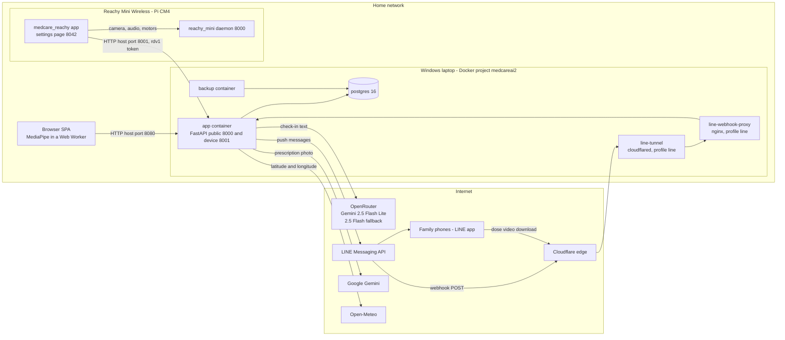
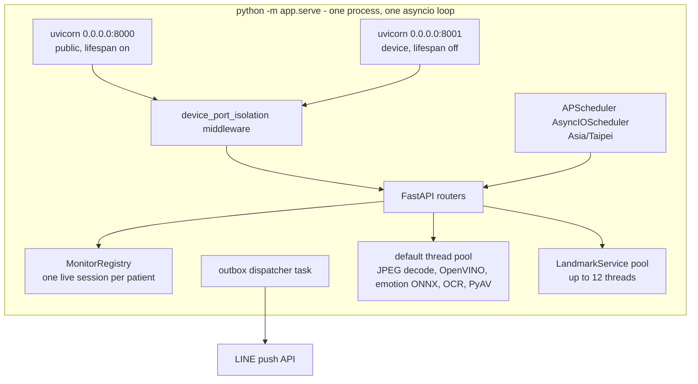
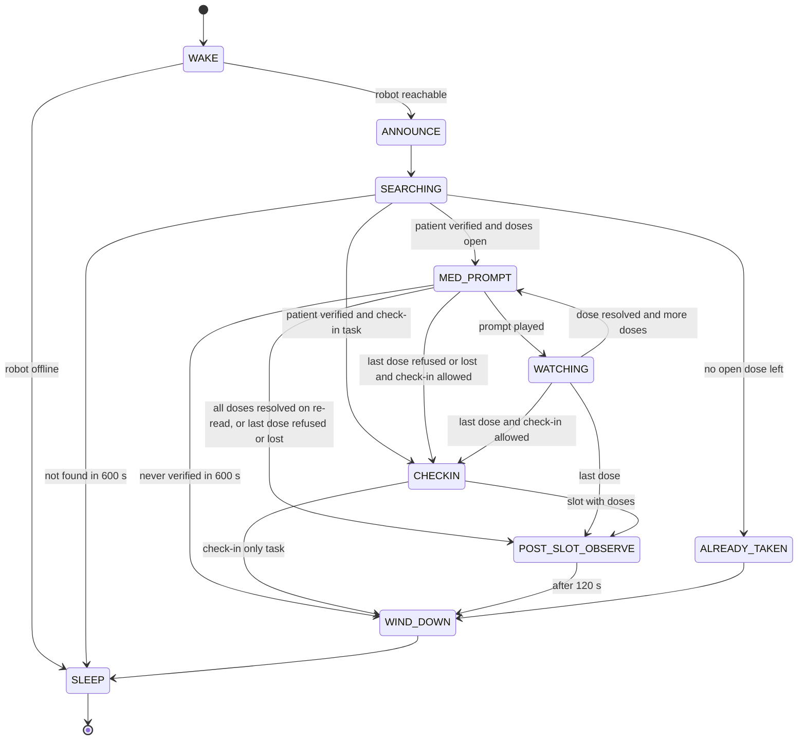

# MedAiCarePlus system architecture

Last updated: 2026-10-04 (commit bcd821a)

This document describes how the system is built and deployed. Two companion documents go deeper:

- [MODELS.md](MODELS.md): every model and algorithm, with inputs, thresholds, latency and limits.
- [DATA_FLOW.md](DATA_FLOW.md): every flow step by step, with diagrams, storage and what leaves the home.

**Conventions**
- References are `path:line` (or `path:function`) at commit `bcd821a`.
- "Unverified" means the code does not confirm the claim. It came from notes such as `CLAUDE.md` or `HANDOFF.md`, or from general knowledge.
- `git show bcd821a:<path>` shows the lines cited. The 4 Oct 2026 commits after `bcd821a` (OCR repair, an HTTP keep-alive session for OpenRouter in `app/services/conversation.py`, robot speech chunking in `bridge/speech.py`, app 0.5.4) moved lines in those files and in `app/config.py`; where this document describes them it follows the committed code and names functions. OCR setup: [OCR.md](OCR.md).

---

## 1. What the system is

MedAiCarePlus helps one elderly, Mandarin-speaking patient in Taiwan take their medicines. Family members are kept informed through LINE.

| Part | What it does | Where |
|---|---|---|
| Server | FastAPI app. It serves the React web app, runs the vision models, decides what is recorded, schedules reminders and sends LINE messages | Docker on a Windows laptop that stays on (`docker-compose.yml:1`, project `medcareai2`) |
| Database | PostgreSQL 16 with raw SQL (asyncpg, no ORM) | `postgres` container (`docker-compose.yml:3-18`) |
| Web app (SPA) | Patient UI: medications, schedule, intake camera, history, family, conversations, privacy | Browser, served by FastAPI from `/app/static/web` (`Dockerfile:48`) |
| Robot | Reachy Mini Wireless running the `medcare_reachy` app. It reminds the patient, streams camera frames to the laptop, listens and speaks Mandarin, and holds check-in chats | Raspberry Pi CM4 inside the robot (`docs/ASR_COMPARISON_2026-10-02.md:79`) |
| Family | Receive reminders, alerts, confirmation requests and opt-in dose videos, and answer with LINE buttons | LINE app on their phones |

Design rules that shape everything else:
- **The server decides; the robot and browser only report.** Recording policy lives in `app/services/monitor_service.py` and `app/intake_v1/policy.py`. The robot never records a dose itself (`CLAUDE.md:74-79`).
- **Camera frames are processed in memory and not stored.** The one exception is opt-in dose videos (`CLAUDE.md:166`; `app/services/dose_video.py`).
- **Audio never leaves the robot.** Speech becomes text on the robot (`reachy_app/medcare_reachy/bridge/voice.py:1-8`).
- **The AI cannot see the pill.** "Taken" means a hand-to-mouth gesture by the verified patient (`README.md:30`; `app/services/dose_report.py:47-48`).

## 2. Overview diagram

`cloudflared` opens an outbound connection to Cloudflare, and requests then come back through it (`docker-compose.yml:58-66`).

## 3. Deployment

### 3.1 Hardware

| Machine | Facts | Source |
|---|---|---|
| Laptop | Windows, always on. RTX 5060 Laptop GPU (8 GB), 15.2 GB RAM with about 2.7 GB free on 2 Oct. **All server ML runs on CPU** (`DEVICE = "CPU"`) | `docs/ASR_COMPARISON_2026-10-02.md:80`; `app/config.py:38` |
| Robot | Reachy Mini Wireless, Raspberry Pi CM4: 4× Cortex-A72, about 3.3 GB RAM free, 3.4 GB disk free, no GPU. Some docs say "Pi 4"; the CM4 is the compute-module form of the Pi 4 (general knowledge) | `docs/ASR_COMPARISON_2026-10-02.md:79`; `reachy_app/README.md:52`; `bridge/runner.py:42` |
| Network | Same Wi-Fi LAN. On 2 Oct: laptop 192.168.49.32, robot 192.168.49.81 (`reachy-mini.local`), SSH user `pollen`. Addresses change between networks | `HANDOFF.md:42` |

### 3.2 Containers

| Service | Image | Profile | Volumes | Notes |
|---|---|---|---|---|
| `postgres` | `postgres:16-alpine` | always | named volume `pgdata` (shown as `medcareai2_pgdata`) | DB `medcareai2`, user `medai`. Timezone Asia/Taipei. Healthcheck `pg_isready` every 5 s (`docker-compose.yml:3-18`; `README.md:60`) |
| `app` | built from `Dockerfile` | always | `./models/face_recognition/face_gallery`, `./ledger` → `/ledger` | Runs `python -m app.serve`. Healthcheck GETs `/health` every 30 s (`docker-compose.yml:20-43`; `Dockerfile:59-63`) |
| `backup` | built from `scripts/backup/Dockerfile.backup` | always | `./backups`, gallery (read-only), `./ledger` | Nightly `pg_dump` plus gallery tar; weekly GPG copy (`docker-compose.yml:85-103`; `scripts/backup/backup.sh`) |
| `line-webhook-proxy` | `nginx:1.27-alpine` | `line` | `scripts/line-webhook/nginx.conf` (read-only) | Forwards 2 routes only (section 3.4) (`docker-compose.yml:49-56`) |
| `line-tunnel` | `cloudflare/cloudflared:2024.12.2` | `line` | none | Quick tunnel to the proxy. The address changes on every start (`docker-compose.yml:58-66`) |
| `reachy-bridge` | built from `Dockerfile.bridge` | `reachy` | none | **Legacy** robot client (version 0.3.0) for testing without hardware. The installed robot app is `reachy_app/` (`docker-compose.yml:68-83`; `reachy_bridge/__init__.py:3`) |

`docker-compose.dev.yml` is a different, unused stack with Ollama and ngrok (`CLAUDE.md:40`).

### 3.3 Ports

| Port | Bound to | Who uses it | Source |
|---|---|---|---|
| Host `8080` → container `8000` | All interfaces. There is no host IP in the mapping, so any LAN host can reach it (inferred from compose syntax; Windows firewall state unverified) | Browsers: SPA, JSON API, legacy pages | `docker-compose.yml:24` |
| Host `8001` → container `8001` | `${DEVICE_BIND:-127.0.0.1}`, set to the laptop's LAN IP so the robot can reach it (this laptop's `.env`: `DEVICE_BIND=192.168.49.32`). Never `0.0.0.0` on an untrusted network, never tunnelled | Robot device API `/api/device/*` | `docker-compose.yml:25-27` |
| nginx `8080` (inside the compose network) | not published | `cloudflared` only | `scripts/line-webhook/nginx.conf:3` |
| Postgres `5432` | not published | `app`, `backup` | `docker-compose.yml:3-18` |
| Robot `8000` | robot | Pollen's `reachy_mini` daemon (REST plus WebSocket). This is why the web app moved to host port 8080 | `CLAUDE.md:38`; `docs/reachy-data-transfer/01-research-and-architecture.md:22` |
| Robot `8042` | robot | `medcare_reachy` settings page | `reachy_app/medcare_reachy/main.py:18-19` |

**Firewall:** the setup guide says to add an inbound rule for TCP 8001 on the Private profile, but only if an unauthenticated heartbeat POST from another LAN device times out (`docs/NEW_LAPTOP_SETUP.md:157-171`, condition at line 165). No rule named `MedAiCare robot device API` exists on this laptop (`Get-NetFirewallRule`, 4 Oct). Which rule, if any, lets the robot reach 8001 is **unverified**.

### 3.4 Public entry: the LINE tunnel

The internet reaches only the `line` profile: Cloudflare quick tunnel → nginx → `app:8000`. nginx forwards two things, and everything else gets 404 (`scripts/line-webhook/nginx.conf:7-27`):

| Location | Methods | Purpose |
|---|---|---|
| `= /api/notify/webhook/line` | POST only, 30 s read timeout, body ≤ 256 KB | LINE webhook (signed with `X-Line-Signature`) |
| `~ ^/api/media/line/[A-Za-z0-9_-]{43}\.(mp4\|jpg)$` | GET and HEAD, with Range headers passed through | Dose-video clips and previews for family |

- `scripts/line-tunnel.ps1` starts the profile and reads the `*.trycloudflare.com` address from the logs (up to 90 s). It then sets LINE's webhook URL through the Messaging API and runs LINE's webhook test (`scripts/line-tunnel.ps1:16-27,50-68`).
- Rerun the script after any tunnel restart, because the address changes (`CLAUDE.md:292`).
- After editing `nginx.conf`, reload it with `docker exec medcareai2-line-webhook-proxy-1 nginx -s reload`. The tunnel keeps its address (`CLAUDE.md:288`).
- **Never tunnel port 8080 directly.** The legacy routes and SPA path handling are not safe on the internet (`CLAUDE.md:291`).
- The mirror route `/line/webhook` (`app/routers/api_notify.py:177-180`) exists on the public port but is not forwarded.

### 3.5 What persists and where

| Data | Location | Survives a rebuild? |
|---|---|---|
| Database | named volume `pgdata` | yes |
| Face gallery photos (`<label>-<i>.jpg`) | host `./models/face_recognition/face_gallery`, bind-mounted, kept out of the image by `.dockerignore` | yes |
| Deletion ledger JSONL | host `./ledger/deletion_ledger.jsonl` (`app/config.py:104`) | yes |
| Backups | host `./backups/nightly`, `./backups/weekly` | yes |
| Dose-video files | `DOSE_VIDEO_DIR`, default `/tmp/medcare_dose_videos` inside the container (`app/config.py:64`). Not a volume, so lost when the container is recreated (inferred) | no |
| Models | **baked into the image**: `/models/face_recognition`, `/models/emotion_seed43`, `/models/landmarks` (`Dockerfile:43-45`) | rebuilt with the image |
| In-memory state (section 4.3) | process memory | no |

### 3.6 App image

- Stage 1 (`node:22-alpine`) runs `npm ci && npm run build` on `frontend_source/` (`Dockerfile:8-17`).
- Stage 2 (`python:3.11-slim`) installs apt libraries for OpenCV and OpenVINO (`Dockerfile:20-28`). It then installs three requirement files, each in its own layer (`Dockerfile:33-38`):
  - `requirements.txt` (20 packages, including `openvino==2024.5.0`, `onnxruntime==1.19.2`, `opencv-python-headless==4.11.0.86`, `numpy`, `scipy`, `pillow`, `zhconv`);
  - `requirements-video.txt` (`av==18.1.0`);
  - `requirements-context.txt` (`holidays==0.105`, `lunar_python==1.4.8`).
- There is **no** `torch`, `mediapipe` or `ultralytics` in the image (`CLAUDE.md:239-241`).
- The built SPA goes to `/app/static/web` (`Dockerfile:48`). A frontend change therefore needs an image rebuild.
- The image is about 1.67 GB (`CLAUDE.md:237`; not re-measured).

## 4. Process model

### 4.1 One process, two listeners

- `app/serve.py:17-29` starts both servers on one event loop. The device server starts only after the public one reports `started`, and it does not capture signals.
- Running `uvicorn app.main:app` alone gives **no** device API (`CLAUDE.md:73`).
- **Lifespan order** (`app/main.py:30-48`):
  1. `run_startup_checks()`
  2. `init_pool()`: asyncpg pool, min 2 / max 10. It executes all of `sql/init.sql` on every start as an idempotent migration (`app/database.py:8-13`).
  3. `check_restore_state` refuses to start while `ops_state.restore_in_progress` exists (`app/startup_checks.py:39-42`).
  4. `register_documents` loads the legal notices.
  5. Warm-up: `get_instance()` on FaceRecognition, Emotion, OCR, Line, IntakeDetection and Landmark services. Endpoints check each service's class attribute `_available`. A service not warmed here makes its endpoints return 503 forever (`CLAUDE.md:223`).
  6. `start_scheduler()`, then `start_dispatcher()`. Shutdown runs in reverse order.
- **Middleware** `device_port_isolation` (`app/main.py:61-71`):
  - `/api/device/*` on the public port → 404;
  - any other path on port 8001 → 404;
  - `Authorization: Bearer rdv1.*` on the public port → 401.
- **`DoseRefused`** maps to a 409 with the refusal body on both ports (`app/main.py:54-58`).
- **CORS** allows `FRONTEND_URL`, `http://localhost:5173`, `http://localhost:3000` and `https://$VERCEL_URL`, with credentials (`app/main.py:73-89`).
- **SPA serving**: `/` and the catch-all serve `static/web` files or fall back to `index.html`. `api/*` misses return JSON 404 (`app/main.py:144-158`).
- **`/health`** returns `face_recognition`, `emotion`, `ocr`, `line`, `intake_detection` and `landmarks` (`app/main.py:126-137`). On 4 Oct all six were `true` (research note, live `curl`).

### 4.2 Threads

| Work | Where it runs | Source |
|---|---|---|
| Face recognition, emotion, OCR, video encoding | `loop.run_in_executor(None, …)`, the default thread pool | face login `app/routers/api_face.py:46-47`; monitor identity `app/services/monitor_service.py:510`; emotion `monitor_service.py:562-563`; OCR `asyncio.to_thread` (the same pool) under `asyncio.wait_for`, `app/routers/api_ocr.py:parse_prescription`; clip encoding `app/services/dose_video.py:147` |
| Robot frames: JPEG decode, then the landmark engine call | default thread pool | `app/routers/api_device.py:675` (`_decode_rgb`), `:682` (`vision_engine.process`) |
| Face recognition calls | serialised by one `threading.RLock` | `app/services/face_recognition_service.py:17-22,46` |
| Server landmarks | `ThreadPoolExecutor(max_workers=min(12, cpu_count))`. `VisionEngine.process` submits the face, hand and pose trackers of one frame to it in parallel | `app/services/landmark_service.py:45`; `app/services/landmarks/engine.py:252-257` (submit at 256) |
| Scheduler jobs | coroutines on the same event loop. `context_info.refresh` is a plain function, so it runs in a worker thread | `app/jobs/scheduler.py:9,88-100` |
| Outbox dispatcher | one asyncio task named `outbox-dispatcher` | `app/services/outbox_dispatcher.py:132-137` |

**Observed risk, impact unmeasured:** older jobs call `LineService.send_text`, a synchronous `requests.post(..., timeout=30)` (`app/services/line_service.py:40`), directly from async code (e.g. `app/jobs/missed_dose_job.py:166,192,249`). While LINE answers, it can block the event loop that the robot's frame stream shares.

### 4.3 In-memory state (lost on every restart or rebuild)

| State | Source |
|---|---|
| `MonitorRegistry`: monitor sessions, last 48 landmark packets, per-session vision trackers | `app/services/monitor_service.py:22,313,594` |
| Detector sessions: 600 frames, 5 min active / 15 min completed TTL, capacity 32 | `app/services/intake_detection.py:1224-1227` |
| Dose-emotion samples: 120 s, cap 1000 | `app/services/dose_emotion.py:42-43` |
| Dose-video frame buffer (opt-in): last 20 s, ≤ 10 fps, ≤ 24 MB per patient. Old frames are trimmed only when a new frame arrives, so after a session ends its last frames stay until the 2-minute cleanup drops buffers idle for more than 20 s: up to about 2 min 20 s | `app/services/dose_video.py:41-43,82-92,445-447`; `app/jobs/scheduler.py:73-79` |
| Consent cache: 5 s | `app/services/consent_service.py:9-10` |
| Late risk re-checks and background post-chat tasks. The 5-minute sweep picks up post-chat work again, but late risk re-checks are lost | `app/routers/api_device.py:263,434,520`; `app/services/after_chat.py:4-5`; `CLAUDE.md:105` |
| Weather and holiday cache | `app/services/context_info.py` |

### 4.4 Scheduler jobs

All jobs use timezone Asia/Taipei (`app/jobs/scheduler.py:7-9`).

| Job id | Trigger | Line | What it does |
|---|---|---|---|
| `missed_doses` | every 1 min | 25-30 | Upcoming reminder, overdue retries, final missed alert, robot tasks (`app/jobs/missed_dose_job.py`) |
| `taken_confirmations` | every 1 min | 31-36 | Batched "dose taken" report plus dose videos to family, through the outbox |
| `weekly_summary` | Sunday 09:00 | 37-42 | Weekly adherence summary to family |
| `refill_reminder` | daily 08:00 | 43-48 | Refill warning at ≤ 7 days of supply (`app/jobs/refill_reminder_job.py:9-10`) |
| `emotion_alerts` | every 30 min | 49-54 | Sad or Angry with score ≥ 0.6 in the last 30 min → family (`app/jobs/emotion_alert_job.py:12-28`) |
| `reachy_tasks` | every 1 min | 55-60 | Expire tasks, re-queue lapsed leases, robot-offline notice (`app/services/reachy_tasks.py:230-252`) |
| `dose_confirmations` | every 1 min | 61-66 | Caregiver reminder after 60 min, expiry, idle monitor sweep (600 s) |
| `conversation_retention` | daily 03:30 | 67-72 | Delete turns after 30 days (flagged after 180), event notes 30 days after their date, tombstones after 7 days |
| `dose_videos` | every 2 min, `max_instances=1` | 73-79 | Delete dose-video files, and drop frame buffers idle for more than 20 s (`app/services/dose_video.py:406-462`) |
| `after_chat_sweep` | every 5 min, `max_instances=1` | 81-87 | Close abandoned chats (15 min), retry post-chat work |
| `checkin_background` | every 30 min, plus once at startup; no misfire limit, coalesce | 88-100 | Open-Meteo weather and holiday tables for check-in prompts |

### 4.5 Notification outbox

New LINE pushes go through a durable queue (`CLAUDE.md:80`):

- **Enqueue:** `INSERT notification_outbox … ON CONFLICT (dedupe_key) DO NOTHING`. Priority 0 wakes the dispatcher at once (`app/services/outbox.py:33-43`). `enqueue_to_contacts` sends only to verified family contacts with a `line_id` and `relationship <> 'user'`, optionally filtered by a notify flag (`app/services/outbox.py:46-61`).
- **Dispatch:** claims up to `BATCH_SIZE = 20` due rows, ordered by priority then `next_attempt_at`, with `FOR UPDATE SKIP LOCKED`. It pushes outside the transaction with `X-Line-Retry-Key = uuid5(outbox_id)`, and a 2xx or 409 counts as delivered (`app/services/outbox_dispatcher.py:18,27-28,62-104`).
- **Polling and backoff:** polls every 5 s. Backoff is 5, 15 and 30 s, then 60 s (priority 0) or 600 s, with no attempt cap (`app/services/outbox_dispatcher.py:19,21,31-35`).
- **Crash recovery:** at startup, rows left in `sending` return to `queued`. This assumes one dispatcher (`app/services/outbox_dispatcher.py:38-46`).
- **Kinds:** `dose_confirm`, `dose_confirm_reply`, `taken_confirmation`, `dose_video`, `safety_alert`, `double_dose_alert`, `robot_offline`, `extra_event`, `overdose_protection_off`.
- **Not yet migrated** (direct, synchronous, no retry): missed-dose reminders, the emotion alert, the weekly summary, the refill reminder, webhook replies and test routes (`app/jobs/missed_dose_job.py:166,192,227,249`; `app/jobs/emotion_alert_job.py:57,70`; `app/jobs/weekly_summary_job.py:55`; `app/jobs/refill_reminder_job.py:70`; `app/routers/api_notify.py:148-172`).

## 5. Components

### 5.1 Server routers

Auth legend:
- **P** public.
- **F** face token (`get_current_user`, limited mode).
- **C** face token plus current core consent (`get_consented_user`).
- **D** robot device token (`get_device`, port 8001 only).
- **K** legacy cookie `medai_session`.

| Router (file) | Prefix | Auth | Purpose |
|---|---|---|---|
| `api_auth.py` | `/api/auth` | P / F / C | Face login, register, email login, logout, `/me`, onboarding |
| `api_face.py` | `/api/face` | P (`identify`, `login`, `check-pose`) / C (`enroll`, `enrollment-status`) | Face login and enrolment with 3 photos |
| `api_consent.py` | `/api/consent` | F | Consent status and record (`app/routers/api_consent.py:12-57`) |
| `api_legal.py` | `/api/legal` | P | Current legal notices |
| `api_account.py` | `/api/account` | F | Export (zip of 24 tables plus photos), delete with re-auth (`app/routers/api_account.py:21-108`) |
| `api_medications.py` | `/api/medications` | C | Medications, schedules, today's doses, Take Now (`intake-now`), supply, archive |
| `api_history.py` | `/api/history` | C | Intakes (paged), upcoming, summary, emotions |
| `api_intake.py` | `/api/intake` | C | Older browser path: detect, record, skip, end |
| `api_monitor.py` | `/api/intake/monitor` | C | Browser intake monitor: start, landmarks, vision, outcome, end, recent, undo |
| `api_emotion.py` | `/api/emotion` | C | Log, history, per-dose results, analyze |
| `api_family.py` | `/api/family` | C | Family contacts, test message |
| `api_notify.py` | `/api/notify` (+ `/line/webhook`) | P (webhook, HMAC) / C | LINE webhook, verification codes, notify settings |
| `api_ocr.py` | `/api/ocr` | C | `POST /parse` prescription photo |
| `api_reachy.py` | `/api/reachy` | C | Pairing, status, settings, "Talk to Reachy now" check-in, manual task |
| `api_conversations.py` | `/api/conversations` | C | Check-in transcripts, timing metrics, delete |
| `api_memory.py` | `/api/memory` | F (GET, DELETE) / C (POST, PATCH) | Check-in memory notes |
| `api_dose_video.py` | `/api/dose-videos` (C), `/api/media` (P, token) | C / P | Video status; public per-recipient clip links (`app/routers/api_dose_video.py:17-72`) |
| `api_device.py` | `/api/device` | D | Robot API: tasks, heartbeat, monitor, conversations (`app/routers/api_device.py:31`) |
| Legacy Jinja2: `auth.py`, `emotion.py`, `ocr.py`, medicines, notifications, display | `/auth`, `/emotion`, `/ocr`, `/medicines`, `/notifications`, `/display` | K (P for the `/auth` routes) | Old HTML pages (`app/main.py:95-100`). They check the cookie but **never consent**. `/emotion/ws/emotion` has **no auth** (`app/routers/emotion.py:61-80`). The cookie itself is handed out without face proof (section 6.3) |

### 5.2 Server services (`app/services/`)

| Module | Role |
|---|---|
| `face_recognition_service.py` | OpenVINO face detection → landmarks → re-identification; gallery matching ([MODELS.md](MODELS.md#1-face-detection-landmarks-and-re-identification)) |
| `emotion_service.py` | Seed-43 MobileNetV3 emotion ONNX, 7 classes |
| `landmark_service.py`, `landmarks/{engine,geometry,packets}.py` | Server-side MediaPipe face, hand and pose graphs on ONNX Runtime, for robot frames |
| `intake_detection.py`, `intake_temporal.py`, `intake_detection_style.py` | Geometric pill-intake detector and its temporal state machine |
| `monitor_service.py` | `MonitorSession` / `MonitorRegistry`: identity gate, owned-hand selection, frame-rate gate, candidates, commits |
| `intake_repository.py` | One transaction for status, stock, emotion and monitor evidence (`commit_monitored`, `transition_intake`, `undo_monitored`) |
| `dose_safety.py`, `schedule.py` | Overdose protection rules R1-R4, schedule generation, `DoseRefused` |
| `dose_confirmation.py` | Caregiver confirmation through signed LINE postback buttons |
| `dose_emotion.py` | One facial-expression result per (session, dose) |
| `dose_video.py` | Frame buffer, H.264 clips, per-recipient links, cleanup |
| `dose_report.py` | Detector band → percentage and a trust word for family |
| `reachy_tasks.py`, `device_auth.py` | Robot tasks with leases; `rdv1.` device tokens |
| `conversation.py`, `after_chat.py`, `memory.py`, `context_info.py` | Check-in replies, three-layer risk screen, summaries, memory notes, day background |
| `outbox.py`, `outbox_dispatcher.py`, `line_service.py` | LINE delivery |
| `consent_service.py`, `legal_service.py`, `deletion_ledger.py` | Consent, legal notices, deletion ledger |
| `ocr_service.py` | Prescription OCR (Gemini or Ollama vision) |
| `adherence.py` | One adherence rule for history and the weekly summary |

Other packages:
- `app/intake_v1/`: the recording policy (`assisted` / `manual_only` / `autonomous`) and an event-corpus logger. The logger is off: compose sets `INTAKE_V1_COLLECT: "0"`, and it has no callers (`docker-compose.yml:36`).
- `app/ops/replay_ledger.py`: restore replay.
- `app/ml_stubs.py`: stubs for local frontend testing.

### 5.3 Database domains

`sql/init.sql` defines 27 tables. It is applied in full at every startup and is idempotent (`app/database.py:11-13`). The `"user"` table name is always quoted (`CLAUDE.md:227`).

| Domain | Tables (`sql/init.sql` line) |
|---|---|
| Identity and account | `"user"` (4), `detail` (21), `login_log` (102) |
| Medication and doses | `medication` (46), `intake` (66), `medication_supply` (248) |
| Monitoring and emotion | `emotion` (31), `monitor_event` (83), `monitor_extra_event` (405), `dose_emotion` (474) |
| Family and notifications | `family_contacts` (109), `notification_settings` (142), `notification` (151), `notification_outbox` (416) |
| Legal, consent, operations | `legal_document` (175), `consent` (190, append-only), `deletion_ledger` (209, no FK so it survives account deletion), `ops_state` (217) |
| Robot | `reachy_device` (279; `auto_record` default FALSE, one active device per patient), `reachy_task` (294), `dose_confirmation` (389) |
| Conversations and memory | `conversation` (320), `conversation_turn` (335, `metrics` JSONB), `patient_memory` (352), `patient_memory_deleted` (375) |
| Dose videos | `dose_video` (441), `dose_video_link` (458, stores only the token's SHA-256) |

Every per-patient table cascades from `"user"`, so deleting the account deletes everything except `deletion_ledger`.

### 5.4 Frontend (`frontend_source/`)

- **Stack:** Vite + React 19 + Tailwind 4 + i18next + recharts (`frontend_source/package.json`). UI languages are zh-TW and English.
- **Routes** (`frontend_source/src/App.tsx:95-171`):
  - public: `/login`, `/register`, `/terms`, `/privacy`;
  - after login and core consent (otherwise `ConsentGate`): `/dashboard`, `/medications`, `/schedule`, `/intake`, `/intake/:medicationId` (`App.tsx:139`), `/emotion`, `/scan` (OCR), `/family`, `/history`, `/conversations`, `/settings`, `/onboarding`;
  - `/privacy-settings` also works in limited mode.
- **Intake camera:** `Intake.tsx` starts a Web Worker (`workers/monitorWorker.ts`) that runs the three MediaPipe Tasks models (`@mediapipe/tasks-vision` 0.10.18) from local `/wasm` and `/models`. It posts landmarks every 66 ms and a JPEG at most every 200 ms ([DATA_FLOW.md](DATA_FLOW.md#5-browser-intake-monitor)).
- **Session:** the face token is kept in `localStorage` as `face_auth_token` (`CLAUDE.md:61`).
- **Unused:** `src/hooks/useMediaPipe.ts` (CDN models), `src/lib/supabase.ts` and `useTTS.ts` are imported by no page (research grep).

### 5.5 Robot app (`reachy_app/medcare_reachy/`, version 0.5.4)

Version 0.5.4 is in the code (`reachy_app/pyproject.toml:8`): 0.5.3 plus the speech chunking of 4 Oct ([MODELS.md section 15](MODELS.md#15-robot-text-to-speech-matcha-tts-and-vocos-bridgespeechpy)). 0.5.4 is not deployed. `CLAUDE.md:127` says 0.5.3 was not yet deployed, while `HANDOFF.md:110` says 0.5.2 was deployed on 3 Oct. What runs on the robot now is **unverified**; heartbeats report it as `bridge_version`. `reachy_app/README.md` still describes 0.3.0.

| Module | Role |
|---|---|
| `main.py` | `MedcareReachy(ReachyMiniApp)`, settings page on `:8042`, starts `BridgeService` |
| `service.py` | Runs the bridge on thread `medcare-bridge` with its own event loop. Builds the clips, voice, speaker, `AppClient` and `Runner` |
| `settings_store.py`, `web.py`, `static/` | `~/.medcare_reachy/settings.json` (chmod 600): `app_url`, `device_token` (`rdv1.`), `language`, `capture_fps` (1-15), `vision_on_server` (default true), `checkin_ack`, `checkin_gestures` |
| `bridge/runner.py` | Frame streaming (`MonitorStream`), heartbeat every 10 s, long-poll task loop |
| `bridge/session.py` | Slot state machine (diagram below) |
| `bridge/app_client.py` | HTTP client for `/api/device/*`; maps errors to exceptions |
| `bridge/voice.py` | Silero VAD + Whisper Base via faster-whisper, "I finished" detection, chat hand-over, echo guards |
| `bridge/speech.py` | Matcha-TTS + Vocos live speech |
| `bridge/clips.py`, `bridge/clips/manifest.json` | 16 prerecorded clips (rendered on the robot by the deploy tool). Optional per-medicine prompts `med_<med_id>.wav` (manifest `per_medication`, `clips.py:97`); without one, `med_prompt_generic` plays |
| `bridge/media.py`, `bridge/gestures.py`, `bridge/moves.py` | SDK facade, "think"/"speak" gestures, the vendored `inquiring3` move |
| `bridge/vision.py`, `bridge/emotion.py`, `models.py` | On-robot vision mode (`vision_on_server=false`, about 3 fps), SHA-256-pinned ONNX files |

**Two vision modes:**
- **Server vision** is the default since 0.4.0. The robot streams 480×360 JPEGs to `/api/device/monitor/frame`, and the laptop computes landmarks, identity and emotion.
- **On-robot vision** runs the landmark and emotion models on the robot. It reaches only about 3 fps, below the 12 fps recording gate (`CLAUDE.md:82,91-94`).

Slot state machine (`reachy_app/medcare_reachy/bridge/session.py:194-546`, plus `_next_dose` at 560-566 and the error handling in `tick` at 143-191):

Transitions the diagram leaves out:
- **MED_PROMPT → MED_PROMPT.** A 409 refusal on the dose's session start (`_refused`, `session.py:261-263,360-366`) or a `SessionLost` (`:264-269`) records the outcome and calls `_next_dose` (`:560-566`): MED_PROMPT again for the next dose, otherwise CHECKIN or POST_SLOT_OBSERVE as drawn.
- **MED_PROMPT → POST_SLOT_OBSERVE when nothing is left to prompt** (`:248-254`) goes straight to POST_SLOT_OBSERVE and **skips CHECKIN**, unlike the WATCHING path.
- **Any state → SLEEP.** `_shutdown` ends the monitor session and any chat, reports the status and sleeps the robot (`:772-796`): on `stop_all` from the heartbeat (`bridge/runner.py:473-475`, via `stop()` and `tick`, `session.py:146-148`), `model_not_ready` (a 503), `task_gone` (a 404), more than 10 lost sessions, or an unexpected error (`:170-190`). `_fail_closed` sleeps the robot with no app calls and keeps the lease (`:763-770`): on `not_authorised` (401/403) or `app_unreachable` (`:149-152,163-165`).

`WAITING_OTHER_CLIENT` is entered from any state on a 409 `busy_other_client`. It retries after 30 s (`session.py:535-546`). After 10 s without the server, the robot fails closed (`session.py:46,149-152`).

## 6. Auth, consent and security boundaries

### 6.1 Credentials

| Credential | Format | Lifetime | Accepted by | Source |
|---|---|---|---|---|
| Face token | `itsdangerous.URLSafeTimedSerializer(SECRET_KEY)` carrying `u_id` | 8 h | `get_current_user` / `get_consented_user` | `app/dependencies.py:9-33` |
| Email/password | bcrypt `password_hash`; login returns a face token | 8 h token | `/api/auth/email-login` | `CLAUDE.md:61` |
| Legacy cookie | `medai_session`, signed with `SECRET_KEY` | 8 h | legacy Jinja2 routes | `app/routers/auth.py:16-35` |
| Device token | `rdv1.` + itsdangerous signature of `{d, u}`, salt `reachy-device`. Only its SHA-256 is stored. **No expiry**: revoked only via `revoked_at` | until revoked | `get_device` on port 8001 | `app/services/device_auth.py:18-28,35,47-78` |
| LINE webhook | `X-Line-Signature` = base64 HMAC-SHA256 of the raw body with `LINE_CHANNEL_SECRET`. An empty secret gives 401 always | per request | `/api/notify/webhook/line` | `app/routers/api_notify.py:71-80` |
| LINE postback | `s` = first 16 hex chars of HMAC-SHA256 with `SECRET_KEY`; the sender must be the verified contact | until the request expires | `dose_confirmation.handle_postback` | `app/services/dose_confirmation.py:56-87,329-349` |
| Dose-video link | `secrets.token_urlsafe(32)` (43 chars); only its SHA-256 is stored | until the clip is deleted (≤ 24 h after send) | `/api/media/line/<token>.mp4\|.jpg` | `app/services/dose_video.py:60-62,314-332` |

`SECRET_KEY` signs face tokens, cookies, device tokens and postbacks, so keep it when moving laptops (`HANDOFF.md:170`).

### 6.2 Consent

Consent rows are append-only, and the latest row per scope wins. A scope counts only when granted at the current `TERMS_VERSION` (default `2026-10`) and against the hash of the exact document shown (`app/services/consent_service.py:19-83`; `app/config.py:68`).

| Kind (notice) | Scopes | Source |
|---|---|---|
| `core` | `core` | `app/services/legal_service.py:15-21` |
| `robot` | `robot_camera`, `robot_microphone`, `cloud_voice`, `conversation_analysis`, `safety_alerts` | same |
| `memory` | `conversation_memory` | same |
| `video` | `dose_video` | same |

| Feature | Needs | Source |
|---|---|---|
| Any data route | `core` | `app/dependencies.py:29-33` |
| Robot pairing; any device route | `robot_camera` (+ `core`) | `app/routers/api_reachy.py:63-65`; `app/services/device_auth.py:67-78` |
| "I finished" listening | `robot_microphone`, sent in the task payload and every heartbeat | `app/services/reachy_tasks.py:80`; `app/routers/api_device.py:537-538` |
| Check-in conversations | `robot_microphone`, `cloud_voice`, `conversation_analysis`, `safety_alerts` | `app/services/reachy_tasks.py:45-49` |
| Check-in memory | `core`, `cloud_voice`, `conversation_analysis`, `conversation_memory` | `app/services/memory.py:21,48-49` |
| Post-chat model call | `core`, `cloud_voice`, `conversation_analysis` | `app/services/after_chat.py:29` |
| Dose videos | `dose_video` | `app/services/dose_video.py` |
| Writing a dose-emotion row | `core` (+ `robot_camera` for robot sessions) | `app/services/dose_emotion.py:366-367,390-395` |

**Limited mode** routes work without core consent: consent, legal, account export and delete, onboarding status, login/register/identify, the webhooks, and `GET`/`DELETE` on `/api/memory` (`tests/test_consent_enforcement.py:18-28`; `CLAUDE.md:65`).

Withdrawal side effects are listed in [DATA_FLOW.md](DATA_FLOW.md#14-consent-withdrawal-export-account-deletion-and-restore).

### 6.3 Trust boundaries

| Boundary | Protection | Known gaps |
|---|---|---|
| Internet → laptop | Only Cloudflare → nginx, 2 routes; HMAC webhook; 43-char media tokens | TLS ends at Cloudflare, which can see webhook bodies and video bytes (general Cloudflare behaviour, unverified in the repo) |
| LAN → web app (8080) | Face token + consent on JSON routes | Published on all interfaces (inferred). No liveness or anti-spoofing check on face login. **Legacy routes (see below) let any LAN host log in by name.** `/emotion/ws/emotion` has no auth |
| LAN → device API (8001) | `DEVICE_BIND` (LAN IP), `rdv1.` token + current robot consent, port isolation middleware. Firewall state unverified (section 3.3) | Plain HTTP on Wi-Fi: frames and transcripts are unencrypted on the LAN (inferred). Device tokens never expire |
| LAN → robot settings page (8042) | none | `GET`/`POST /api/config`, `/api/status` and `/api/restart` have **no auth** (`reachy_app/medcare_reachy/web.py:18-40`). The settings server's URL is `http://0.0.0.0:8042` (`reachy_app/medcare_reachy/main.py:18`). Any LAN device can change `app_url` or `device_token`, which would send the robot's camera frames and transcripts to another server |
| Data at rest | Face gallery bind-mounted, not baked into the image; media tokens and device tokens stored hashed | **Nightly backups are unencrypted** (`pg_dump` + gallery tar). Only the Sunday copy is GPG AES256, and it fails while `BACKUP_PASSPHRASE` is empty (`scripts/backup/backup.sh:23-39`) |
| Production checks | Always checked: the default `SECRET_KEY`, and empty `LINE_CHANNEL_SECRET`, `OPERATOR_NAME`, `OPERATOR_CONTACT`, `TUNNEL_PROVIDER`. Only with `REACHY_FEATURE_ENABLED`: empty `LLM_PROVIDER`, `LLM_PROVIDER_REGION`, `LLM_RETENTION`, `RISK_CLASSIFIER_API_KEY`, and both LLM models pinned (not `openrouter/free`). `APP_ENV=prod` only makes a failure fatal; otherwise it is a warning (`app/startup_checks.py:16-35`) | The laptop runs `APP_ENV=dev` and `REACHY_FEATURE_ENABLED=0`, so the base checks only warn and the Reachy checks never run. `RISK_CLASSIFIER_API_KEY` is used nowhere but this check (grep: only `app/config.py`, `app/startup_checks.py` and `tests/test_startup_checks.py`) |

**Legacy login and registration on port 8080** (public `/auth` router, `app/routers/auth.py`):
- **Login by name.** `POST /auth/confirm-login` sets the 8 h `medai_session` cookie for any active user whose `face_label` is posted as the form field `name`. There is no face proof (`auth.py:69-93`).
- **Labels from any photo.** `POST /auth/face-frame` (`auth.py:54-66`) and `POST /api/face/identify` (`app/routers/api_face.py:33-48`) return the matched face label for any JPEG, without auth.
- Together these let any LAN host open the legacy pages (`/medicines`, `/notifications/line-send`, `/ocr/save`, `/display`), which also skip consent.
- **Registration without consent.** `POST /auth/register` inserts a `"user"` and `detail` row with no `consent` row (`auth.py:96-121`).
- **Enrolment without login.** `POST /auth/register-photos` saves 3 gallery photos without a login, for a new `face_label` only (no account and no photos yet, so it cannot replace anyone's photos), after the same duplicate-face checks as `/api/face/enroll` (`auth.py:130-150`). With `/auth/register` this creates a face-login account that never saw a consent notice.

## 7. External services

| Service | Used for | Receives | Sent by | Gate |
|---|---|---|---|---|
| OpenRouter `https://openrouter.ai/api/v1/chat/completions` | Check-in reply, risk check, summary, memory extraction | Conversation **text** only: the system prompt and day background (no place name), up to 12 turns, the memory block (reply only), the full transcript for summaries. Header `X-Title: MedAiCarePlus Reachy check-in`. Never audio | `app/services/conversation.py:43,290-317`; `app/services/memory.py:303-387` | check-in scopes; memory scopes for the notes |
| LINE Messaging API `api.line.me/v2/bot/message/push` and `…/channel/webhook/endpoint` | Family and patient notifications; finding the tunnel URL | Patient name, medicine names, times, AI estimate %, fps, safety-alert quotes (≤ 120 chars), emotion type and score, the weekly adherence % and emotion-row count, dose-video links | `app/config.py:58-59`; `app/services/line_service.py` | verified contacts and their notify flags. The LINE jobs check no consent scope (no consent call in `app/jobs/`), including the outbox-based taken report (`app/jobs/taken_confirmation_job.py:90-183`) and the weekly summary, which loops over every user (`app/jobs/weekly_summary_job.py:20-22`). Only dose-video clips check a scope (`dose_video`, `app/services/dose_video.py:143,358`); messages the robot triggers pass the device route's consent check |
| LINE platform → laptop (through the tunnel) | Webhook events; family phones downloading clips | Laptop serves clip and preview bytes | `app/routers/api_notify.py:64-174`; `app/routers/api_dose_video.py:46-72` | HMAC signature; per-recipient token |
| Cloudflare quick tunnel | Public HTTPS for the two routes | Webhook bodies and clip bytes in transit | `docker-compose.yml:60-66` | profile `line` |
| Google Gemini `generativelanguage.googleapis.com/v1beta/models/{model}:generateContent` | Prescription OCR for every account. `OCR_MODEL` (default `gemini-3.5-flash`), then once `OCR_GEMINI_FALLBACK_MODEL` (default `gemini-3.5-flash-lite`) when the first is busy, times out or is gone (404). 25 s per request, 45 s per scan | The enhanced prescription photo (JPEG q95) and the extraction prompt, in one request. The key goes only in the `x-goog-api-key` header | `app/services/ocr_service.py:_call_gemini`, `_post_gemini` | `GEMINI_API_KEY` set in `.env` (it is on this laptop, so `/health` shows `ocr: true`) |
| Ollama `OLLAMA_URL` | OCR when no Gemini key is set | The photo, then the icon-row crop, on the local network | `app/services/ocr_service.py:_call_ollama`; `app/config.py:34` | The default `localhost` URL does not reach the host from inside the container (unverified) |
| Open-Meteo `api.open-meteo.com/v1/forecast` | Weather for check-in background | Latitude and longitude only (default 25.0330, 121.5654) | `app/services/context_info.py:25-28,160-169` | `WEATHER_ENABLED` |
| Hugging Face / GitHub | Robot app distribution and model downloads at install time | nothing from the patient | `HANDOFF.md:33,36`; `reachy_app/tools/deploy_to_robot.py:37,339-341` | — |
| jsDelivr CDN `cdn.jsdelivr.net` | Bootstrap, Bootstrap Icons and Chart.js for the **legacy Jinja pages** | the browser's own requests (its IP address; general browser behaviour) | `app/templates/base.html:7-8,38`; `app/templates/dashboard.html:100` | whenever a legacy page is opened |

At run time the `medcare_reachy` app calls only its `app_url` (research grep of `reachy_app/medcare_reachy`). Whether Pollen's daemon or dashboard on the robot contacts Hugging Face at run time is **unverified**. Supabase keys exist in `.env`, but no code path uses them (`CLAUDE.md:61`).

## 8. Configuration

Settings come from `.env` via `env_file`. `docker-compose.yml:29-36` overrides `DATABASE_URL`, `TZ`, the model paths, `FRONTEND_URL` and `INTAKE_V1_COLLECT`. Defaults below are from `app/config.py` at `bcd821a`, except the OCR row, which is the 4 Oct commit.

| Group | Variables (default) | Source |
|---|---|---|
| Core | `DATABASE_URL`, `SECRET_KEY` (`change-me-in-production-32chars!!`), `MEDCARE_TIMEZONE` (Asia/Taipei), `APP_ENV` (dev), `TERMS_VERSION` (2026-10) | `app/config.py:33,37,39,67-68` |
| Ports and compose | `WEB_PORT` (8080), `DEVICE_BIND` (127.0.0.1), `MEDCARE_FRONTEND_URL`, `PUBLIC_PORT` (8000), `DEVICE_PORT` (8001) | `docker-compose.yml:24-35`; `app/config.py:107-108` |
| Models | `FACE_REC_BASE`, `EMOTION_MODEL_PATH`, `LANDMARK_MODEL_DIR`, `YOLO_MODEL_PATH`, `FACE_DET_CONFIDENCE` (0.6), `FACE_MATCH_THRESHOLD` (0.3) | `app/config.py:7-31,45-46` |
| Dose safety | `DOSE_EARLY_MINUTES` (120) | `app/config.py:43` |
| Intake policy | `INTAKE_V1_MODE` (assisted), `INTAKE_V1_AUTO_CONFIRM_MIN` (0.75), `INTAKE_V1_PROMPT_MIN` (0.30), `INTAKE_V1_ADAPTIVE_MOUTH` (on), `INTAKE_V1_TONGUE_SUPPORT` (on), `INTAKE_V1_COLLECT` (compose "0") | `app/intake_v1/config.py:40-71` |
| LINE and videos | `LINE_CHANNEL_ACCESS_TOKEN`, `LINE_CHANNEL_SECRET`, `PUBLIC_BASE_URL` (empty → webhook host), `DOSE_VIDEO_DIR` (/tmp/medcare_dose_videos) | `app/config.py:56-64` |
| LLM | `OPENROUTER_API_KEY`, `LLM_MODEL` (`google/gemini-2.5-flash-lite`), `LLM_FALLBACK_MODEL` (`google/gemini-2.5-flash`), `LLM_DEADLINE_SECONDS` (8), `OPENROUTER_PROVIDER_ONLY`, `OPENROUTER_DATA_COLLECTION`, `LLM_SERVICE`/`LLM_PROVIDER`/`LLM_PROVIDER_REGION`/`LLM_RETENTION` (notice fill-ins) | `app/config.py` |
| Weather | `WEATHER_ENABLED` (true), `WEATHER_PLACE` (台北, logs only), `WEATHER_LATITUDE` (25.0330), `WEATHER_LONGITUDE` (121.5654) | `app/config.py:94-97` |
| OCR | `GEMINI_API_KEY` (empty: the only setting an installation must add), `OCR_MODEL` (gemini-3.5-flash), `OCR_GEMINI_FALLBACK_MODEL` (gemini-3.5-flash-lite; empty turns it off), `OCR_GEMINI_TIMEOUT` (25), `OCR_GEMINI_IMAGE_BUDGET` (45), `OLLAMA_URL`, `OLLAMA_TIMEOUT` (180) | `app/config.py` (OCR block); [OCR.md](OCR.md) |
| Legal and production | `OPERATOR_NAME`, `OPERATOR_CONTACT`, `TUNNEL_PROVIDER`, `REACHY_FEATURE_ENABLED`, `RISK_CLASSIFIER_API_KEY` | `app/config.py:73-75,99-100` |
| Restore and backup | `DELETION_LEDGER_FILE` (/ledger/deletion_ledger.jsonl), `BACKUP_PASSPHRASE` | `app/config.py:104`; `docker-compose.yml:95` |

The laptop's `.env` (secret values not read):
- **Set:** `SECRET_KEY`, both LINE keys, `OPENROUTER_API_KEY`, `GEMINI_API_KEY`.
- **Values:** `APP_ENV=dev`, `REACHY_FEATURE_ENABLED=0`, `DEVICE_BIND=192.168.49.32`, `OCR_MODEL=gemini-3.5-flash` and `OCR_GEMINI_FALLBACK_MODEL=gemini-3.5-flash-lite` (see [OCR.md](OCR.md#which-model-and-why)). Conversation, risk, summary and memory calls use `google/gemini-2.5-flash-lite` with fallback `google/gemini-2.5-flash` through OpenRouter.
- **Empty:** the operator/tunnel/LLM-provider fill-ins and `BACKUP_PASSPHRASE`.
- Compose passes `.env` to the app through `env_file` (`docker-compose.yml:28`), read when the container is created. On 4 Oct the running container used the OCR models above: all three accounts got a real scan result through `POST /api/ocr/parse`.

## 9. Operations

| Task | How | Notes |
|---|---|---|
| Rebuild after any backend or frontend change | `docker compose up -d --build app` | Schema migrates on start. A rebuild drops in-memory state and `/tmp` dose videos. Watch disk space: on 2 Oct a full C: drive produced an image with empty files (`HANDOFF.md:73-80`) |
| Health | `curl http://localhost:8080/health`; `docker compose logs --tail 80 app` | `README.md:17,67` |
| Backend tests | in a throwaway container from the app image | `README.md:73-77`; `CLAUDE.md:280` |
| Deploy the robot app | `python reachy_app/tools/deploy_to_robot.py [--host reachy-mini.local] [--user pollen] [--camera-ipc-fps 12-30]`. It backs up the installed package, uploads it, installs faster-whisper and Whisper Base, renders changed clips on the robot and checks them with Whisper, then sets `capture_fps 15` and `vision_on_server true` | Then restart the app through the daemon: `POST /api/apps/restart-current-app`. Saving settings restarts only the worker thread (`CLAUDE.md:85`). An `IPC_FPS` change needs a manual daemon restart (`reachy_app/tools/deploy_to_robot.py:17-19,280-390`) |
| Pair a robot | Web Settings → Reachy robot → Pair. Enter the one-time `rdv1.` key and `http://<laptop LAN IP>:8001` on the robot's `:8042` page | A 404 on the heartbeat means the wrong port was used (`docs/NEW_LAPTOP_SETUP.md:173-185`) |
| Start LINE | `scripts/line-tunnel.ps1` (about 30 s, idempotent) | Rerun after every tunnel restart |
| Backup | automatic: daily 02:30 into `backups/nightly/<date>` (14 kept); Sunday `backups/weekly/<date>.tar.gpg` (4 kept) | `scripts/backup/backup.sh:17-61` |
| Restore | `scripts/restore.ps1 -Dump … -Gallery …`: sets the restore marker, `pg_restore --single-transaction`, replaces the gallery, replays the deletion ledger, starts services | `scripts/restore.ps1:58-104` |
| New laptop | `docs/NEW_LAPTOP_SETUP.md`: clone with Git LFS, copy `.env` (keep `SECRET_KEY`), build, restore, stop the laptop sleeping, a firewall rule for 8001 if the robot's heartbeat times out, point the robot at the new IP | |
| Robot reinstall warning | Reinstalling from the Hugging Face dashboard reverts to 0.3.0 (space `pearlyjam21/medcare_reachy`) | `HANDOFF.md:33,146` |

## 10. Known limits

| Limit | Effect | Source |
|---|---|---|
| Robot camera capped at 10 fps by Pollen's daemon (`IPC_FPS = 10`) | Below the server's 12 fps gate, so every robot dose is `degraded` and goes to family confirmation (seen 2 Oct: `landmark_fps` 10.1). Fix: `--camera-ipc-fps 15` plus a manual daemon restart; undone by daemon updates | `CLAUDE.md:87` |
| About 1 s stream stalls, cause unknown | Makes a dose `degraded` even at 15 fps. Lead: Wi-Fi power save (untested) | `CLAUDE.md:89` |
| `reachy_device.auto_record` defaults to FALSE (decision D2 open) | Robot doses are never auto-recorded until a caregiver switches it on | `sql/init.sql:276-284` |
| No pill identification | "Taken" means a hand-to-mouth gesture by the verified person | `README.md:30` |
| No liveness check on face login | A photo of the patient may pass (inferred) | research grep of `app/` |
| Legacy `/auth` routes give a session for a posted name, and register without consent | Any LAN host can open the legacy pages as the patient (section 6.3) | `app/routers/auth.py:69-121` |
| Robot settings API on `:8042` has no auth | Any LAN device can repoint the robot's `app_url` or token | `reachy_app/medcare_reachy/web.py:18-40` |
| Schedules are not topped up | Rows end 30 days after the last edit | `app/services/schedule.py:20`; `CLAUDE.md:173` |
| Single process and in-memory state | One outbox dispatcher; a restart loses sessions, late risk checks and `/tmp` clips | section 4.3 |
| Quick-tunnel address changes on restart | LINE webhook breaks until `line-tunnel.ps1` is rerun | `CLAUDE.md:292` |
| Laptop must stay on | The robot fails closed about 10 s after losing the server | `HANDOFF.md:156`; `bridge/session.py:46` |
| Older LINE paths are synchronous, without outbox or retry | A slow LINE call can stall the event loop | section 4.2 |
| Safety alerts do not repeat, although the robot notice §6 says they do | — | `CLAUDE.md:108` |
| Static assets uncached; MediaPipe loads lazily and sequentially in the browser | Slower start on a tablet over Wi-Fi | `CLAUDE.md:246-248` |
| Unverified on real hardware | Sustained 15 fps over Wi-Fi with a person in view; real hand-to-mouth detection by the robot | `HANDOFF.md:137-141` |

## 11. Stale docs found while writing this

| Doc | Stale claim | Actual |
|---|---|---|
| Previous `docs/ARCHITECTURE.md` | PyTorch emotion CNN, WebSocket emotion, models mounted, LINE stub | ONNX emotion, models baked into the image (`Dockerfile:43-45`), LINE live |
| `CLAUDE.md:8,241`; `README.md:62`; `docs/NEW_LAPTOP_SETUP.md:138` | OCR non-functional, `ocr: false` | Corrected on 4 Oct: OCR works for every account once `GEMINI_API_KEY` is in `.env`. YOLO is still inert |
| `CLAUDE.md:237,243` | `requirements.txt` is 19 lines and the only one installed | 20 lines; three requirement files installed (`Dockerfile:33-38`) |
| `CLAUDE.md:51-56` | Detector thresholds are raw per-frame deltas | That describes `update_hand_state`, which has no caller. The live path (`intake_temporal.py`) is time-normalised ([MODELS.md](MODELS.md#7-pill-intake-detector)) |
| `CLAUDE.md:73` | Port 8001 "never published" | Published on `DEVICE_BIND` (LAN), never tunnelled |
| `CLAUDE.md:32` | Run path `d:\medcareai2_20260920\app` | This laptop: `C:\medcareai\MedAiCarePlus` |
| `reachy_app/README.md` | Version 0.3.0, on-robot vision, no microphone, no clips | 0.5.4, server vision default, microphone, 16 clips |
| `HANDOFF.md:81,148` | No LLM call yet; LINE not configured | OpenRouter check-ins live; LINE keys set |
| `README.md:44` | Robot streams about 15 frames per second | Capped at 10 fps unless the daemon is patched |
