# Data flows

Last updated: 2026-10-04 (commit bcd821a)

This document follows each kind of data through MedAiCarePlus. For each flow it gives a diagram, numbered steps naming the endpoints and functions, what is stored where and for how long, and what leaves the home. The deployment and components are described in [ARCHITECTURE.md](ARCHITECTURE.md); the models and thresholds in [MODELS.md](MODELS.md).

**Conventions**
- References are `path:line` at commit `bcd821a` (`git show bcd821a:<path>` shows them). The 4 Oct 2026 commits after it moved lines in `app/config.py`, `app/services/conversation.py` (an HTTP keep-alive session), `app/services/ocr_service.py` and the robot's `bridge/speech.py`; section 16 (OCR) and the playback step of section 9 follow the committed code and name functions.
- "Unverified" means the code does not confirm it.
- `ID` in diagrams stands for a path parameter such as `{task_id}`.
- Router paths are shown in full, e.g. `/api/device/monitor/frame`.

## Contents

1. [Overview: where data lives](#1-overview-where-data-lives)
2. [Medication schedule and reminders](#2-medication-schedule-and-reminders)
3. [Robot task lease and reminder slot](#3-robot-task-lease-and-reminder-slot)
4. [Robot dose session: frames to decision](#4-robot-dose-session-frames-to-decision)
5. [Browser intake monitor](#5-browser-intake-monitor)
6. [Caregiver confirmation over LINE](#6-caregiver-confirmation-over-line)
7. [Overdose protection decision points](#7-overdose-protection-decision-points)
8. [Taken report and dose videos](#8-taken-report-and-dose-videos)
9. [Check-in conversation](#9-check-in-conversation)
10. [After the chat: summary, risk backstop, memory](#10-after-the-chat-summary-risk-backstop-memory)
11. [Memory read path and the memory API](#11-memory-read-path-and-the-memory-api)
12. [Dose emotion result and emotion alerts](#12-dose-emotion-result-and-emotion-alerts)
13. [Face enrolment and login](#13-face-enrolment-and-login)
14. [Consent withdrawal, export, account deletion and restore](#14-consent-withdrawal-export-account-deletion-and-restore)
15. [LINE contact linking](#15-line-contact-linking)
16. [Prescription OCR](#16-prescription-ocr)
17. [Robot heartbeat and fail-safe](#17-robot-heartbeat-and-fail-safe)
18. [Timing metrics](#18-timing-metrics)
19. [Day background: weather and holidays](#19-day-background-weather-and-holidays)
20. [Backups](#20-backups)
21. [What leaves the home](#21-what-leaves-the-home)
22. [Retention summary](#22-retention-summary)
23. [Unverified items](#23-unverified-items)

---

## 1. Overview: where data lives

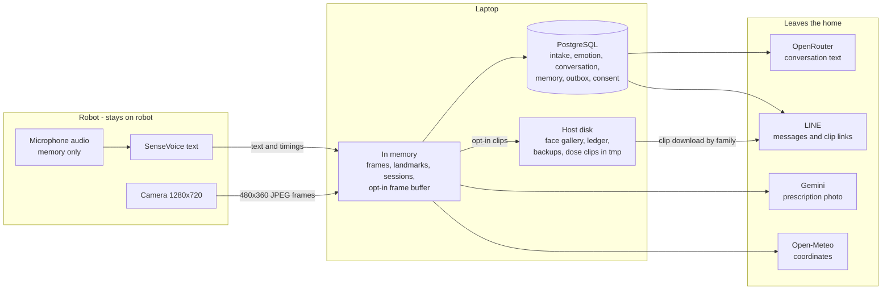
```mermaid
flowchart LR
  subgraph Robot["Robot - stays on robot"]
    Mic["Microphone audio<br/>memory only"]
    Cam["Camera 1280x720"]
    STT["SenseVoice text"]
  end
  subgraph Laptop["Laptop"]
    RAM["In memory<br/>frames, landmarks, sessions,<br/>opt-in frame buffer"]
    PG[("PostgreSQL<br/>intake, emotion, conversation,<br/>memory, outbox, consent")]
    Disk["Host disk<br/>face gallery, ledger,<br/>backups, dose clips in tmp"]
  end
  subgraph Out["Leaves the home"]
    OR["OpenRouter<br/>conversation text"]
    LINE["LINE<br/>messages and clip links"]
    GEM["Gemini<br/>prescription photo"]
    OM["Open-Meteo<br/>coordinates"]
  end
  Mic --> STT
  STT -- "text and timings" --> RAM
  Cam -- "480x360 JPEG frames" --> RAM
  RAM --> PG
  RAM -- "opt-in clips" --> Disk
  PG --> OR
  PG --> LINE
  Disk -- "clip download by family" --> LINE
  RAM --> GEM
  RAM --> OM
```

| Data | Lives in | Kept |
|---|---|---|
| Camera frames | Laptop RAM only, unless the patient opted in to dose videos | processed and dropped; the opt-in buffer holds the last 20 s and can stay in RAM up to about 2 min 20 s after a session (section 8) |
| Microphone audio | Robot RAM only | never stored (`reachy_app/medcare_reachy/bridge/voice.py:1-8`) |
| Dose records, emotion results, notifications | PostgreSQL | until account deletion (no purge job) |
| Conversation turns | PostgreSQL | 30 days (flagged 180 days) |
| Face photos | Host bind mount | until account deletion |
| Dose-video clips | Container `/tmp` | ≤ 24 h after send |

Full tables are in sections 21 and 22.

## 2. Medication schedule and reminders

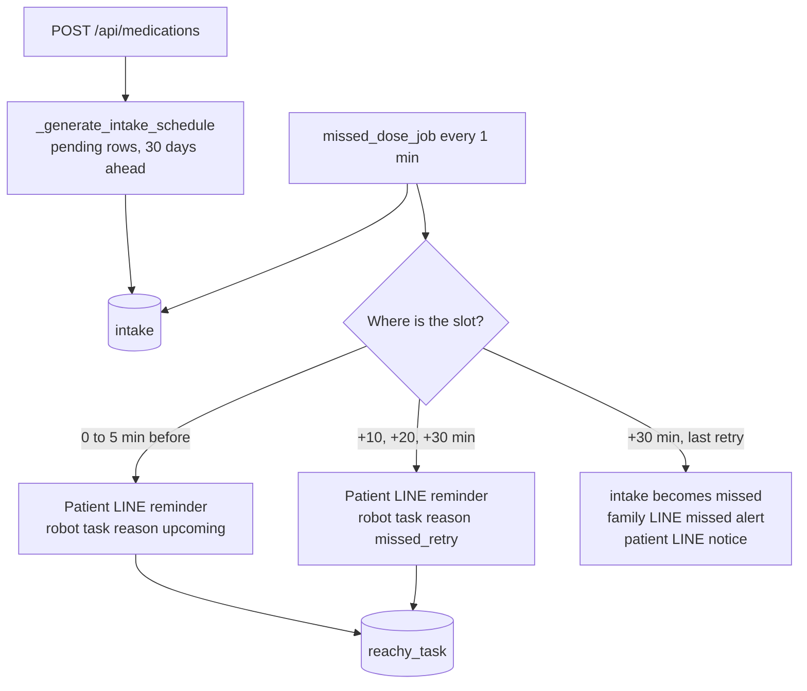
```mermaid
flowchart TD
  A["POST /api/medications"] --> B["_generate_intake_schedule<br/>pending rows, 30 days ahead"]
  B --> C[("intake")]
  J["missed_dose_job every 1 min"] --> C
  J --> D{"Where is the slot?"}
  D -- "0 to 5 min before" --> U["Patient LINE reminder<br/>robot task reason upcoming"]
  D -- "+10, +20, +30 min" --> W["Patient LINE reminder<br/>robot task reason missed_retry"]
  D -- "+30 min, last retry" --> M["intake becomes missed<br/>family LINE missed alert<br/>patient LINE notice"]
  U --> T[("reachy_task")]
  W --> T
```

**Steps**
1. **Create.** `POST /api/medications` calls `_generate_intake_schedule` (`app/routers/api_medications.py:18-40,479-483`).
   - It inserts `pending` intake rows from `schedule.occurrences()`: 30 days ahead (`HORIZON_DAYS`) or until `use_before` (`app/services/schedule.py:20,99-118`). `ON CONFLICT DO NOTHING`.
   - Times: presets 08:00 / 12:00 / 20:00 / 22:00 plus `custom_times`, at most 8 a day, and an optional ISO weekday filter (`schedule.py:16,19,44,56-60`).
2. **Edit.** `PATCH /api/medications/ID` deletes future pending/missed rows and regenerates them, but only when the times, weekdays, `use_before` or `active` changed (`api_medications.py:43-54,516-569`). `/archive` clears future rows; `/reactivate` regenerates from now (`:576-612`).
3. **No top-up.** Nothing extends a schedule, so it ends 30 days after its last edit (`CLAUDE.md:173`).
4. **Reminder job.** `check_missed_doses` runs every minute (`app/jobs/missed_dose_job.py:49-255`). Settings defaults come from `notification_settings`: remind 5 min before, then every 10 min, 3 retries, notify family on missed.
   - Doses are grouped per (patient, 5-minute slot) (`SLOT_WINDOW_MINUTES`, `:17,20-28,90-93`).
   - Each dose gets an overdose-protection verdict on the run's clock (`dose_safety.verdicts`, `:137-142`). The robot is sent only for allowed doses, and held-back doses get their refusal sentence in the patient's LINE text (`:38-46`).
   - **Upcoming** (`0 < time to slot ≤ 5 min`): LINE text to the patient's own `user.line_id` and a `notification` row. Then, in one transaction, `reminder_sent = TRUE` and `enqueue_reachy_task(reason='upcoming')` inside a savepoint (`:144-179`).
   - **Overdue** at +10, +20, +30 min: patient LINE 「請盡快服用」 for allowed doses, `missed_reminders_sent + 1`, and a robot task with `reason='missed_retry'` (`:182-205`).
   - **Missed** at +30 min (retries × interval): `intake_stats='missed'`, LINE `send_missed_dose_alert` to verified family with `notify_missed`, and a LINE notice to the patient (`:208-255`). With the defaults, the third warning and the missed alert fire in the same run.
   - The robot task expires at slot + 10 × (3 + 1) = 40 min (`:129`).
5. **Manual actions.**
   - Take Now: `POST /api/medications/ID/intake-now` reuses the nearest open dose or inserts an ad-hoc row whose time is never a whole minute (`api_medications.py:222-366`; `app/services/dose_safety.py:87-90`).
   - Mark taken, skipped, missed or pending from the app: `PATCH /api/medications/intake/ID {status}` → `transition_intake` (`api_medications.py:369-395`; `app/services/intake_repository.py:127-160`).
     - A dose awaiting a caregiver's answer is refused (409 `awaiting_caregiver_confirmation`, `:141-142`).
     - `taken` runs `dose_safety.check(lock=True)` and takes stock; leaving `taken` returns the stock (`:146-155`).
     - A refusal returns the 409 sentence only. **No double-dose alert:** a button press is no evidence of a second pill (`:147-148`).
   - Skip: `api_intake.py` sends a direct LINE notice (`app/routers/api_intake.py:107`).

**Stored:** `intake` rows (no purge; future pending rows go on edit or archive), `notification` rows, `reachy_task` rows.

**Leaves the home:** LINE texts with the patient name, medicine names and slot times. These reminders go **directly** through `LineService`, not the outbox, so there is no retry. No consent check is made for these LINE reminders (none in `missed_dose_job.py`).

## 3. Robot task lease and reminder slot

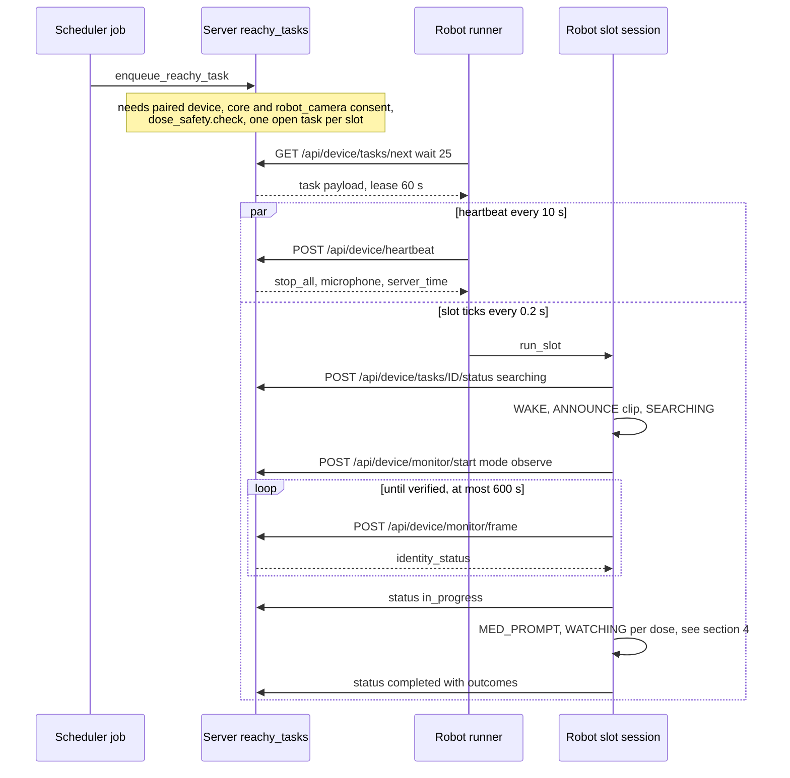
```mermaid
sequenceDiagram
  participant J as Scheduler job
  participant S as Server reachy_tasks
  participant R as Robot runner
  participant P as Robot slot session
  J->>S: enqueue_reachy_task
  Note over S: needs paired device, core and robot_camera consent,<br/>dose_safety.check, one open task per slot
  R->>S: GET /api/device/tasks/next wait 25
  S-->>R: task payload, lease 60 s
  par heartbeat every 10 s
    R->>S: POST /api/device/heartbeat
    S-->>R: stop_all, microphone, server_time
  and slot ticks every 0.2 s
    R->>P: run_slot
    P->>S: POST /api/device/tasks/ID/status searching
    P->>P: WAKE, ANNOUNCE clip, SEARCHING
    P->>S: POST /api/device/monitor/start mode observe
    loop until verified, at most 600 s
      P->>S: POST /api/device/monitor/frame
      S-->>P: identity_status
    end
    P->>S: status in_progress
    P->>P: MED_PROMPT, WATCHING per dose, see section 4
    P->>S: status completed with outcomes
  end
```

**Steps**
1. **Enqueue** (`app/services/reachy_tasks.py:92-129`).
   - Requires an un-revoked device (`:105-108`), current `core` + `robot_camera` consent (`:109-111`), and `dose_safety.check` (`:112-113`).
   - `INSERT reachy_task … ON CONFLICT DO NOTHING` keeps one open task per (patient, slot). A still-queued task is re-armed with `attempt + 1` and a later expiry (`:114-123`).
   - Other sources: `POST /api/reachy/tasks` (manual) and `POST /api/reachy/checkin` (conversation only, `reason='checkin'`, 15-minute expiry) (`app/routers/api_reachy.py:101-163`).
2. **Lease.** The robot long-polls `GET /api/device/tasks/next?wait=25` (`app/routers/api_device.py:34,111-114`; `bridge/runner.py:34,418`).
   - `lease_next` checks every 1 s (`reachy_tasks.py:151-159`).
   - `_lease_once` sets `status='leased'` and `lease_until = NOW() + 60 s`. It picks the oldest unexpired queued task with `FOR UPDATE SKIP LOCKED`, skipping tasks whose doses are not yet startable (R1/R4) (`:19,132-148`).
   - On start-up the robot first calls `GET /api/device/tasks/current` to resume a lease it already holds (`bridge/runner.py:408-429`).
3. **Payload** (`task_payload`, `reachy_tasks.py:62-89`):
   - `task_id`, `slot_time`, `reason`, `attempt`, `status`, `expires_at`, `patient_name`, `auto_record`;
   - `microphone`: `robot_microphone` consent is current;
   - `checkin`: all 4 check-in scopes are current;
   - `doses[]`: `intk_id`, `med_id`, `med_name`, `pill_description`, `dose_form`, `units_per_dose`, `intake_stats`, `supported`.
4. **Slot.** The robot's state machine (`bridge/session.py:194-546`):
   - `WAKE` (robot offline → abort);
   - `ANNOUNCE`: clip `wake_greeting`, or `reminder` for `missed_retry`;
   - `SEARCHING`: observe session, scan yaw every 4 s, clip `searching` every 120 s, give up after 600 s with `not_found`;
   - then a prompt per dose (section 4), an optional check-in (section 9), a 120 s `POST_SLOT_OBSERVE`, and `WIND_DOWN` (clip, status `completed` with the outcomes, robot sleeps).
5. **Status transitions** allowed by the server: `leased → searching | aborted`, `searching → in_progress | not_found | aborted`, `in_progress → completed | not_found | aborted` (`reachy_tasks.py:24-28,171-202`). The robot walks `OPEN_ORDER` step by step and ignores a 409 (`session.py:714-727`).
6. **Maintenance** every minute (`reachy_tasks.py:212-252`):
   - expire tasks past `expires_at`;
   - re-queue lapsed leases;
   - if a slot is due and the robot has not heartbeat for 60 s, queue a `robot_offline` outbox notice, at most once per 6 h per patient.

**Stored:** `reachy_task` (status, attempt, lease, outcomes; no purge) and `reachy_device` heartbeat fields.

**Leaves the home:** nothing in this step. The `robot_offline` LINE notice goes to family.

## 4. Robot dose session: frames to decision

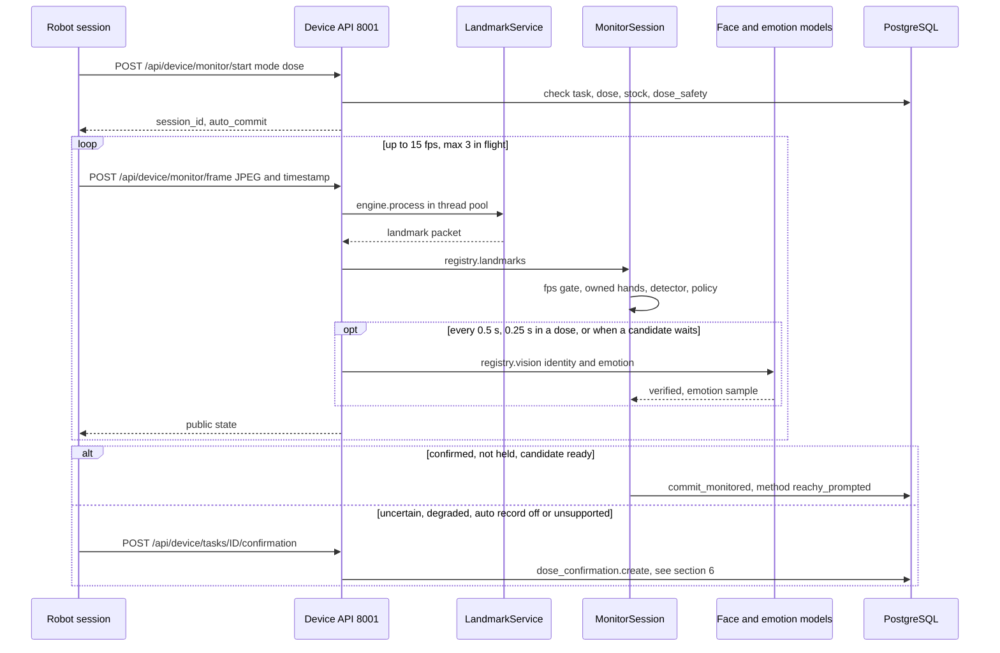
```mermaid
sequenceDiagram
  participant P as Robot session
  participant API as Device API 8001
  participant LM as LandmarkService
  participant MS as MonitorSession
  participant FR as Face and emotion models
  participant DB as PostgreSQL
  P->>API: POST /api/device/monitor/start mode dose
  API->>DB: check task, dose, stock, dose_safety
  API-->>P: session_id, auto_commit
  loop up to 15 fps, max 3 in flight
    P->>API: POST /api/device/monitor/frame JPEG and timestamp
    API->>LM: engine.process in thread pool
    LM-->>API: landmark packet
    API->>MS: registry.landmarks
    MS->>MS: fps gate, owned hands, detector, policy
    opt every 0.5 s, 0.25 s in a dose, or when a candidate waits
      API->>FR: registry.vision identity and emotion
      FR-->>MS: verified, emotion sample
    end
    API-->>P: public state
  end
  alt confirmed, not held, candidate ready
    MS->>DB: commit_monitored, method reachy_prompted
  else uncertain, degraded, auto record off or unsupported
    P->>API: POST /api/device/tasks/ID/confirmation
    API->>DB: dose_confirmation.create, see section 6
  end
```

**Steps**
1. **Start** (`POST /api/device/monitor/start`, `app/routers/api_device.py:548-583`).
   - Checks: face recognition is available (else 503), the task is leased and owns the dose, the dose is pending or missed, stock ≥ `units_per_dose`, the medicine is active, and `dose_safety.check` passes (else 409).
   - `auto_commit = device.auto_record AND supported`, where supported means `solid_oral` and 1 unit (`reachy_tasks.py:37-42`). `auto_record` defaults to FALSE (`sql/init.sql:276-284`).
   - `registry.replace(client_type='reachy')`. A live session of another client type within 5 s gives 409 `busy_other_client` (`app/services/monitor_service.py:34,318-322,354-371`).
   - `clip_enabled` is set from the `dose_video` consent (`api_device.py:582`).
2. **Robot encodes frames** (`bridge/runner.py:38-61,209-247`):
   - camera 1280×720 → 4:3 centre (960×720) → halved to 480×360 → JPEG quality 70, about 12 ms on the CM4;
   - paced by the camera, target 15 fps, at most 3 requests in flight;
   - the daemon caps the camera at 10 fps unless patched (`CLAUDE.md:87`).
3. **Frame request.** `POST /api/device/monitor/frame`, multipart `session_id`, `generation`, `frame_seq`, `timestamp` (robot clock) and the file (`api_device.py:651-703`).
   - Limits: ≤ 1,000,000 B and ≤ 1920×1080 (`:35,614-623`).
   - Under the session's `frame_lock`, an old `frame_seq` is ignored (`:668-673`).
   - If `clip_enabled`, the JPEG is copied into the dose-video buffer (`:678-679`).
   - The per-session `VisionEngine` computes landmarks in the executor, and the packet goes to `registry.landmarks` (`:680-687`). A frame held over 0.25 s is logged.
4. **Monitor session** (`monitor_service.py:403-483`):
   - frame-rate gate: 3 s window, ≥ 1 s span, ≥ 12 fps, gap ≤ 0.25 s, else `degraded` (`:27-30,268-282`);
   - the last 48 packets are kept;
   - owned-hand selection, then the detector and the v1 policy ([MODELS.md](MODELS.md#7-pill-intake-detector)).
5. **Identity and emotion** (`_maybe_start_vision`, `api_device.py:638-648,694-702`; `monitor_service.py:485-574`):
   - a vision call starts in the background every 0.5 s, every 0.25 s for a verified dose session without an emotion result yet, and at once while a candidate waits;
   - identity runs on a call while the patient is unverified or a candidate is pending, otherwise at most every 0.5 s (`monitor_service.py:505`);
   - verified means `identity_hits ≥ 2` and the latest hit no more than 1.5 s old (`:202-203`). The hits can be spread over longer; the count resets only on a mismatch, ambiguity or a box jump with IoU < 0.20 (`:519-542`);
   - emotion runs on every call once the patient is verified and `select_owned_observations` accepts the frame; samples go to `dose_emotion.add_sample`, covered mouths marked `occluded` (`:543-574`).
6. **Candidate** (`monitor_service.py:459-482`). On a closed `confirmed` or `uncertain` event in dose mode, a candidate is created: `event_id`, decision, confidence, `frame_seq`, emotion mean, identity distance, `degraded`, `ready=False`.
   - Hold policy: `observe`, `degraded` or `auto_commit_off` turn `confirmed` into `uncertain` (`:285-301`).
   - The candidate becomes **ready** on a vision frame with `frame_seq` ≥ the candidate's (the same frame counts), an uncovered mouth, and identity re-checked at or after the candidate's frame (`:575-587`, condition 581-584).
   - Observe mode reports events to `extra_events` (cap 20, `:35,459-465`). The robot files them with `POST /api/device/tasks/ID/extra-event`, which queues a LINE outbox message (`api_device.py:175-196`).
7. **Auto-commit** when the candidate is ready, `confirmed` and not held (`:588-590`): `_reachy_commit` → `commit_monitored(..., "reachy_prompted")` (`api_device.py:543-545`), then the session switches to `observe`.
   - **Commit transaction** (`app/services/intake_repository.py:27-96`):
     1. lock the intake row;
     2. idempotency check on `monitor_event.event_id`;
     3. `dose_safety.check(lock=True, started_at, after_intake=True)`;
     4. `take_stock` removes `units_per_dose`;
     5. optional `emotion` row (`during_ingestion`);
     6. intake becomes `taken`, `actual_intake_time=NOW()`, `taken_notified=FALSE`, with confidence, method, `emot_id` and `units_taken`;
     7. insert a `monitor_event` row.
   - After the commit: `dose_video.capture` (if enabled) and `dose_emotion.note_resolution`. A refusal raises a double-dose alert and a 409.
8. **Robot side** (`bridge/session.py:285-357`):
   - `recorded.status == taken` → clip `thanks`;
   - a ready candidate that was not recorded → confirmation with source `unsupported_dose`, `auto_record_off`, `degraded` or `uncertain_detection` (`:588-595`);
   - "I finished" heard and no camera result within 8 s → source `patient_claim`;
   - not verified for 90 s → `left_pending`;
   - 180 s without an event → clip `help`, and after 180 s more → `left_pending`.
   - A 409 refusal with `speech_text` is spoken once per dose if the patient was seen in the last 90 s (`session.py:360-393`).

**Stored**

| What | Where | How long |
|---|---|---|
| Frames | RAM; optional dose-video buffer (section 8) | dropped after processing; buffer up to about 2 min 20 s after the session |
| Landmark packets | RAM, 48 per session | until the session ends (idle sweep 600 s) |
| Intake status, stock, `monitor_event`, `emotion` | PostgreSQL | until account deletion |

**Leaves the home:** nothing. Robot ↔ laptop traffic stays on the LAN, as plain HTTP.

**Today in practice:** the robot camera runs at about 10 fps, so every robot dose is `degraded` and goes to family confirmation (section 6), even with `auto_record` on (`CLAUDE.md:87`).

## 5. Browser intake monitor

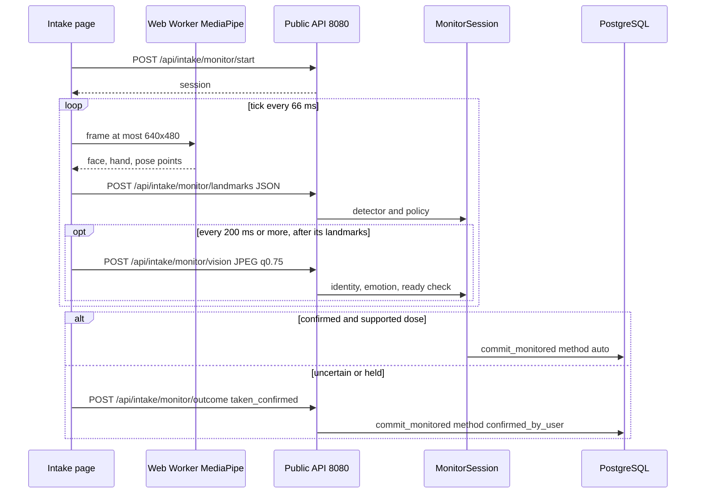
```mermaid
sequenceDiagram
  participant UI as Intake page
  participant W as Web Worker MediaPipe
  participant API as Public API 8080
  participant MS as MonitorSession
  participant DB as PostgreSQL
  UI->>API: POST /api/intake/monitor/start
  API-->>UI: session
  loop tick every 66 ms
    UI->>W: frame at most 640x480
    W-->>UI: face, hand, pose points
    UI->>API: POST /api/intake/monitor/landmarks JSON
    API->>MS: detector and policy
    opt every 200 ms or more, after its landmarks
      UI->>API: POST /api/intake/monitor/vision JPEG q0.75
      API->>MS: identity, emotion, ready check
    end
  end
  alt confirmed and supported dose
    MS->>DB: commit_monitored method auto
  else uncertain or held
    UI->>API: POST /api/intake/monitor/outcome taken_confirmed
    API->>DB: commit_monitored method confirmed_by_user
  end
```

**Steps**
1. **Start.** "Take pill" → `POST /api/intake/monitor/start {intk_id}` (`frontend_source/src/pages/Intake.tsx:393`; `app/routers/api_monitor.py:77-102`).
   - Needs face recognition and emotion available (else 503), the dose pending/missed, in stock and active, and `dose_safety.check`.
   - `auto_commit` = supported dose. There is no `auto_record` switch for the browser.
2. **Camera.** `getUserMedia` at ideal 640×480 (`Intake.tsx:401-403`). The worker loads three MediaPipe Tasks models from `/wasm` and `/models`, GPU first (`frontend_source/src/workers/monitorWorker.ts:21-57`).
3. **Every 66 ms** (`Intake.tsx:336-374,416`):
   - Skip if the worker or the landmark request is busy.
   - Draw the frame scaled to ≤ 640×480 and transfer it to the worker.
   - Every ≥ 200 ms, also queue `canvas.toBlob('image/jpeg', 0.75)` for that frame.
4. **Landmarks.** `POST /api/intake/monitor/landmarks` with ≤ 4 faces, ≤ 4 poses, ≤ 8 hands, width ≤ 1920, height ≤ 1080 (`api_monitor.py:40-49,105-111`). Same detector and policy as section 4.
5. **Vision.** After the landmark POST for the same frame succeeds: `POST /api/intake/monitor/vision` (multipart, ≤ 1 MB, `api_monitor.py:114-127`), at most 5 per second. It fills the video buffer if enabled.
   - Identity runs on every call while the patient is unverified or a candidate is pending, otherwise at most every 0.5 s (`monitor_service.py:505`).
   - Emotion runs on every call once the patient is verified and `select_owned_observations` accepts the frame (`:543-563`).
   - On a ready `confirmed` candidate it auto-commits with method `auto` (`monitor_service.py:589`).
6. **Patient answer** for an uncertain or held candidate: `POST /outcome {taken_confirmed | not_taken | undo}` (`api_monitor.py:130-152`).
   - `taken_confirmed` → `commit_monitored(method="confirmed_by_user")`.
   - Undo → `undo_monitored`, which restores stock and marks the event rejected (`intake_repository.py:99-124`).
7. **End.** `/end`, `/recent` (last 10 taken events). Idle sessions end after 600 s without a packet (`monitor_service.py:37,383-393`).

**Stored:** sessions, the last 48 packets and emotion samples (120 s) in RAM; on commit: `intake`, `monitor_event`, `emotion` and a `dose_emotion` row.

**Leaves the home:** nothing. The models run in the browser, and only landmark JSON and ≤ 5 fps JPEGs go to the laptop. The browser must use `localhost` or HTTPS for the camera (`README.md:30`).

## 6. Caregiver confirmation over LINE

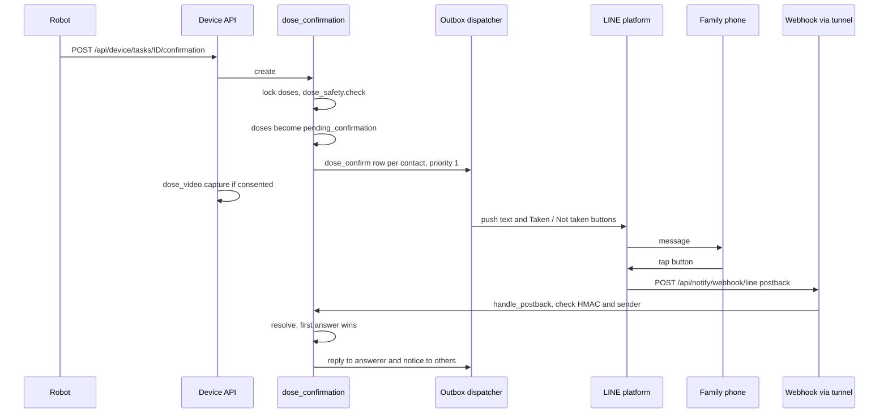
```mermaid
sequenceDiagram
  participant R as Robot
  participant API as Device API
  participant DC as dose_confirmation
  participant OB as Outbox dispatcher
  participant L as LINE platform
  participant F as Family phone
  participant WH as Webhook via tunnel
  R->>API: POST /api/device/tasks/ID/confirmation
  API->>DC: create
  DC->>DC: lock doses, dose_safety.check
  DC->>DC: doses become pending_confirmation
  DC->>OB: dose_confirm row per contact, priority 1
  API->>API: dose_video.capture if consented
  OB->>L: push text and Taken / Not taken buttons
  L->>F: message
  F->>L: tap button
  L->>WH: POST /api/notify/webhook/line postback
  WH->>DC: handle_postback, check HMAC and sender
  DC->>DC: resolve, first answer wins
  DC->>OB: reply to answerer and notice to others
```

**Steps**
1. **Robot request** `POST /api/device/tasks/ID/confirmation {intk_id, source, evidence}` (`app/routers/api_device.py:134-165`).
   - Sources: `uncertain_detection`, `unsupported_dose`, `degraded`, `auto_record_off`, `patient_claim`.
   - Evidence: `event_id`, `decision`, `confidence`, `frame_seq`, `degraded`, `landmark_fps`, `said_done` (or for a claim: `phrase`, `camera: no_event`).
   - `started_at` comes from the open robot session for that dose (`:142-146`).
2. **Create** (`app/services/dose_confirmation.py:176-224`):
   1. Lock the doses and run `dose_safety.check(lock=True, started_at, after_intake=True)`. Its facts add notes: last taken within 24 h, early by more than 30 min (`dose_safety.py:566-585`).
   2. Doses become `pending_confirmation`, with no stock change.
   3. Insert `dose_confirmation` (`previous_status` JSON, source, evidence).
   4. Queue an outbox `dose_confirm` row per eligible contact: verified, `notify_missed`, has a `line_id`, not `'user'` (`:104-108`).
3. **Message** (`:122-167`): the reason (with fps when degraded), medicines, notes, the AI estimate (`dose_report.ai_estimate`, e.g. `48%（不確定）`), and a buttons template with two signed postbacks.
4. **Clip:** `dose_emotion.note_resolution_for` and `dose_video.capture`. The clip is sent at once with the request through `send_with_confirmation` (`app/services/dose_video.py:162-187`).
5. **Delivery:** outbox → `POST https://api.line.me/v2/bot/message/push` with `X-Line-Retry-Key` (`app/services/outbox_dispatcher.py:62-104`).
6. **Answer.** The LINE webhook postback → `handle_postback` (`app/routers/api_notify.py:89-101`; `dose_confirmation.py:329-349`).
   - Data: `action=dose_confirm&id=<uuid>&a=taken|not_taken&c=<contact_id>&s=<16-hex HMAC-SHA256(SECRET_KEY)>`, ≤ 300 chars (`:56-87`).
   - The sender's LINE userId must equal the contact's `line_id`; the contact must be verified, not `'user'`, and belong to that patient (`:336-345`).
7. **Resolve** (`:262-326`). The first answer wins.
   - **Taken:** per dose, `dose_safety.facts(asked=created_at, lock=True)` then `evaluate`.
     - Refused → restore the previous status. Only `dose_too_soon` and `daily_max_reached` also queue a double-dose alert; a not-due or expired refusal sends none (`dose_confirmation.py:297-305`; `dose_safety.py:254,528-529`).
     - Otherwise `take_stock`, intake `taken`, `actual_intake_time = created_at`, method `caregiver_confirmed`.
   - **Not taken:** restore the previous statuses.
   - Replies through the outbox: an ack to the answerer, "X answered" to the others, "already answered/expired" to latecomers (`:362-416`).
8. **No answer** (minute job, `:419-472`): a reminder after 60 min, and expiry at max(missed window, 120 min), which restores the previous status. While pending, manual edits are refused (`intake_repository.py:139-142`), and the dose counts as taken for R2/R3 (section 7).

**Stored:** `dose_confirmation`, `notification_outbox` (full payload), intake status. No purge.

**Leaves the home:** to LINE: patient name, medicine names, reason, fps, AI estimate %, last-taken notes, and optionally the clip link. From LINE: the postback (the contact's userId and the answer).

## 7. Overdose protection decision points

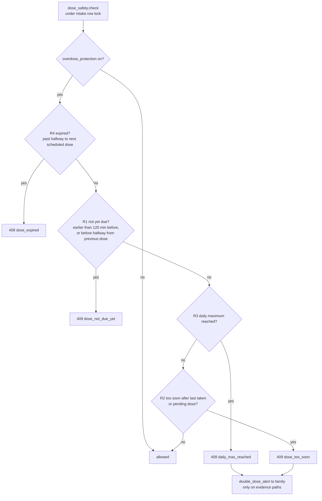
```mermaid
flowchart TD
  S["dose_safety.check<br/>under intake row lock"] --> OFF{"overdose_protection on?"}
  OFF -- "no" --> OK["allowed"]
  OFF -- "yes" --> R4{"R4 expired?<br/>past halfway to next scheduled dose"}
  R4 -- "yes" --> X4["409 dose_expired"]
  R4 -- "no" --> R1{"R1 not yet due?<br/>earlier than 120 min before,<br/>or before halfway from previous dose"}
  R1 -- "yes" --> X1["409 dose_not_due_yet"]
  R1 -- "no" --> R3{"R3 daily maximum reached?"}
  R3 -- "yes" --> X3["409 daily_max_reached"]
  R3 -- "no" --> R2{"R2 too soon after last taken<br/>or pending dose?"}
  R2 -- "yes" --> X2["409 dose_too_soon"]
  R2 -- "no" --> OK
  X3 --> A["double_dose_alert to family<br/>only on evidence paths"]
  X2 --> A
```

**Rules** (`app/services/dose_safety.py:9-17`; `evaluate` at `:257-288`, checked in the order R4, R1, R3, R2)

| Rule | Meaning | Numbers |
|---|---|---|
| R4 expiry | A dose not taken by halfway to the same medicine's next scheduled dose stays missed. Ad-hoc doses never expire | `:93-103` |
| R1 due | From `DOSE_EARLY_MINUTES` before the scheduled time, never before halfway from the previous dose | 120 min (`app/config.py:43`; `app/services/schedule.py:141,164-178`) |
| R3 daily maximum | `max_daily_doses`, else the number of daily times, counted on the scheduled Taipei day. Open confirmation requests count | 1-24 (`:79-84,170-194`) |
| R2 minimum gap | `min_interval_minutes`, else half the shortest daily gap (12 h for once a day), else 240 min. Measured from the nearest taken dose or an open request's `created_at` | 30-2880 min (`:46,67-76`) |

- **Clock:** evidence paths judge R1 and R4 at `min(at, started_at)`, when the camera session started (`:268`).
- **Concurrency:** `LOCK_SQL` locks the medicine rows in its own statement before `FACTS_SQL` reads (`:195-199,291-297`).
- **Call sites:** `enqueue_reachy_task` (`reachy_tasks.py:113`), `_lease_once` (`startable_sql`, `:144`), device and browser `monitor/start` (`api_device.py:574`; `api_monitor.py:92`), manual task (`api_reachy.py:133,144-147`), Take Now (`api_medications.py:319,362`), `commit_monitored` (`intake_repository.py:69-70`), `transition_intake` (`:149`), `dose_confirmation.create`/`resolve` (`dose_confirmation.py:199,295-296`), and `missed_dose_job` verdicts (`missed_dose_job.py:138`).
- **409 body** (`refusal_body`, `dose_safety.py:458-465`; `schedule.py:206-255`):
  - `detail`, `intk_id`, `med_name`, `scheduled_time` and the rule's times;
  - `reply`: one sentence in the patient's language (the latest check-in's, else zh-TW);
  - `speech_text`: the same in Simplified;
  - `after_intake`.
  - Latin-letter medicine names are spoken as 「這個藥」 (`:372-378`).
- **Double-dose alert** (`:522-549`): only for `dose_too_soon` / `daily_max_reached` on an evidence path (camera commit, robot request, caregiver "taken"). It is a priority-0 `double_dose_alert` to `notify_missed` contacts, at most once per dose per rolling hour.
- **Switch:** `notification_settings.overdose_protection`, default TRUE (`sql/init.sql:263`). Turning it off tells every verified contact through the outbox (`dose_safety.py:598-609`; `api_notify.py:266-300`).

**Stored:** nothing new beyond the `notification` and outbox rows. **Leaves the home:** the double-dose alert and the protection-off notice go to LINE.

## 8. Taken report and dose videos

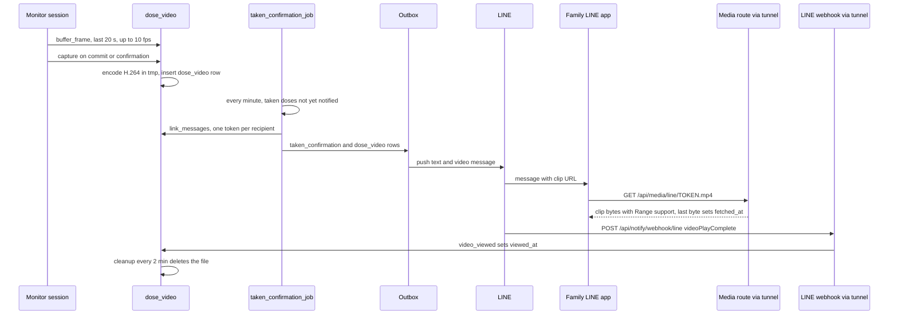
```mermaid
sequenceDiagram
  participant MS as Monitor session
  participant DV as dose_video
  participant J as taken_confirmation_job
  participant OB as Outbox
  participant L as LINE
  participant F as Family LINE app
  participant M as Media route via tunnel
  participant WH as LINE webhook via tunnel
  MS->>DV: buffer_frame, last 20 s, up to 10 fps
  MS->>DV: capture on commit or confirmation
  DV->>DV: encode H.264 in tmp, insert dose_video row
  J->>J: every minute, taken doses not yet notified
  J->>DV: link_messages, one token per recipient
  J->>OB: taken_confirmation and dose_video rows
  OB->>L: push text and video message
  L->>F: message with clip URL
  F->>M: GET /api/media/line/TOKEN.mp4
  M-->>F: clip bytes with Range support, last byte sets fetched_at
  L->>WH: POST /api/notify/webhook/line videoPlayComplete
  WH->>DV: video_viewed sets viewed_at
  DV->>DV: cleanup every 2 min deletes the file
```

**Steps**
1. **Buffer** (`app/services/dose_video.py:82-92`). Only while `clip_enabled`, i.e. the `dose_video` consent at session start. JPEGs the server already receives are kept in RAM per patient: the last 20 s, frames ≥ 0.1 s apart (≤ 10 fps), ≤ 24 MB (`:41-43`).
   - Old frames are trimmed only when a new frame arrives (`:91-92`). Nothing drops the buffer when a session ends: the 2-minute cleanup drops buffers whose newest frame is more than 20 s old (`:445-447`; `app/jobs/scheduler.py:73-79`). After a session, up to 20 s of JPEGs (≤ 24 MB) can therefore stay in RAM for up to about 2 min 20 s. A restart loses them.
   - The buffer is also dropped when consent is withdrawn (`delete_all`, `:397-398`) or found withdrawn at encoding (`:143-144`).
2. **Capture** (`capture`, `:112-125`). Called from `commit_monitored` (`intake_repository.py:35-36`) and the robot confirmation (`api_device.py:161-164`).
   - Clip window: event start − 2 s, 6-15 s long, or the last 20 s with no event. Needs ≥ 5 frames, the newest ≤ 30 s old (`:99-109`).
3. **Store** (`_store`, `:140-159`). Re-checks consent, encodes in the executor (H.264, [MODELS.md section 18](MODELS.md#18-other-processing-not-models)), writes to `DOSE_VIDEO_DIR` (default `/tmp/medcare_dose_videos`) and inserts a `dose_video` row.
4. **Taken report** (`app/jobs/taken_confirmation_job.py`, every minute):
   - Selects `taken` doses with `taken_notified=FALSE` within 2 h by `GREATEST(actual_intake_time, resolved_at)` (`:25,93-122`).
   - Groups per (patient, 5-minute slot) and sends once 5 min have passed since the earliest dose (`:21,139-140`).
   - If `notify_family_on_taken` is off, clips are discarded and rows marked (`:132-138`).
   - Recipients: verified contacts with `notify_taken` and a `line_id`, not `'user'` (`:142-146`).
   - Text per dose: how it was recorded, the AI estimate (高 / 不確定 / 低 at 0.75 / 0.45, `app/services/dose_report.py:8,16-44`), low-fps and "said done" notes, the footnote "AI can't see the pill", and a video note.
   - Outbox rows: `taken_confirmation` (dedupe `taken:{u_id}:{min intk}:{recorded ts}:{contact}`), plus one `dose_video` row per clip per contact. Then `taken_notified = TRUE` (`:165-183`).
5. **Links** (`link_messages`, `dose_video.py:314-332`):
   - per contact, `token = secrets.token_urlsafe(32)` (43 chars), stored only as `token_sha256` in `dose_video_link`;
   - video message `originalContentUrl = {base}/api/media/line/{token}.mp4`, `previewImageUrl = …jpg`, `trackingId = dv-<link uuid hex>`;
   - `sent_at = NOW()`, `expires_at = +24 h`.
   - Base URL: `PUBLIC_BASE_URL` if https, else the current LINE webhook host checked with a probe, cached 300 s (60 s on failure) (`:58-59,250-281`). No base URL → the clip is deleted as `no_public_link`.
6. **Serving** (`app/routers/api_dose_video.py:46-72`):
   - public, no login; the clip must not be deleted or expired, and consent must still be current;
   - Range support, headers `Cache-Control: private, no-store`, `X-Robots-Tag: noindex`, no referrer;
   - serving the last byte sets `fetched_at`; LINE's `videoPlayComplete` from that recipient sets `viewed_at` (`api_notify.py:103-110`).
7. **Cleanup** every 2 min (`dose_video.py:406-462`). Files are deleted:
   - 10 min after every link was fetched or viewed;
   - 24 h after sending in any case;
   - after 4 h if never sent;
   - at once on consent withdrawal;
   - when superseded, unlinked, or orphaned for 600 s.
   - Rows stay as a record without media.

**Stored**

| What | Where | How long |
|---|---|---|
| Frame buffer | RAM | last 20 s while frames arrive; after the session, up to about 2 min 20 s until the cleanup drops it; lost on restart |
| Clip and preview files | container `/tmp` (lost if the container is recreated) | ≤ 24 h after send, ≤ 4 h unsent |
| `dose_video`, `dose_video_link` rows | PostgreSQL | until account deletion |
| Outbox payloads | PostgreSQL | until account deletion |

**Leaves the home:** the text report to LINE; the clip bytes to each family member's LINE app through Cloudflare. Delivered videos stay on family phones and cannot be recalled (`CLAUDE.md:170`).

## 9. Check-in conversation

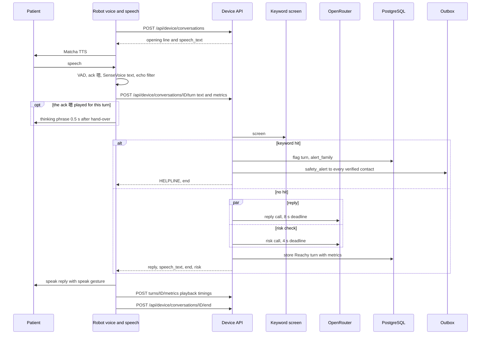
```mermaid
sequenceDiagram
  participant Pt as Patient
  participant R as Robot voice and speech
  participant API as Device API
  participant SC as Keyword screen
  participant LLM as OpenRouter
  participant DB as PostgreSQL
  participant OB as Outbox
  R->>API: POST /api/device/conversations
  API-->>R: opening line and speech_text
  R->>Pt: Matcha TTS
  Pt->>R: speech
  R->>R: VAD, ack 嗯, SenseVoice text, echo filter
  R->>API: POST /api/device/conversations/ID/turn text and metrics
  opt the ack 嗯 played for this turn
    R->>Pt: thinking phrase 0.5 s after hand-over
  end
  API->>SC: screen
  alt keyword hit
    API->>DB: flag turn, alert_family
    API->>OB: safety_alert to every verified contact
    API-->>R: HELPLINE, end
  else no hit
    par reply
      API->>LLM: reply call, 8 s deadline
    and risk check
      API->>LLM: risk call, 4 s deadline
    end
    API->>DB: store Reachy turn with metrics
    API-->>R: reply, speech_text, end, risk
  end
  R->>Pt: speak reply with speak gesture
  R->>API: POST turns/ID/metrics playback timings
  R->>API: POST /api/device/conversations/ID/end
```

**Trigger**
- After the last dose of a slot when `_may_chat`: the task's `checkin` flag (all 4 scopes `robot_microphone`, `cloud_voice`, `conversation_analysis`, `safety_alerts`) plus working microphone and speech (`bridge/session.py:560-566,631-634`; `reachy_tasks.py:45-49`).
- Or a conversation-only task from "Talk to Reachy now" (`POST /api/reachy/checkin`, `reason='checkin'`).

**Steps**
1. **Start.** `POST /api/device/conversations {task_id, language}` (`app/routers/api_device.py:318-338`). 403 `checkin_consent_required` without the 4 scopes (`:275-277`).
   - With memory consent, the opening may use the patient's own preferred name, and one follow-up event from 1-7 days ago is chosen (`app/services/memory.py:143-152,390-407`).
   - Inserts `conversation` and the opening Reachy turn.
2. **Robot listening** (`bridge/voice.py`, "chat" mode): Silero VAD (0.5 s pause ends a segment), the 「嗯」 ack at once, then SenseVoice. Echo guards drop Reachy's own voice. Only text and timings leave the robot (`:402-450`). The thinking phrase is armed only when the ack played for this turn, and plays 0.5 s after hand-over unless the patient speaks again (`:428-429`; [MODELS.md section 14](MODELS.md#14-robot-i-finished-matcher-and-echo-guards-bridgevoicepy)).
3. **Turn.** `POST /api/device/conversations/ID/turn {text, metrics}`, robot timeout 60 s (`api_device.py:341-437`; `bridge/app_client.py:202-209`).
   1. Consent re-check; text 1-500 chars.
   2. **Layer 1 keyword screen** before any model call (`conversation.screen`, `conversation.py:227-249`).
   3. DB transaction: lock the conversation (409 if ended), store the patient turn (`flagged` on a hit, `metrics.robot`), load history. `closing` = goodbye words or ≥ 6 patient turns.
   4. Memory block, built in a savepoint, only when there is no hit, no earlier flag and the turn is not closing (`api_device.py:381-394`).
   5. **Keyword hit:** `alert_family` in the same transaction, HELPLINE reply (119 / 1925), `end=True`, `risk_source='keyword'`.
   6. **Otherwise**, two concurrent calls (`:406-425`):
      - **layer 2** `classify_risk`: last 6 turns, 32 tokens, 4 s;
      - **reply** `reply_with_metrics`: system prompt + day background, memory block, last 12 turns, 200 tokens, 8 s.
      - A risk cancels the reply, uses HELPLINE, flags the turn and alerts.
      - A closing turn uses the fixed CLOSING line but is still risk-checked.
   7. Store the Reachy turn with `metrics.server`.
   8. An `unknown` risk result → `_late_risk_check` in the background: 30 s deadline, 20 s wait after a 429; in memory only (`:431-471`).
   9. Response `{reply, speech_text (Simplified), end, risk, reply_turn_id, server_ms}`.
4. **Playback.** Matcha TTS in chunks cut only at punctuation (comma clauses joined up to 16 chars; a clause without a comma stays whole; app 0.5.4, `speech.chunks`), with the "speak" antenna gesture unless it is a risk reply. Then `POST /api/device/conversations/ID/turns/TURN/metrics` with `round_trip_ms`, `tts_first_audio_ms`, `tts_total_ms`, `tts_chunks` (`session.py:427-438`).
5. **End.** `POST /api/device/conversations/ID/end {reason}`. Reasons: `goodbye`, `risk`, `silence` (25 s without an answer, or 300 s in total), `stopped`. It sets `after_chat_state='pending'` and runs `after_chat.process` in the background (`api_device.py:509-521`).
6. **Safety alert** (`conversation.alert_family`, `conversation.py:630-653`):
   - `UPDATE conversation SET risk_flag = TRUE … AND NOT risk_flag RETURNING`, so one alert per conversation;
   - a priority-0 `safety_alert` to every verified contact, quoting ≤ 120 chars of the patient's words;
   - `safety_alert_undelivered` in the app when there is no contact;
   - later turns get HELPLINE without a model call.

**Stored**

| What | Where | How long |
|---|---|---|
| Audio | robot RAM | never stored |
| `conversation_turn` (text, flags, metrics) | PostgreSQL | 30 days; flagged turns 180 days |
| `conversation` (model, follow-up id, flags) | PostgreSQL | until deleted by the patient or account |
| Late risk checks | server RAM | lost on restart |

**Leaves the home:** to OpenRouter: the conversation text (≤ 12 turns), the day background (date, time, lunar date, weather, holidays; no place name) and the memory block (reply only). To LINE (on risk): the alert with a quote.

## 10. After the chat: summary, risk backstop, memory

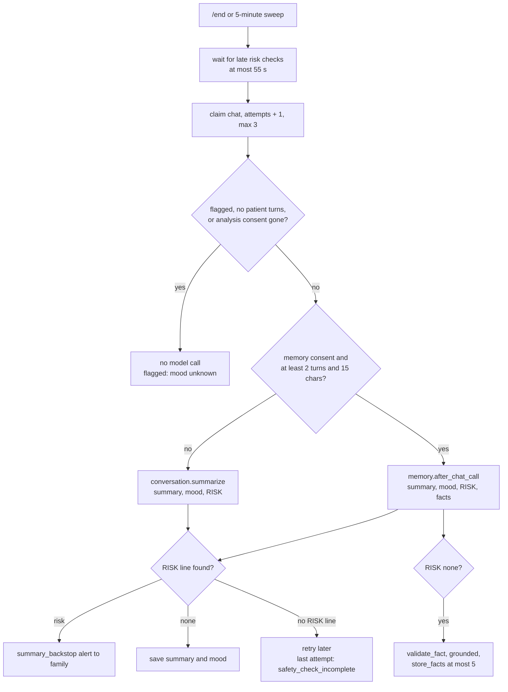
```mermaid
flowchart TD
  E["/end or 5-minute sweep"] --> W["wait for late risk checks<br/>at most 55 s"]
  W --> CL["claim chat, attempts + 1, max 3"]
  CL --> SK{"flagged, no patient turns,<br/>or analysis consent gone?"}
  SK -- "yes" --> NOC["no model call<br/>flagged: mood unknown"]
  SK -- "no" --> RT{"memory consent and<br/>at least 2 turns and 15 chars?"}
  RT -- "yes" --> AC["memory.after_chat_call<br/>summary, mood, RISK, facts"]
  RT -- "no" --> SU["conversation.summarize<br/>summary, mood, RISK"]
  AC --> J{"RISK line found?"}
  SU --> J
  J -- "risk" --> AL["summary_backstop alert to family"]
  J -- "none" --> SV["save summary and mood"]
  AC --> FA{"RISK none?"}
  FA -- "yes" --> VF["validate_fact, grounded,<br/>store_facts at most 5"]
  J -- "no RISK line" --> RE["retry later<br/>last attempt: safety_check_incomplete"]
```

**Steps** (`app/services/after_chat.py:70-268`)
1. Wait for this chat's late risk checks, bounded at 20 + 30 + 5 = 55 s (`:53-67`).
2. Claim: `attempts + 1`, state `pending`, `MAX_ATTEMPTS` 3 (`:26,165-172`).
3. Skip without a model call when:
   - the chat is flagged (summary NULL, mood `unknown`);
   - there are no patient turns;
   - `core` + `cloud_voice` + `conversation_analysis` consent is no longer current (`:177-192`).
4. Route (`:205-211`):
   - memory consent, ≥ 2 patient turns and ≥ 15 chars → `memory.after_chat_call`: one call with the transcript, a date table (today − 7 to + 14) and up to 40 known facts; temperature 0, 45 s (`memory.py:303-387`);
   - otherwise `conversation.summarize`: `SUMMARY_PROMPT`, 25 s (`conversation.py:583-610`).
5. A rate limit in the first 10 min is refunded and the chat stays `pending` (`:33,215-217`).
6. When judged (an ok answer or a risk found), save the summary and mood. On the final attempt with no judgement, send a `safety_check_incomplete` notification (`:222-238`).
7. **Risk backstop** (layer 3): a RISK line → `summary_backstop` alert. It quotes the summary only if Reachy had no memory notes in that chat (`conversation.py:656-662`; `after_chat.py:204,224`). If saving fails, the alert is still sent (`:149-158,239-247`).
8. **Facts**, only after an explicit `RISK: none`: ≤ 5, each passing `validate_fact` and `grounded`. `store_facts` locks the user row, re-reads consent uncached, checks the chat is not flagged and respects tombstones (`memory.py:81-141,249-283`).
9. Follow-up bookkeeping (`memory.finish_followup`, `:286-300`).
10. **Sweep** every 5 min (`app/jobs/after_chat_job.py:20-50`):
    - closes chats with no turn for 15 min (`end_reason='abandoned'`);
    - ends chats still unfinished after 2 days (`end_stale`);
    - retries `pending`/`failed` chats more than 1 min after they ended, ≤ 2 days old, in batches of 20.

**Stored:** `conversation.summary`, `mood` (until deleted), `patient_memory` rows (until deleted; events 30 days after their date), `notification`.

**Leaves the home:** the full transcript (and, with memory, the known facts and date table) to OpenRouter. On risk, an alert to LINE.

## 11. Memory read path and the memory API

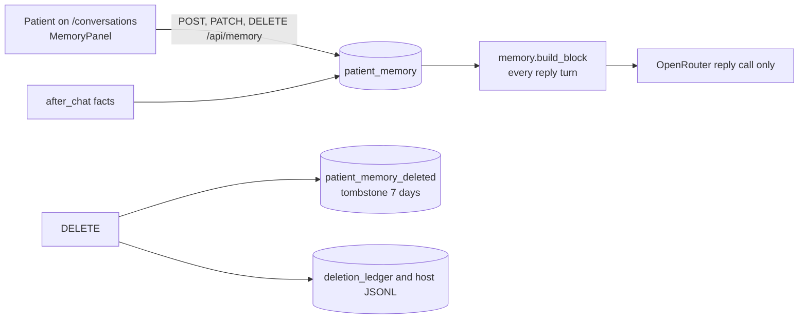
```mermaid
flowchart LR
  P["Patient on /conversations<br/>MemoryPanel"] -- "POST, PATCH, DELETE /api/memory" --> MEM[("patient_memory")]
  AC["after_chat facts"] --> MEM
  MEM --> BB["memory.build_block<br/>every reply turn"]
  BB --> LLM["OpenRouter reply call only"]
  DEL["DELETE"] --> TS[("patient_memory_deleted<br/>tombstone 7 days")]
  DEL --> LED[("deletion_ledger and host JSONL")]
```

**Steps**
1. **Read on every turn.** `memory.build_block` / `render_block` (`app/services/memory.py:185-217,410-417`). The block contains:
   - a preamble saying these are reference notes and the rules still apply;
   - the patient's name;
   - the chosen follow-up;
   - coming events (≤ 2 within 3 days), people (≤ 6), likes/routines (≤ 6).
   - Caps: line 60 (zh) / 150 (en) chars, block 400 / 1200 chars.
2. **Current facts** (`CURRENT_FACTS_SQL`, `:232-235`): the newest row per (kind, subject). A `source='patient'` row wins. `name` can only come from the patient's own entry (`CHAT_KINDS`, `:20,86-87`).
3. **Who sees the block:** only the reply model. The risk check, summary prompt and family alerts never get it (`api_device.py:381-394`).
4. **API** (`app/routers/api_memory.py`):

| Route | Consent | Behaviour | Lines |
|---|---|---|---|
| `GET /api/memory` | limited mode | items plus the chats that taught them | 39-49 |
| `POST /api/memory` | core + memory scopes | add (403 `memory_consent_required`, 422 `invalid_fact`) | 52-69 |
| `PATCH /api/memory/fact?kind=&subject=` | core + memory scopes | correct a fact | 72-80 |
| `DELETE /api/memory/fact` | limited mode | delete one | 91-97 |
| `DELETE /api/memory?confirm=all` | limited mode | delete all | 100-104 |

5. **Delete:** rows go, a tombstone is written per (kind, subject), plus a `deletion_ledger` row per memory id and the host JSONL after commit (`memory.py:435-453`; `api_memory.py:83-88`).
6. **Withdrawing memory consent deletes nothing** on the server. The UI offers the delete (`CLAUDE.md:141`).

**Leaves the home:** the block goes to OpenRouter with each reply call; never to family.

## 12. Dose emotion result and emotion alerts

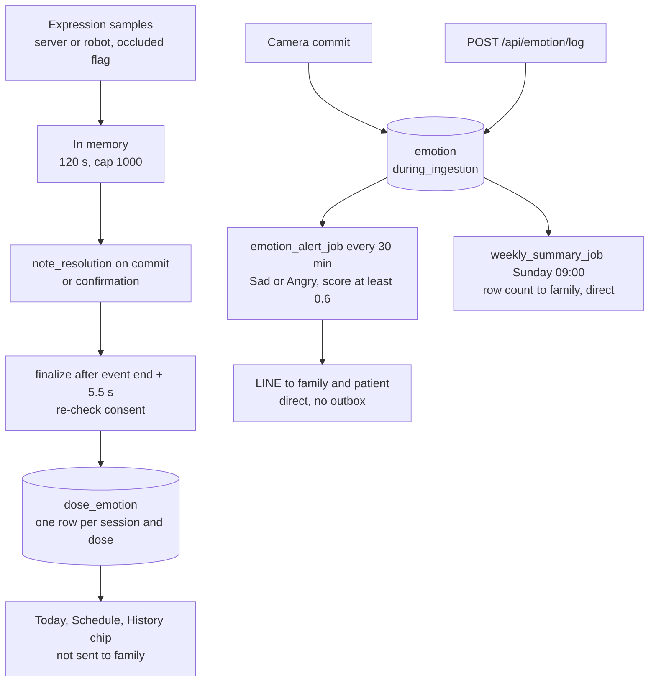
```mermaid
flowchart TD
  S["Expression samples<br/>server or robot, occluded flag"] --> B["In memory<br/>120 s, cap 1000"]
  B --> N["note_resolution on commit<br/>or confirmation"]
  N --> F["finalize after event end + 5.5 s<br/>re-check consent"]
  F --> DE[("dose_emotion<br/>one row per session and dose")]
  C["Camera commit"] --> EM[("emotion<br/>during_ingestion")]
  LOG["POST /api/emotion/log"] --> EM
  EM --> J["emotion_alert_job every 30 min<br/>Sad or Angry, score at least 0.6"]
  J --> L["LINE to family and patient<br/>direct, no outbox"]
  EM --> WS["weekly_summary_job Sunday 09:00<br/>row count to family, direct"]
  DE --> UI["Today, Schedule, History chip<br/>not sent to family"]
```

**Steps**
1. **Samples** `(t, probabilities, occluded, source)` from server scoring (`monitor_service.py:569`) or robot reports (accepted only for the verified, owned face; `monitor_service.py:237-258`; `api_device.py:40-56,586-595`). Kept 120 s, cap 1000 (`app/services/dose_emotion.py:42-43`).
2. **Trigger:** `note_resolution` on commit (`intake_repository.py:37-39`) or confirmation (`dose_confirmation.py:223`). The write is scheduled after the event end + 5 s + 0.5 s, and at least 2 s later. `finalize_soon` runs on session end, replacement or idle sweep (`dose_emotion.py:309-363`).
3. **Finalize** (`:370-419`): once per session.
   - Re-check consent: `core`, plus `robot_camera` for robot sessions.
   - Compute the basis and outcome: `recorded`, `taken_other`, `sent_to_family`, `patient_claim`, `skipped` or `unresolved`.
   - `INSERT dose_emotion … ON CONFLICT (session_id, intk_id) DO NOTHING`. The log omits the emotion class.
4. **Display:** `GET /api/emotion/medication` and `/medication/ID` (`app/routers/api_emotion.py:101-134`). The chip appears on `/api/medications/today` and `/api/history/intakes`, showing "mouth covered" or "unsure" when they apply.
5. **Emotion alert job** (`app/jobs/emotion_alert_job.py:6-81`, every 30 min) reads the `emotion` table only (not `dose_emotion`): Sad or Angry, score ≥ 0.6, in the last 30 min.
   - It sends a direct LINE alert to family with `notify_emotion` (if `notify_family_on_bad_mood`, default TRUE) and to the patient, and writes a `notification` row.
   - **No dedupe key and no consent check** in the job.
   - Robot doses that go to family confirmation never write an `emotion` row (`dose_confirmation.py:306-315`). With every robot dose `degraded` today, robot sessions do not feed this job (inference).
6. **Client-written rows.** `POST /api/emotion/log` (consented user, `app/routers/api_emotion.py:37-58`) inserts an `emotion` row with any of the 7 types and a client-supplied `emotion_score` (default 0.5, no range check, `:17-21`). These rows feed the emotion alert job and the weekly summary like camera rows.
7. **Weekly summary** (Sunday 09:00, `app/jobs/weekly_summary_job.py:10-60`):
   - loops over **every** user, with no consent check (`:20-22`);
   - sends each verified contact with `notify_weekly` the adherence % and 「情緒狀態: N 次記錄」, where N is the number of `emotion` rows in the past 7 days (capped at 7 by `LIMIT 7`), or 「穩定」 when there are none (`:33-42`; `app/services/line_service.py:102-109`);
   - direct LINE through `LineService`, no outbox.

**Stored:** `dose_emotion` and `emotion` rows, no purge. A patient-side delete of dose-emotion results does not exist yet (`CLAUDE.md:163`).

**Leaves the home:** the emotion alert (type and score %) and the weekly summary's emotion-row count go to LINE. Dose-emotion results are never shared with family (`dose_emotion.py:17-19`).

## 13. Face enrolment and login

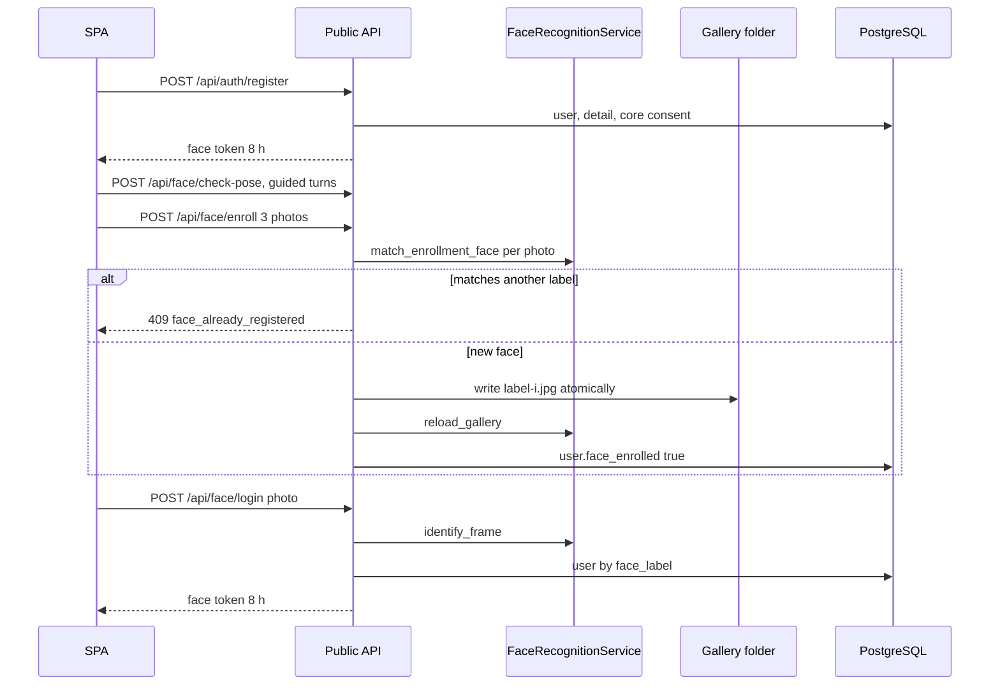
```mermaid
sequenceDiagram
  participant UI as SPA
  participant API as Public API
  participant FR as FaceRecognitionService
  participant FS as Gallery folder
  participant DB as PostgreSQL
  UI->>API: POST /api/auth/register
  API->>DB: user, detail, core consent
  API-->>UI: face token 8 h
  UI->>API: POST /api/face/check-pose, guided turns
  UI->>API: POST /api/face/enroll 3 photos
  API->>FR: match_enrollment_face per photo
  alt matches another label
    API-->>UI: 409 face_already_registered
  else new face
    API->>FS: write label-i.jpg atomically
    API->>FR: reload_gallery
    API->>DB: user.face_enrolled true
  end
  UI->>API: POST /api/face/login photo
  API->>FR: identify_frame
  API->>DB: user by face_label
  API-->>UI: face token 8 h
```

**Steps**
1. **Register** (`POST /api/auth/register`, `app/routers/api_auth.py:167`). Inserts `"user"` (name, lower-case `face_label`, optional email, bcrypt password, `line_id`) and `detail` (age, gender, address), and records `core` consent in the same transaction. Returns an 8 h token.
2. **Enrol** (`POST /api/face/enroll`, `app/routers/api_face.py:107-238`). Exactly 3 photos from a consented user. The label always comes from the DB. Under a global `_enroll_lock`, each photo goes through `match_enrollment_face` against every other label (distance ≤ 0.3 = match; fails closed when no descriptor is computed).
   - **Duplicate guard** (`_known_face_refusal`, `:241-269`): 409 `face_already_registered` or `face_registered_without_account`, never naming the other account.
   - **Store:** the detected face crops go to `<label>-<i>.jpg` in the gallery folder (host bind mount) via a temp file and rename. Then the gallery reloads and `face_enrolled = TRUE`.
3. **Login** (`POST /api/face/login`, no auth, `api_face.py:51-79`):
   - `identify_frame` → the closest identity, or `Unknown` above 0.3;
   - look up the active user by `face_label`;
   - return an itsdangerous token `{u_id, name}`, valid 8 h (`app/dependencies.py:9-26`).
   - `/api/auth/face-login` does the same and also sets a cookie (`api_auth.py:42-104`).
   - Only the legacy `/auth` router writes `login_log` (`app/routers/auth.py:85`).
4. **Monitor identity** reuses the same gallery (section 4).
5. **Legacy `/auth` routes** (public, port 8080; see [ARCHITECTURE.md section 6.3](ARCHITECTURE.md#63-trust-boundaries)):
   - `POST /auth/face-frame` returns the matched label for any JPEG, without auth (`auth.py:54-66`), as does `POST /api/face/identify` (`api_face.py:33-48`).
   - `POST /auth/confirm-login` sets the `medai_session` cookie for any active user whose `face_label` is posted as the form field `name`, with no face proof (`auth.py:69-93`).
   - `POST /auth/register` inserts `"user"` and `detail` with **no consent row** (`auth.py:96-121`).
   - `POST /auth/register-photos` saves 3 gallery photos for a new label with no login (`auth.py:130-150`).

**Stored:** face crops on the host disk until account deletion; `"user"` and `detail` rows. The token is kept in the browser's `localStorage`.

**Leaves the home:** nothing.

## 14. Consent withdrawal, export, account deletion and restore

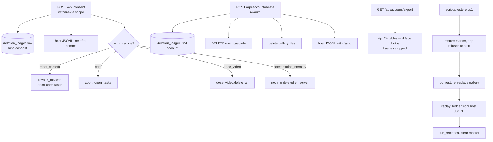
```mermaid
flowchart TD
  W["POST /api/consent<br/>withdraw a scope"] --> L1[("deletion_ledger row<br/>kind consent")]
  W --> J1["host JSONL line after commit"]
  W --> RC{"which scope?"}
  RC -- "robot_camera" --> RV["revoke_devices<br/>abort open tasks"]
  RC -- "core" --> AB["abort_open_tasks"]
  RC -- "dose_video" --> DV["dose_video.delete_all"]
  RC -- "conversation_memory" --> NM["nothing deleted on server"]
  D["POST /api/account/delete<br/>re-auth"] --> L2[("deletion_ledger kind account")]
  D --> DU["DELETE user, cascade"]
  D --> GF["delete gallery files"]
  D --> J2["host JSONL with fsync"]
  X["GET /api/account/export"] --> Z["zip: 24 tables and face photos,<br/>hashes stripped"]
  R["scripts/restore.ps1"] --> MK["restore marker, app refuses to start"]
  MK --> PR["pg_restore, replace gallery"]
  PR --> RP["replay_ledger from host JSONL"]
  RP --> RT["run_retention, clear marker"]
```

**Gating**
- Data routes use `get_consented_user`: core consent at `TERMS_VERSION` (`app/dependencies.py:29-33`).
- Device routes need core + `robot_camera`. The heartbeat answers `stop_all` instead of an error (`app/services/device_auth.py:67-85`; `api_device.py:527-528`).
- Consent state is cached 5 s per process (`app/services/consent_service.py:9-10`). The robot learns of a microphone withdrawal within one 10 s heartbeat (`bridge/runner.py:476-478`).

**Withdrawal** (`POST /api/consent`, `app/routers/api_consent.py:29-57`)
1. Append a `consent` row (append-only; it records the user agent and the notice hash).
2. `robot_camera=false` → `reachy_tasks.revoke_devices`: devices revoked and open tasks aborted, in the same transaction (`:41-42`).
3. `core=false` → `abort_open_tasks` (`:43-44`).
4. Every withdrawn scope → a `deletion_ledger` row `kind='consent'` plus a host JSONL line after commit (`:45-52`).
5. `dose_video=false` → `dose_video.delete_all`: buffer dropped, files deleted, queued outbox rows cancelled (`:54-56`).
6. `conversation_memory=false` → no server-side deletion.

**Export** (`GET /api/account/export`, limited mode, `app/routers/api_account.py:46-67`): a zip with `account.json` (every row of 24 tables, including outbox payloads, conversation turns and dose emotion) plus the face photos. `password_hash`, `token_hash` and `token_sha256` are stripped.

**Delete** (`POST /api/account/delete`, `:70-108`)
1. Re-authenticate: the password if set, else a face token at most 600 s old.
2. `deletion_ledger.record('account', u_id, face_label)`, then `DELETE "user"`, which cascades every foreign key.
3. Delete the gallery files, append to `/ledger/deletion_ledger.jsonl` with fsync, and purge the label from memory (`app/services/deletion_ledger.py:21-68`).
4. Dose-video files are removed by the next orphan sweep (inference: `dose_video.py:451-462`).

**Restore** (`scripts/restore.ps1`)
1. Set `ops_state.restore_in_progress`. The app refuses to start while it exists (`app/startup_checks.py:39-42`).
2. `pg_restore --single-transaction` and replace the gallery.
3. `python -m app.ops.replay_ledger /ledger/deletion_ledger.jsonl` (`restore.ps1:102-103`). It parses everything first, then replays (`deletion_ledger.py:93-130`):
   - account: delete the user and gallery files again;
   - conversation and memory: delete by id + owner;
   - consent: add a withdrawal only if the restored grant is older than it.
4. Run retention, clear the marker, start the services.

**Stored:** `deletion_ledger` (no FK, survives the account) and the host JSONL, indefinitely.

**Leaves the home:** the export zip goes to the patient's browser.

## 15. LINE contact linking

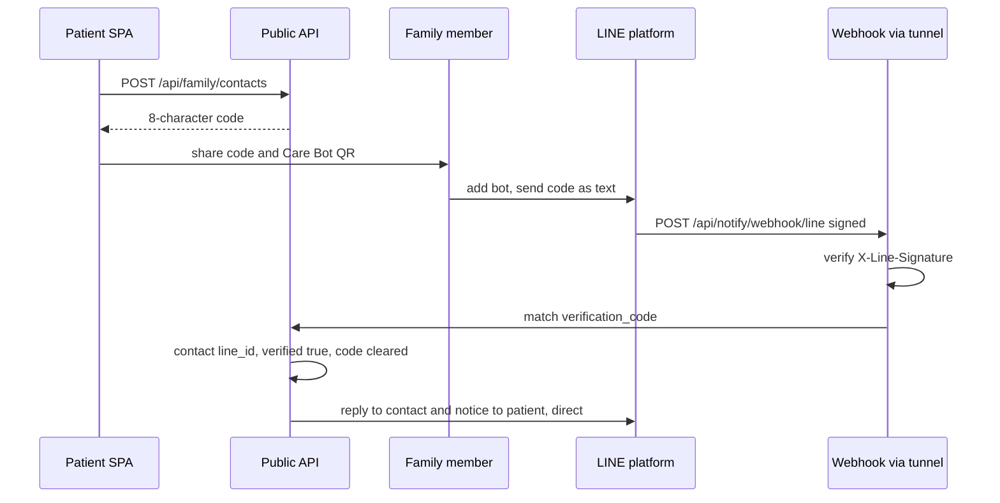
```mermaid
sequenceDiagram
  participant P as Patient SPA
  participant API as Public API
  participant Fam as Family member
  participant L as LINE platform
  participant WH as Webhook via tunnel
  P->>API: POST /api/family/contacts
  API-->>P: 8-character code
  P->>Fam: share code and Care Bot QR
  Fam->>L: add bot, send code as text
  L->>WH: POST /api/notify/webhook/line signed
  WH->>WH: verify X-Line-Signature
  WH->>API: match verification_code
  API->>API: contact line_id, verified true, code cleared
  API->>L: reply to contact and notice to patient, direct
```

**Steps**
1. `POST /api/family/contacts` creates a contact with an 8-character code from A-Z0-9 (`app/routers/api_family.py:13-15,42-80`). `POST /api/notify/generate-code` regenerates it and sets `verified=FALSE` (`app/routers/api_notify.py:45-61`). Codes do not expire (no column, `sql/init.sql:109-124`).
2. The family member adds the "Care Bot" channel (`@331ealnq`, `CLAUDE.md:286`) and sends the code.
3. Webhook `POST /api/notify/webhook/line` (`api_notify.py:64-174`):
   - 401 if `LINE_CHANNEL_SECRET` is empty;
   - `X-Line-Signature` must equal base64 HMAC-SHA256 of the raw body, compared with `compare_digest`.
4. Text events: the upper-cased text is matched to a code. A match sets `line_id = sender userId`, `verified=TRUE`, `verified_at`, `code=NULL` (`:119-140`).
   - With `relationship='user'`, the patient's own LINE goes into `"user".line_id`, which enables patient reminders (`:147-158`).
   - Replies use `LineService` directly, not the outbox.
5. The same webhook also carries postbacks (section 6) and `videoPlayComplete` (section 8).

**Stored:** `family_contacts` (`line_id`, flags) until deleted or account deletion.

**Leaves the home:** replies to LINE. LINE sends the family member's userId to the laptop.

## 16. Prescription OCR

```mermaid
sequenceDiagram
  participant UI as Scan page
  participant API as POST /api/ocr/parse
  participant O as OCRService
  participant G as Gemini or Ollama
  participant DB as PostgreSQL
  UI->>API: prescription photo
  API->>O: process_image in a worker thread (45 s limit with Gemini)
  O->>O: YOLO warp skipped, denoise, CLAHE, sharpen
  O->>G: one request: paper fields + every medicine line + schedule icons, JPEG q95
  G-->>O: JSON (or busy / gone: one try on the fallback model)
  O-->>UI: every medicine (dose times, form, ISO dates; no ID or birth date), or {error, code}
  UI->>DB: user edits and keeps medicines, one POST /api/medications each
```

**Steps**
1. The Scan page uploads a photo to `POST /api/ocr/parse` (any account with current core consent; nothing else about the account is used).
2. `process_image` (`app/services/ocr_service.py`):
   1. the YOLO warp is skipped (inert in the container);
   2. enhancement.
3. **Gemini** (`GEMINI_API_KEY` set): one request to `OCR_MODEL` (default `gemini-3.5-flash`) for the paper's fields, every medicine line and the 6 schedule-icon marks. A 429/5xx, a timeout (25 s) or a 404 gets one try on `OCR_GEMINI_FALLBACK_MODEL` (default `gemini-3.5-flash-lite`), all within 45 s. **Ollama** (no key): the text fields, then the icon-row crop (78-92% of the height, upscaled 2×). See [MODELS.md section 12](MODELS.md#12-prescription-ocr).
4. Post-processing (`ocr_parsing.py`) gives each medicine its dose times (usage text; the icon row for a one-medicine bag), dose form, amounts and stock, turns ROC dates into ISO, drops implausible dates and non-names, and removes national ID numbers and birth dates from every field. The user edits one card per medicine, then saves each kept one through the medication API (section 2).
5. **Failures** return a non-2xx `{error, code}` and never a success-shaped all-`N/A` result. The Scan page shows the code's sentence in the page's language (en / zh-TW).

**Stored:** nothing from OCR itself. The photo is processed in memory, and only the confirmed medications are saved (each with the paper's patient name, pharmacy, pharmacist and dates in `prescription_meta`; never an ID number or birth date, which the server strips before answering). The server log names the model and the HTTP status of a failed request, never the key, the photo or the text read.

**Leaves the home:** with Gemini, the whole prescription photo (patient name, physician, hospital, medicines) goes to Google.

## 17. Robot heartbeat and fail-safe

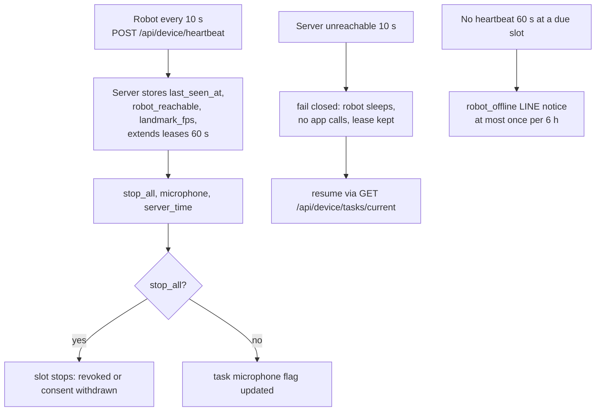
```mermaid
flowchart TD
  H["Robot every 10 s<br/>POST /api/device/heartbeat"] --> S["Server stores last_seen_at,<br/>robot_reachable, landmark_fps,<br/>extends leases 60 s"]
  S --> Rsp["stop_all, microphone, server_time"]
  Rsp --> M{"stop_all?"}
  M -- "yes" --> Stop["slot stops: revoked or consent withdrawn"]
  M -- "no" --> Mic["task microphone flag updated"]
  U["Server unreachable 10 s"] --> FC["fail closed: robot sleeps,<br/>no app calls, lease kept"]
  FC --> Res["resume via GET /api/device/tasks/current"]
  Off["No heartbeat 60 s at a due slot"] --> RO["robot_offline LINE notice<br/>at most once per 6 h"]
```

**Steps**
1. **Heartbeat payload:** `robot_reachable`, `landmark_fps`, `vision_fps`, `bridge_version`, `missing_clips` (`bridge/runner.py:458-479`). Limits: fps 0-240, version ≤ 50 chars (`api_device.py:76-81`).
2. **Server** (`api_device.py:524-540`; `reachy_tasks.py:205-209`): stores `last_seen_at`, `robot_reachable`, `landmark_fps` and `status_detail`, and extends leases. A revoked device or withdrawn consent gives `stop_all: true`.
3. **Robot errors** (`bridge/app_client.py:115-148`; `bridge/session.py:143-191`):

   | Error | Robot action |
   |---|---|
   | Transport error or 5xx (not 503) | `AppUnreachable`; after 10 s → `_fail_closed("app_unreachable")` |
   | 401/403 | stop: `not_authorised` |
   | 409 refusal codes | `DoseRefused` |
   | 409 `busy_other_client` | wait (`WAITING_OTHER_CLIENT`) |
   | Other 409 | session lost; recover, at most 10 times |
   | 503 | `model_not_ready` |
   | 404 | `task_gone` |

4. **Offline notice:** see section 3, step 6.

**Stored:** `reachy_device` heartbeat fields (latest values only). **Leaves the home:** only the `robot_offline` LINE notice.

## 18. Timing metrics

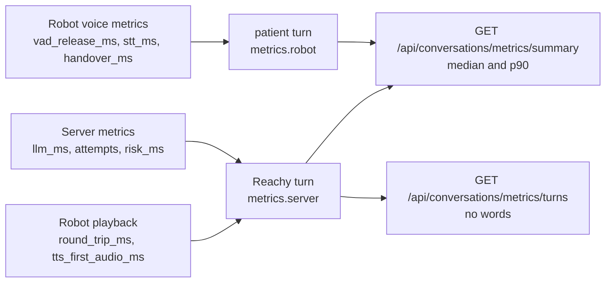
```mermaid
flowchart LR
  RV["Robot voice metrics<br/>vad_release_ms, stt_ms, handover_ms"] --> T1["patient turn<br/>metrics.robot"]
  SV["Server metrics<br/>llm_ms, attempts, risk_ms"] --> T2["Reachy turn<br/>metrics.server"]
  PB["Robot playback<br/>round_trip_ms, tts_first_audio_ms"] --> T2
  T1 --> API["GET /api/conversations/metrics/summary<br/>median and p90"]
  T2 --> API
  T2 --> CSV["GET /api/conversations/metrics/turns<br/>no words"]
```

| Source | Keys | Stored in | Source code |
|---|---|---|---|
| Robot, per patient turn | `speech_ms`, `segments`, `vad_release_ms`, `stt_ms`, `stt_last_ms`, `handover_ms`, `echo_dropped`, `listen_mode`, `ack_ms`, `ack_resumed` | `conversation_turn.metrics.robot` (patient turn) | `bridge/voice.py:432-447`; `api_device.py:376-377` |
| Server, per reply | `received_to_reply_ms`, `consent_ms`, `screen_ms`, `db_ms`, `llm_ms`, `fallback_used`, `attempts[]`, `risk_source`, `risk_ms`, `risk_result`, `risk_attempts`, later `late_*` | `metrics.server` (Reachy turn) | `api_device.py:426-430,458-465` |
| Robot, playback | `round_trip_ms`, `tts_first_audio_ms`, `tts_total_ms`, `tts_chunks` | merged into `metrics.robot` (Reachy turn), cap 30 keys | `api_device.py:474-506`; `bridge/speech.py:161-165` |

- Validation: flat, ≤ 30 keys, key ≤ 40 chars, numbers with |x| ≤ 1e9, text ≤ 80 chars, otherwise 422. On a 422 the robot resends the words without metrics (`api_device.py:206-234`; `session.py:478-487`).
- Summary (`app/routers/api_conversations.py:74-131`): window 1-90 days, cut to 30. Median and nearest-rank p90 per stage, including `speech_end_to_first_sound_ms` = handover + round trip + first audio. Durations over 24 h are ignored.

**Stored:** inside `conversation_turn`, so kept 30 days. **Leaves the home:** nothing.

## 19. Day background: weather and holidays

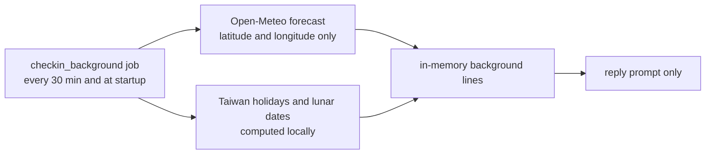
```mermaid
flowchart LR
  J["checkin_background job<br/>every 30 min and at startup"] --> OM["Open-Meteo forecast<br/>latitude and longitude only"]
  J --> HO["Taiwan holidays and lunar dates<br/>computed locally"]
  OM --> C["in-memory background lines"]
  HO --> C
  C --> RP["reply prompt only"]
```

1. `context_info.refresh` runs in a worker thread every 30 min and once at startup, with no misfire limit (`app/jobs/scheduler.py:88-100`; `app/services/context_info.py:328-345`).
2. Open-Meteo request (`context_info.py:25-28,160-169`): `current=temperature_2m,weather_code`, daily weather code, max/min temperature and rain probability, 3 days, timezone `MEDCARE_TIMEZONE`, 15 s timeout. No key.
3. Freshness (`_weather_line`, `context_info.py:187-210`; limits at `:26-27`):
   - a current temperature older than 1 h is left out, while today's and tomorrow's forecast are still shown;
   - the "weather unknown" line (`NO_WEATHER`, `:61`) appears only when nothing fresh remains: a forecast older than 3 h, none fetched, or weather disabled (`:207-208`).
4. The lines go only into the reply prompt, never into the risk check, summary or memory call (`app/services/conversation.py:24-25`).

**Stored:** RAM only. **Leaves the home:** the coordinates (default Taipei 25.0330, 121.5654) to Open-Meteo; the rendered lines (without a place name) to OpenRouter in reply calls.

## 20. Backups

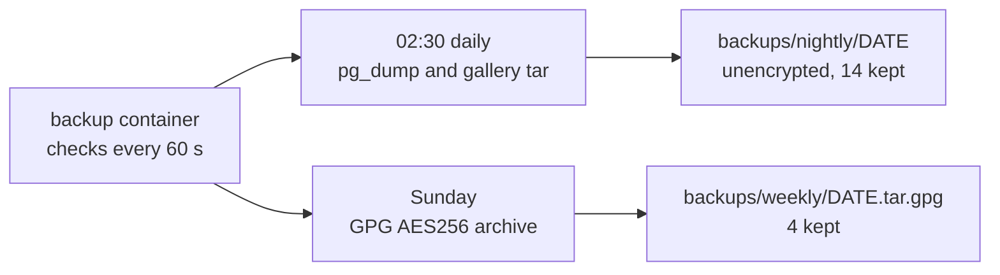
```mermaid
flowchart LR
  B["backup container<br/>checks every 60 s"] --> N["02:30 daily<br/>pg_dump and gallery tar"]
  N --> ND["backups/nightly/DATE<br/>unencrypted, 14 kept"]
  B --> W["Sunday<br/>GPG AES256 archive"]
  W --> WD["backups/weekly/DATE.tar.gpg<br/>4 kept"]
```

- Nightly: `pg_dump -Fc` plus a tar of the face gallery into `backups/nightly/<date>`. **Unencrypted.** 14 sets kept, also pruned by `-mtime +13` (`scripts/backup/backup.sh:17-25,41-55`).
- Weekly (Sunday): an archive encrypted with GPG AES256 using `BACKUP_PASSPHRASE`. It fails while the passphrase is empty, as it is in `.env` today. 4 kept, also pruned by `-mtime +27` (`backup.sh:27-46`).
- The `./ledger` folder is mounted into the backup container, but the restore replays the host copy, so deletions made after a backup are re-applied (section 14).

**Leaves the home:** nothing. The backups stay on the laptop's disk.

## 21. What leaves the home

| Destination | What is sent | When | Gate |
|---|---|---|---|
| OpenRouter (`openrouter.ai`) | Reply call: system prompt, day background (no place name), memory block, last 12 turns. Risk call: last 6 turns. Summary / after-chat: full transcript, date table, up to 40 known facts | each check-in turn; after each chat | the 4 check-in scopes; memory scopes for notes |
| LINE push (`api.line.me`) | Patient name, medicine names and times, reminders, missed alerts, taken reports with AI estimate %, fps notes, confirmation requests, safety alerts quoting ≤ 120 chars, double-dose alerts, emotion type and score, weekly summary, refill, robot offline, extra hand-to-mouth events, protection-off notices, verification replies, clip links | jobs and events | verified contacts and their notify flags. The LINE jobs check no consent scope (no consent call in `app/jobs/`): reminders and missed alerts, the outbox-based taken report (`app/jobs/taken_confirmation_job.py:90-183`), the emotion alert, the refill reminder, the robot-offline notice, and the weekly summary, which loops over every user (`weekly_summary_job.py:20-22`). Only dose-video clips check a scope (`dose_video`, `dose_video.py:143,358`). Messages the robot triggers (confirmation requests, extra events, safety alerts) pass the device route's consent check |
| Family LINE app via Cloudflare | Dose-video MP4 and JPG bytes | after a taken report or confirmation request | `dose_video` consent; per-recipient token |
| LINE webhook-endpoint API + probe | The tunnel host (to find the base URL) | when building clip links | — |
| Google Gemini | Prescription photo (one request, a second to the fallback model only when the first fails) | each scan | `GEMINI_API_KEY` set |
| Open-Meteo | Latitude and longitude | every 30 min | `WEATHER_ENABLED` |
| jsDelivr CDN (`cdn.jsdelivr.net`) | The browser's requests for Bootstrap, Bootstrap Icons and Chart.js (its IP address; general browser behaviour) | when a legacy Jinja page is opened (`app/templates/base.html:7-8,38`; `dashboard.html:100`) | none |
| Cloudflare (transit) | Webhook bodies (LINE userIds, postback data, verification text) and clip bytes. TLS ends at Cloudflare (general behaviour, unverified in the repo) | — | profile `line` |

**Never leaves the home:** audio (stays on the robot); raw camera frames except opt-in clips; face gallery photos; dose-emotion results; emotion results, except the emotion alert's type and score and the weekly summary's count of `emotion` rows (「情緒狀態: N 次記錄」, `app/jobs/weekly_summary_job.py:33-42`); memory notes to family; landmark data; backups.

**Inside the home but unencrypted:**
- Robot ↔ laptop over Wi-Fi is plain HTTP: JPEG frames, transcripts, metrics and heartbeats (inferred from `app_url http://<ip>:8001`, `HANDOFF.md:46`).
- Browser ↔ laptop is plain HTTP on port 8080. The camera works only through `localhost` or HTTPS (`README.md:30`), so the intake monitor normally runs on the laptop itself.

## 22. Retention summary

| Data | Retention | Source |
|---|---|---|
| `conversation_turn` | 30 days; flagged turns 180 days (daily 03:30) | `app/jobs/conversation_retention_job.py:13-14,19-24` |
| `conversation` (summary, mood) | until the patient deletes it or the account | `app/routers/api_conversations.py:196-209` |
| `patient_memory` | until deleted; event notes 30 days after their date | `conversation_retention_job.py:15,26-27` |
| `patient_memory_deleted` (tombstones) | 7 days | `conversation_retention_job.py:16,28-29` |
| Dose-video files | 10 min after all recipients fetched/viewed; ≤ 24 h after send; 4 h if never sent; at once on withdrawal; orphans after 600 s | `app/services/dose_video.py:54-57,406-462` |
| `dose_video`, `dose_video_link` rows | until account deletion (media gone) | — |
| Dose-video frame buffer (RAM) | last 20 s, ≤ 10 fps, ≤ 24 MB; after a session up to about 2 min 20 s (trimmed only on a new frame; dropped by the 2-minute cleanup once idle > 20 s) | `dose_video.py:41-43,87-92,445-447` |
| Monitor state | 48 packets; emotion samples 120 s / 1000; idle session 600 s | `monitor_service.py`; `dose_emotion.py` |
| Detector sessions | 5 min active / 15 min completed | `app/services/intake_detection.py:1224-1227` |
| Consent cache | 5 s | `app/services/consent_service.py:9` |
| Late risk checks | memory only, lost on restart | `app/routers/api_device.py:449` |
| Weather | forecast 3 h, current temperature 1 h | `app/services/context_info.py:26-27` |
| `intake`, `medication`, `medication_supply`, `emotion`, `dose_emotion`, `monitor_event`, `monitor_extra_event`, `dose_confirmation`, `reachy_task`, `reachy_device`, `notification`, `notification_outbox` (full payloads, including safety-alert quotes), `consent`, `login_log` | **no purge job**: until account deletion. Future pending intake rows go on schedule edit or archive | research grep of `app/**/*.py`; `api_medications.py:43-54` |
| `deletion_ledger` and `./ledger/deletion_ledger.jsonl` | indefinite, survives account deletion | `sql/init.sql:207-215`; `app/services/deletion_ledger.py:21-32` |
| Face gallery photos | until account deletion | `app/routers/api_account.py:99-102` |
| Nightly backups | 14 sets | `scripts/backup/backup.sh:41,45,55` |
| Weekly backups | 4 sets | `backup.sh:43,46` |
| Intake training corpus | disabled (`INTAKE_V1_COLLECT=0`, no callers) | `docker-compose.yml:36` |

## 23. Unverified items

| Item | Status |
|---|---|
| Daemon camera cap `IPC_FPS = 10` and the observed 10.1 fps | from `CLAUDE.md:87`; the file lives on the robot |
| Cause of the ~1 s stream stalls | unknown (`CLAUDE.md:89`) |
| Which robot app version runs on the robot | the code is 0.5.4; 0.5.4 is not deployed (`bridge_version` in heartbeats tells) |
| Ollama reachable from the container with the default URL | unverified |
| TLS termination and visibility at Cloudflare | general Cloudflare behaviour |
| Double emotion alerts at the 30-minute window edge | possible from the code, not observed |
| Measured latencies (~29 ms per frame, ~1.5 s per reply) | from `CLAUDE.md:82,112` and `HANDOFF.md`; not re-measured |
| Which firewall rule lets the robot reach port 8001 | no rule named `MedAiCare robot device API` exists on this laptop; other rules not enumerated |
| Whether Pollen's daemon or dashboard on the robot contacts Hugging Face at run time | not checked |
