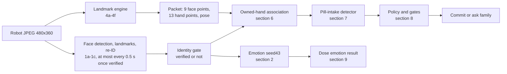
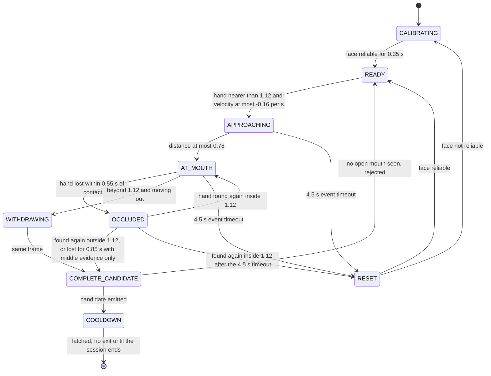

# Models and algorithms

Last updated: 2026-10-04 (commit bcd821a)

This document lists every model and decision algorithm in MedAiCarePlus: what each one is, what goes in and out, the thresholds, and how far it can be trusted. For how the parts are deployed, see [ARCHITECTURE.md](ARCHITECTURE.md). For how data moves between them, see [DATA_FLOW.md](DATA_FLOW.md).

**Conventions**
- References are `path:line` at commit `bcd821a` (`git show bcd821a:<path>` shows those lines). The 4 Oct 2026 commits after it (OCR repair, OpenRouter keep-alive, robot speech chunking) moved lines in `app/config.py`, `app/services/conversation.py`, `app/services/ocr_service.py` and `bridge/speech.py`; sections 11, 12 and 15 describe that committed code and cite the changed parts by function name.
- **"ext"** marks a fact from external documentation (Intel Open Model Zoo, MediaPipe, sherpa-onnx) that the repo itself does not state.
- **"Unverified"** means nobody measured it or the code does not confirm it.
- The model files' ONNX/IR metadata was read with a pure-Python protobuf reader. Nothing was run for this document.
- Server ML runs on **CPU only** (`DEVICE = "CPU"`, `app/config.py:38`). The stack is `openvino==2024.5.0` and `onnxruntime==1.19.2` (CPUExecutionProvider), plus `opencv-python-headless==4.11.0.86` (`requirements.txt`). There is no torch, mediapipe or ultralytics on the server.
- On 4 Oct 2026, `/health` reported every service available: `face_recognition`, `emotion`, `ocr`, `line`, `intake_detection`, `landmarks` (`app/main.py:126-137`).

---

## Summary

| # | Name | Task | Architecture | Input | Output | Runtime | Runs on | File |
|---|---|---|---|---|---|---|---|---|
| 1a | face-detection-adas-0001 | Find faces | MobileNet + SSD head (ext) | 1×3×384×672 BGR | ≤ 200 boxes × 7 | OpenVINO CPU | laptop | `models/face_recognition/intel/face-detection-adas-0001/FP32/` |
| 1b | landmarks-regression-retail-0009 | 5 face points for alignment | small CNN, 8 conv layers | 1×3×48×48 | 10 values (5 points) | OpenVINO CPU | laptop | `…/landmarks-regression-retail-0009/FP32/` |
| 1c | face-reidentification-retail-0095 | Face descriptor for identity | MobileNetV2-based (ext), 63 conv layers | 1×3×128×128, aligned | 256-d vector | OpenVINO CPU | laptop | `…/face-reidentification-retail-0095/FP32/` |
| 2 | Emotion seed43 | 7-class facial expression | torchvision MobileNetV3-Large, head 1280→7 | 1×3×112×112 grey-as-RGB | 7 logits | ONNX Runtime CPU, 1 thread | laptop (and robot in on-robot mode) | `models/emotion_seed43/model_fp32.onnx` |
| 3 | Haar cascade (legacy) | Find a face for the old emotion routes | OpenCV Viola-Jones | grey image | boxes | OpenCV | laptop | `app/services/emotion_service.py:76-84` |
| 4a | face_detector.onnx | Face detection for landmarks | BlazeFace short-range (ext) | 1×128×128×3 | 896 anchors × 16 + scores | ONNX Runtime CPU | laptop (robot frames) | `models/landmarks/` |
| 4b | face_landmarks_detector.onnx | 478-point face mesh | MediaPipe Face Mesh with iris (ext) | N×256×256×3 | 1434 values + presence | ONNX Runtime CPU | laptop | `models/landmarks/` |
| 4c | hand_detector.onnx | Palm detection | MediaPipe palm detector | 1×192×192×3 | 2016 anchors × 18 + scores | ONNX Runtime CPU | laptop | `models/landmarks/` |
| 4d | hand_landmarks_detector.onnx | 21 hand points | MediaPipe hand landmark | 1×224×224×3 | 63 values + presence, handedness, world | ONNX Runtime CPU | laptop | `models/landmarks/` |
| 4e | pose_detector.onnx | Person detection | MediaPipe pose detector (OpenCV Zoo export) | 1×3×224×224 | 2254 anchors × 12 + scores | ONNX Runtime CPU | laptop | `models/landmarks/` |
| 4f | pose_landmarks_detector.onnx | 39 body points | MediaPipe pose landmark, lite | 1×256×256×3 | 195 values + heatmap, segmentation, world | ONNX Runtime CPU | laptop | `models/landmarks/` |
| 5 | MediaPipe Tasks (3 models) | Face, hand, pose landmarks in the browser | same networks as 4a-4f, original TFLite | ≤ 640×480 video frame | landmarks | `@mediapipe/tasks-vision` 0.10.18, WASM, GPU or CPU | browser Web Worker | `frontend_source/public/models/*.task` |
| 6 | Owned-hand association | Which hands belong to the verified patient | geometry rules | landmark packet + verified face box | ≤ 2 hands or skip | Python | laptop | `app/services/monitor_service.py:76-126` |
| 7 | Pill-intake detector | Hand-to-mouth event | geometry features + temporal state machine, **no neural net** | owned face and hand landmarks with timestamps | none / uncertain 0.48 / confirmed 0.82 | Python | laptop | `app/services/intake_detection.py`, `app/services/intake_temporal.py` |
| 8 | Recording policy and gates | Decide auto-record, ask, or ignore | thresholds and gates | detector result, fps, identity | confirmed / uncertain / none + hold reason | Python | laptop | `app/intake_v1/policy.py`, `app/services/monitor_service.py` |
| 9 | Dose emotion result | One expression result per dose | mean of probability vectors (soft vote) | emotion samples with occlusion flags | label, score, phases, timeline | Python | laptop | `app/services/dose_emotion.py` |
| 10 | Keyword safety screen | Catch self-harm or overdose talk | word lists + regexes on normalised text | patient text | risk kind or none | Python | laptop | `app/services/conversation.py:82-249` |
| 11 | Check-in LLMs (4 uses) | Reply, risk label, summary, memory facts | remote chat models via OpenRouter (architecture unverified) | prompts + conversation text | text | HTTPS API | OpenRouter providers | `app/services/conversation.py`, `app/services/memory.py` |
| 12a | YOLO segmentation | Prescription page outline | YOLO (ultralytics) | photo | mask | **inert**: not installed | — | `models/segmentation/prescription_best_100_epo.pt` |
| 12b | Vision LLM OCR | Read the prescription | Gemini `OCR_MODEL` (default `gemini-3.5-flash`, fallback `gemini-3.5-flash-lite`), or an Ollama vision model without a Gemini key | enhanced photo (Ollama: + icon-row crop) | JSON: paper fields + every medicine | HTTPS API / local Ollama | Google or local | `app/services/ocr_service.py` |
| 13a | Silero VAD | Find speech segments | Silero VAD (ext) | 16 kHz audio, 512-sample windows | speech segments | sherpa-onnx | robot | `~/.medcare_reachy/models/stt/silero_vad.onnx` |
| 13b | Whisper Base | Speech to text | Whisper Base via faster-whisper / CTranslate2 | 16 kHz segments up to 8 s | text | CPU int8, 2 threads | robot | Hugging Face cache under `~/.medcare_reachy/models/stt/whisper/` |
| 14 | "I finished" matcher and echo guards | Detect 「我吃完了」, drop Reachy's own voice | word lists, regexes, SequenceMatcher | transcripts | done flag / cleaned text | Python | robot | `reachy_app/medcare_reachy/bridge/voice.py` |
| 15 | Matcha-TTS zh-baker + Vocos | Speak Mandarin | Matcha acoustic model + Vocos vocoder | Simplified text chunks, cut only at punctuation | waveform | sherpa-onnx, 2 threads | robot | `~/.medcare_reachy/models/tts/` |
| 16 | On-robot vision | Landmarks + emotion on the robot | copies of 4a-4f and 2 | 640×480 frame | landmark packet + emotion | ONNX Runtime CPU | robot (`vision_on_server=false` only) | `reachy_app/medcare_reachy/vision_models/` |
| 17 | inquiring3 move + gestures | "Thinking" and "speaking" motion | recorded motion data + sine patterns | — | head/antenna targets at 25-50 Hz | Python | robot | `reachy_app/medcare_reachy/bridge/moves/inquiring3.json`, `bridge/gestures.py` |

Section 18 covers processing that is not a model: video encoding, OCR image enhancement, the day context and the family wording. Section 19 lists what is unverified.

How the vision models chain together on one robot frame:

---

## 1. Face detection, landmarks and re-identification

Three Intel Open Model Zoo (OMZ) networks run in a chain on OpenVINO. Paths are at `app/config.py:13-15`, and the service is `app/services/face_recognition_service.py`.

| | 1a Detection | 1b Landmarks | 1c Re-identification |
|---|---|---|---|
| File (FP32 IR) | `face-detection-adas-0001.xml/.bin` (242,166 + 4,212,072 B) | `landmarks-regression-retail-0009` (45,336 + 762,464 B) | `face-reidentification-retail-0095` (246,600 + 4,427,256 B) |
| Graph | net `mobilenet_ssd_672x384`, 49 Convolution layers | 8 Conv layers | 63 Conv layers |
| Input | `data` 1×3×384×672 (N,C,H,W), BGR (ext) | 1×3×48×48 face crop | 1×3×128×128 aligned face |
| Output | 1×1×200×7: image_id, label, conf, x1, y1, x2, y2 | 1×10×1×1: 5 points normalised to the crop | 1×256×1×1 descriptor |
| Infer requests | 1, not reshaped (`input_size=(0,0)`) | up to 10 | up to 10 |

Loading is at `face_recognition_service.py:45-72`. The wrapper code is Intel's sample code under Apache-2.0, per the file headers (`models/face_recognition/face_detector.py:1-15`). `models.lst` also names arcface, facenet and face-detection-retail, but those files are absent and unused.

**Preprocessing**
- Frames are BGR uint8, stretch-resized to the model input with `cv2.resize`, then HWC → CHW. There is no normalisation in Python (`models/face_recognition/utils.py:20-52`).

**Post-processing**
- Detection (`face_detector.py:91-106`): stop at confidence < `FACE_DET_CONFIDENCE` (0.6, `app/config.py:45`). Scale boxes to pixels, enlarge by `roi_scale_factor` 1.15 (line 52), and clip to the frame.
- Alignment (`face_identifier.py:27-32,118-143`): the 5 landmarks are mapped to fixed reference points by an SVD similarity transform (`warpAffine`), then the face is resized to 128×128.
- Matching (`faces_database.py:37-46,150-179`):
  - distance = cosine distance × 0.5, giving a range of [0, 1];
  - each identity's distance is its closest gallery photo (`MIN_DIST`), and the identity with the smallest distance wins;
  - a distance above `FACE_MATCH_THRESHOLD` (0.3, `app/config.py:46`) gives `Unknown` (`face_identifier.py:100-102`).

**Gallery**
- Photos are `models/face_recognition/face_gallery/<label>-<i>.jpg`. The whole image is the ROI (`face_detector=None`), and the label drops the `-<n>` suffix (`faces_database.py:76-78,197-209`). Today it holds 2 labels × 3 photos.
- Enrolment takes exactly 3 photos. It is refused (409) when any photo matches another label within the threshold (`match_enrollment_face`, `face_recognition_service.py:200-251`; `app/routers/api_face.py:107-269`). The detected face crop is saved and the gallery reloaded (`reload_gallery`, lines 80-90).

**Entry points**

| Function | Use | Source |
|---|---|---|
| `identify_frame` | Face login: best match over all faces → `"user".face_label` → 8 h token | `face_recognition_service.py:166-198`; `app/routers/api_face.py:51-79` |
| `identify_faces` | Monitor: a label per face. 4 or more faces → `saturated`, no faces returned | `face_recognition_service.py:253-276` |
| `get_face_direction` | Enrolment wizard: yaw = (nose_x − eye-centre_x) / eye width; ±0.12 means turned left or right ("roughly 15-20°") | `face_recognition_service.py:92-164` |

**Monitor identity gate** (`app/services/monitor_service.py:485-545`)
- Identity runs on every vision call while the patient is unverified or a candidate is pending, and otherwise at most every 0.5 s (line 505).
- A frame counts as a hit only if:
  - exactly one face carries the patient's `face_label`, with no error and no saturation (lines 519-523);
  - its box overlaps a landmark face box with IoU ≥ 0.20, and fewer than 4 faces are visible (lines 528-532).
- `identity_hits` resets to 0 on a mismatch or saturation (line 521), on ambiguity (line 530), and when the box jumps (IoU < 0.20 with the previous box, line 534).
- `verified()` = `identity_hits ≥ 2` and the latest hit no more than 1.5 s old (lines 202-203). The hits themselves can be spread over a longer time, since only those resets clear the count.

**Calibration and latency**
- The thresholds 0.6 and 0.3 are defaults. No calibration data for this patient is in the repo (unverified).
- Latency is not measured in the repo (unverified).
- All public methods hold one `threading.RLock`, so face inference is serialised (lines 17-22, 46).

**Limitations**
- No liveness or anti-spoofing check anywhere in `app/` (research grep). A photo of the patient may pass face login (inferred).
- `/api/face/identify` returns the matched label without auth (`api_face.py:33-48`).

**Source / licence:** Intel OMZ (ext: OMZ models are Apache-2.0; the repo states the licence only for the wrapper code). Source revision `562d558a5769a72e26822e39a1295db32ff8e791`, Git LFS (`README.md:53`).

## 2. Facial expression model "seed43"

| Fact | Value | Source |
|---|---|---|
| File | `models/emotion_seed43/model_fp32.onnx`, 16,834,005 B, SHA-256 `0caaedf04b60d1c95d89ee2162c8bf207ccd669b88865f155b17987cc15ffbad` | `README.md:55` |
| Metadata | `model_fp32_metadata.json`: `model_name` `mobilenet_v3_large`, `parameter_count` 4,210,999, `input_size` 112, `preprocess_version` `ferplus-gray-rgb-imagenet-v1` | metadata file |
| Graph | PyTorch 2.7.1 export, opset 17. Input `images` [batch,3,112,112] float32 → output `logits` [batch,7]. 140 nodes: Conv 62, HardSwish 21, Relu 19, Add 10, GlobalAveragePool 9, HardSigmoid 8, Mul 8 (squeeze-excite), Gemm 2 | ONNX metadata |
| Architecture | Stock torchvision MobileNetV3-Large with its last Linear replaced by 1280→7. Check: 5,483,032 params − (1280×1000+1000) + (1280×7+7) = 4,210,999 exactly | arithmetic |
| Classes | angry, disgust, fear, happy, sad, surprise, neutral. The service refuses to load on a metadata or label mismatch | `app/services/emotion_service.py:12,44-46` |
| Training | Augmentation: horizontal flip, affine ±8°, mild translation and scale, brightness and contrast. Checkpoint `weakclass_strong_seed43_webcam_epoch1_35fa391173a4`. **Dataset not stated**; "ferplus" appears only in the preprocessing name | metadata file |
| Runtime | ONNX Runtime CPUExecutionProvider, intra-op 1 / inter-op 1 thread | `emotion_service.py:48-51` |
| Latency | about 4.5 ms per call on this laptop | comment at `monitor_service.py:44` |

**Preprocessing** (`emotion_service.py:17-32`)
1. Crop the face box padded by 10% on each side.
2. BGR → grey → RGB (PIL), so all three channels are the grey image.
3. Bilinear resize to 112×112 (stretched, not letterboxed).
4. Divide by 255, then normalise with ImageNet mean (0.485, 0.456, 0.406) and std (0.229, 0.224, 0.225). Output is NCHW.

**Post-processing** (`emotion_service.py:64-74`): softmax over the logits. The argmax gives `emotion_type` (capitalised) and `emotion_score`, and all 7 probabilities are returned.

**Entry points**
- `predict_crop`: the monitor path. It scores the box that OpenVINO verified as the patient (`monitor_service.py:546-563`).
- `predict_frame`: legacy. It finds a face with the Haar cascade (section 3) first. Used by `POST /api/emotion/analyze`, `/analyze-batch` (`app/routers/api_emotion.py:137-179`) and the unauthenticated legacy WebSocket `/emotion/ws/emotion` (`app/routers/emotion.py:61-74`).

**How the monitor schedules it** (`monitor_service.py:43-48,226-258,304-310,546-574`)
- Robot server-vision sessions: every 0.5 s (`VISION_INTERVAL`). This becomes every 0.25 s (4 Hz, `DOSE_VISION_INTERVAL`) while a verified dose session has no emotion result yet.
- **Mouth covered** (`_mouth_hidden`, lines 226-234): there are no mouth points, or a hand's wrist point lies within max(0.04, 0.6 × face-box width) of the mouth centre. The mouth points are compact indices 5 and 8, which are Face Mesh points 61 and 291.
  - The live display hides the result while the mouth is covered.
  - The sample is still stored, marked `occluded`. Synthetic tests showed covered faces shift results toward surprise and angry (`CLAUDE.md:154`).
- Robots in on-robot mode send their own emotion. It is accepted only for the owned face index (`_accept_robot_emotion`, lines 237-258), and the server then skips its own model for that session (lines 561-563).

**Calibration and limitations**
- No accuracy figures for this patient or webcam are in the repo (unverified).
- The output is a softmax, not a calibrated probability.
- Facial expression is not mood. The app shows the result as an expression sample.

**Source / licence:** trained in-house (`D:\newEmotion\…`, outside the repo). Licence unverified; training-data licence unknown.

Not used: `models/emotion/model4.2.2.pth` (4,599,669 B), a legacy PyTorch checkpoint. Torch is not installed.

## 3. Haar cascade face finder (legacy emotion routes)

- **What:** OpenCV's `frontalface_default` Viola-Jones cascade, which ships with OpenCV (ext). It runs with `scaleFactor` 1.1 and `minNeighbors` 5, and keeps the largest face (`app/services/emotion_service.py:76-84`).
- **Used by:** `predict_frame` only, which serves the legacy `/api/emotion/analyze*` routes and the WebSocket. The live intake monitor never uses it.
- **Limitations:** frontal faces only; no identity check, so it scores whoever is largest in view.

## 4. Server landmark models (MediaPipe as ONNX)

The robot streams JPEG frames, and the laptop computes face, hand and pose landmarks with ONNX ports of MediaPipe's models. This replaced on-robot vision, which reached only about 3 fps on the CM4 (`CLAUDE.md:82`).

| File (`models/landmarks/`) | Size (B) | Input | Outputs | Graph |
|---|---|---|---|---|
| `face_detector.onnx` (BlazeFace short-range, ext) | 418,479 | [1,128,128,3] NHWC | regressors [1,896,16] (box 4 + 6 keypoints × 2), classificators [1,896,1] | 95 nodes, Conv 37 |
| `face_landmarks_detector.onnx` (Face Mesh, 478 points with iris) | 4,921,020 | [N,256,256,3] | [*,1,1,1434] (= 478 × 3), presence [*,1,1,1], [*,1] | 223 nodes, Conv 106, PRelu 69 |
| `hand_detector.onnx` (palm detector) | 4,589,397 | [1,192,192,3] | [1,2016,18] (box 4 + 7 keypoints × 2), [1,2016,1] | Conv 63 |
| `hand_landmarks_detector.onnx` | 10,903,230 | [1,224,224,3] | [1,63] (21 × 3), [1,1], [1,1], world [1,63] | Conv 47 |
| `pose_detector.onnx` (OpenCV Zoo, tf2onnx 1.9.2) | 11,990,159 | [1,3,224,224] NCHW | [1,2254,1], [1,2254,12] (box 4 + 4 keypoints × 2) | Conv 73 |
| `pose_landmarks_detector.onnx` (lite) | 5,533,894 | [1,256,256,3] | [1,195] (39 × 5), presence [1,1], segmentation [1,256,256,1], heatmap [1,64,64,39], world [1,117] | Conv 88 |

**Provenance** (`reachy_app/tools/MODELS.md:6-32`)
- Source files: MediaPipe `face_landmarker.task`, `hand_landmarker.task` and `pose_landmarker_lite.task` (float16/1), the same files the browser uses.
- Converted with `tf2onnx` 1.16.1 at opset 13 (`tensorflow-cpu` 2.15.1).
- `pose_detector.tflite` stores sparse weights that tf2onnx cannot read, so OpenCV Zoo's `person_detection_mediapipe_2023mar.onnx` export of the same detector is used. On MediaPipe's `pose.jpg` it finds the same box, centre within a pixel.
- Each file is pinned by SHA-256 and checked at load (`app/services/landmark_service.py:19-26,47-54`).
- **Licence:** Apache-2.0 (MediaPipe and OpenCV Zoo).

**Pipeline** (`app/services/landmarks/engine.py`, `geometry.py`, `packets.py`, ported from the robot's `vision.py`, `engine.py:1-11`)
- It behaves like MediaPipe's VIDEO mode: each landmark model re-crops around its own last result. Detectors run only to find new instances.
- Detector specs (`engine.py:86-94`):

  | Pipeline | Detector size | Input range | Landmark crop size |
  |---|---|---|---|
  | Face | 128 | [-1, 1] | 256 |
  | Hand | 192 | [0, 1] | 224 |
  | Pose | 224 | [-1, 1] | 256 |

  The landmark models take input in [0, 1].
- Detection runs on a letterboxed square of the whole frame with black fill (`Tracker.detect`, `engine.py:155-170`; letterbox at 158). Boxes are merged by weighted NMS at IoU 0.3 (`geometry.py:96-114`).
- **ROI maths** (`engine.py:52-83`):
  - face: scale 1.5, rotation from the eye keypoints;
  - hand from a detection: scale 2.6, shift_y −0.5;
  - hand from landmarks: scale 2.0, shift_y −0.1;
  - pose alignment ROI: scale 1.25.
- **Pose refinement:** heatmap 64×64×39, kernel 7, minimum confidence 0.5 (`geometry.py:117-140`).
- **Tracking constants** (`engine.py:30-34`):
  - `DETECT_EVERY` 3: detectors run every 3rd frame. The face detector also runs every frame while nothing is tracked, because it is cheap (`cheap_detector`, `engine.py:88,193`).
  - `POSE_EVERY` 2: pose repeats its last result in between.
  - `MIN_DETECTION` 0.5, `MIN_PRESENCE` 0.5, `SAME_INSTANCE_IOU` 0.5.
- **Max instances:** faces 4, hands 8, poses 4 (`packets.py:6`).
- **Output packet:** the same format the browser worker sends, with coordinates normalised to the frame (`packets.py`):
  - 9 face points, Face Mesh indices (1, 10, 13, 14, 33, 61, 152, 263, 291);
  - 13 hand points (0, 4, 5, 6, 8, 9, 10, 12, 14, 16, 17, 18, 20);
  - pose: nose, shoulders 11/12 and wrists 15/16, with sigmoid visibility.

**Runtime**
- One shared model set, ONNX Runtime with intra-op 2 threads (`landmark_service.py:54`).
- A `ThreadPoolExecutor(max_workers=min(12, cpu_count))` (line 45). `VisionEngine.process` submits the face, hand and pose trackers of one frame to it in parallel (`engine.py:252-257`, submit at 256). The call into `process` itself runs in the default thread pool (`app/routers/api_device.py:682`).
- Each monitor session has its own `VisionEngine` (trackers), and its frames are processed in order under `frame_lock` (`app/routers/api_device.py:668-682`).

**Input limits:** JPEG ≤ 1,000,000 B and ≤ 1920×1080 (`app/routers/api_device.py:35,614-623`). Robot app 0.5.1+ sends 480×360 (`CLAUDE.md:88`).

**Latency:** about 29 ms per frame on this laptop, enough for 15 fps (`CLAUDE.md:82`; `HANDOFF.md:51`). Frames held up more than 0.25 s are logged (`api_device.py:37,689-693`).

**Accuracy against real MediaPipe Tasks** (x86, `mediapipe==1.0.1`; `reachy_app/tools/MODELS.md:34-48`; `reachy_app/tests/test_vision_accuracy.py`):

| Image | Points | Mean error |
|---|---|---|
| portrait.jpg | 9 face points | 1.1 px |
| pointing_up.jpg | 21 hand points | 1.1 px |
| thumb_up.jpg | 21 hand points | 5.8 px |
| pose.jpg | nose, shoulders, wrists | 5.5 px |

On a 90-frame moving clip, the mouth and fingertip points differ by 0.6-0.8 px on average.

**Limitations:** pose is the lite model. Hand landmarks degrade when the hand covers the mouth, which is exactly the moment of interest. The detector logic (section 7) treats a lost hand near the mouth as occlusion.

## 5. Browser landmark models (MediaPipe Tasks)

- **Library:** `@mediapipe/tasks-vision` 0.10.18 (`frontend_source/package.json:13`). WASM runtime and models are served locally from `/wasm` and `/models` (`frontend_source/src/workers/monitorWorker.ts:21-34`).
- **Models:** `face_landmarker.task` (numFaces 4), `hand_landmarker.task` (numHands 8), `pose_landmarker_lite.task` (numPoses 4), all float16/1, running mode `VIDEO`. They come from `storage.googleapis.com/mediapipe-models/…` via `scripts/fetch_mediapipe_models.py` (`README.md:56`; `reachy_app/tools/MODELS.md:14-17`).
- **Delegate:** GPU first. On failure, all three models are re-initialised on CPU, which doubles start-up time (`monitorWorker.ts:53-57`; `CLAUDE.md:248`).
- **Input:** a frame drawn at most 640×480 every 66 ms tick (`Intake.tsx:61-62,416`).
- **Output:** the packet format of section 4 (9 face points, 13 hand points, pose subset), with `performance.now()/1000` timestamps (`monitorWorker.ts:90-112`).
- **Licence:** Apache-2.0.
- **Limitations:**
  - The models load lazily after the camera opens, adding about 0.6-1.5 s, and they load one after another (`CLAUDE.md:247`).
  - Static assets are not cached: about 25.6 MB may be re-downloaded every session (`CLAUDE.md:246`).

## 6. Owned-hand association

This rule decides which hands belong to the verified patient, so another person's hand near their mouth is never counted (`select_owned_observations`, `app/services/monitor_service.py:76-126`).

| Step | Rule |
|---|---|
| Preconditions | A verified target box exists. Fewer than 4 faces, 4 poses and 8 hands; otherwise skip the frame |
| Face | The best landmark face must have IoU ≥ 0.20 with the verified box, and beat the second best by ≥ 0.12 |
| Pose | The nose must lie inside the face box ± 0.04. Ambiguous if a second nose is less than 0.03 farther |
| Shoulders | Shoulder width ≥ 0.04 (normalised) |
| Hands | Each hand's wrist must match one of this pose's wrists (visibility ≥ 0.5), within max(0.06, 0.8 × shoulder width). If another person's wrist is within a margin of max(0.02, 0.15 × shoulder width), the whole frame is rejected |
| Output | At most 2 owned hands, or `None` |

When it returns `None`, the stage becomes `WAITING_FOR_PEARL` and any active event is reset (`monitor_service.py:429-437`).

## 7. Pill-intake detector

A geometric detector with **no neural network**. It turns owned face and hand landmarks over time into a hand-to-mouth event.
- **Provenance:** `D:\clone\medcareai-original-intake-performance`, revision `419dd718…` (`README.md:54`).
- **Live call chain:**
  1. `MonitorRegistry.landmarks` (`monitor_service.py:403-483`)
  2. `select_owned_observations`
  3. `IntakeDetectionService.process_frame(…, result_transform=apply_policy)` (`monitor_service.py:438-443`)
  4. `_process_ordered_frame` (`intake_detection.py:1563-1630`)
  5. `build_temporal_observations` (`intake_detection.py:1129-1218`)
  6. `TemporalIntakePipeline.process` (`intake_temporal.py:200-324`)

### 7.1 Per-frame features (`PillIngestionDetector`, `app/services/intake_detection.py`)

**Mouth** (lines 259-323), from Face Mesh points 13, 14, 61, 291:
- `mouth_open_ratio` = lip gap / mouth width.
- Mouth zone: width × 1.8 by max(2.2 × height, 0.6 × width) × 2.0, plus a lower half-zone (constants at lines 21-22).
- A head-pitch proxy from points 1, 10, 152, 33, 263.

**Hand** (lines 334-465), from the 13 hand points:
- Palm centre = middle-finger knuckle. `palm_size` = max(25, (width + length) / 2).
- A finger counts as extended when tip-to-palm > 1.12 × PIP-to-palm.
- Grip types:
  - fist: ≤ 1 finger extended;
  - flat palm: ≥ 3 extended and tip ratio > 0.95;
  - pinch: thumb-index < 0.38 × palm_size, with the index extended;
  - loose grip: < 0.75 × palm_size with 1-3 fingers extended.
- `fingertip_to_mouth_norm` = the smallest of the index, thumb and middle tip distances to the mouth, divided by mouth width.
- **Mouth occlusion score** (lines 129-166). Points added:

  | Condition | Points |
  |---|---|
  | Hand box overlaps the mouth box ≥ 0.60 / 0.30 / 0.10 | +0.45 / +0.30 / +0.15 |
  | Palm inside the mouth zone | +0.25 |
  | Palm close to the mouth | +0.20 |
  | Flat palm | +0.10 |

  Heavy occlusion ≥ 0.65, moderate ≥ 0.45 (lines 41-42).

**Mouth behaviour** (`MouthBehaviorState`, lines 1238-1334). `INTAKE_V1_ADAPTIVE_MOUTH` is on by default (`app/intake_v1/config.py:56`).
- Baseline: the 20th percentile of up to 30 ratios. It is updated only when the mouth width is ≥ 24 px, the stage is CALIBRATING, READY or RESET, and no hand is within 1.12 (lines 1171-1180).
- Open: ratio ≥ 0.24, or 2 of the last 3 frames ≥ max(0.16, baseline + 0.045).
- Closed: 2 of 3 frames ≤ max(0.12, baseline + 0.025).
- Non-adaptive fallback: open when ratio > 0.35.
- Tongue support (`INTAKE_V1_TONGUE_SUPPORT`, on): quality ≥ 0.60, score ≥ 0.65 and score − baseline ≥ 0.20. **It cannot fire on the live path**, because the monitor never sends `mouth_cues` (section 7.4).

**Observation per owned hand** (lines 1184-1217):
- `center`: palm position normalised by frame width and height.
- `distance`: `fingertip_to_mouth_norm`.
- `delivery_like`: holding an object (pinch or loose grip).
- `contradiction`: a flat-palm cover (occlusion ≥ 0.45), or the palm inside the mouth area without holding anything.

### 7.2 Temporal state machine (`TemporalIntakePipeline`, `app/services/intake_temporal.py`)

Distances are in mouth widths. Velocities are per second: Δdistance / Δt, so they are time-normalised (line 183). Hand tracks are matched by palm position.

| `TemporalConfig` (lines 28-44) | Value |
|---|---|
| `entry_distance` (contact) | 0.78 |
| `exit_distance` | 1.12 |
| `approach_velocity` | −0.16 /s |
| `withdraw_velocity` | 0.12 /s |
| `min_withdraw_delta` | 0.22 |
| `calibration_seconds` | 0.35 |
| `occlusion_grace_seconds` | 0.55 |
| `event_timeout_seconds` | 4.5 |
| `cooldown_seconds` | 1.25, **unused**: defined and aliased only (lines 39, 122), never read by `process()` |
| `track_grace_seconds` | 0.65 |
| `track_match_distance` / `reacquire_match_distance` (image units) | 0.35 / 0.75 |
| `lost_event_close_seconds` | 0.85 |

Transitions are at `intake_temporal.py:217-318`.
- "Moving out" means velocity ≥ 0.12/s or ≥ 0.22 past the closest point (lines 283-293).
- **Event timeout** (lines 307-318): more than 4.5 s after the approach started (`started_at`, line 266), the check resets an event in APPROACHING, AT_MOUTH, OCCLUDED or WITHDRAWING. In practice:
  - WITHDRAWING never reaches the check, because both paths into it call `_complete` in the same frame (lines 291-298).
  - OCCLUDED moves on earlier in the frame (back to AT_MOUTH at line 300, or completes), so an occluded event is reset only in the frame its hand is found again inside 1.12 (OCCLUDED → AT_MOUTH → RESET), or it completes as middle evidence after 0.85 s.
  - While the active hand is missing outside OCCLUDED, the same timeout applies at lines 245-249.
- **RESET** lasts one frame: the next frame goes to READY if the face is reliable, else CALIBRATING (lines 217-218).
- **COOLDOWN is a permanent latch.** `process()` has no COOLDOWN branch and never reads `cooldown_seconds`. After one candidate the session stays latched; a new monitor session starts a new generation (lines 320-324).

### 7.3 Completion and confidence (`_complete`, `intake_temporal.py:389-461`)

| Outcome | Condition | Confidence |
|---|---|---|
| `none` (`closed_mouth_sequence_rejected`) | No open mouth before, at or after contact | 0.0 |
| `confirmed` (`coherent_delivery_sequence`) | Mouth evidence, a holding grip seen, outward motion seen, no contradiction, flat-palm share < 0.75, not forced middle | **0.82** (`HIGH_EVIDENCE_CONFIDENCE`, line 129) |
| `uncertain` with tongue support | As above but incoherent, and 2 of 3 aligned tongue frames from contact − 0.4 s to last contact + 0.6 s | 0.56 (unreachable live, see below) |
| `uncertain` | Everything else | **0.48** (`MIDDLE_EVIDENCE_CONFIDENCE`, line 130) |

Detector session store (in memory): 600 frames, 5 min active TTL, 15 min completed TTL, capacity 32 (`intake_detection.py:1224-1227`).

### 7.4 Calibration notes and limitations

- **The confidences are fixed band values, not calibrated probabilities** (`app/services/dose_report.py:3-5`). Live output is only 0.82, 0.48 or none.
- **The 0.56 band is unreachable through the monitor.** `monitor_service.py:438-441` builds the payload without `mouth_cues`, so `tongue_score` is always None (`intake_detection.py:1152-1158,1315-1323`). `dose_report.py:3` still names 0.56.
- **The frame-rate warning in `CLAUDE.md:51-56` describes unused code.** `update_hand_state` (`intake_detection.py:467-1115`) has raw per-frame deltas, `CONFIRM_THRESHOLD` 0.40 (line 61), `UNCERTAIN_FLOOR` 0.33 (line 62) and `classify_event_style`. It has **no caller** (grep: the only call to `classify_event_style` is inside it).
  - The live path uses `compute_mouth_geometry` and `compute_hand_features` from that class, with time-normalised velocity.
  - Still frame-count-dependent: the mouth's 3-frame votes and 30-sample baseline, and the tongue window of 3 samples. A low frame rate stretches these windows in time.
- **The 12 fps recording gate** (section 8) is what protects against low frame rates in practice.
- **Accuracy on real doses is unmeasured** (unverified, `HANDOFF.md:137-141`). The detector cannot see the pill, the count or swallowing (`README.md:30`).
- **Corpus collection** for retraining (`app/intake_v1/` `log_event`) exists but is disabled: `INTAKE_V1_COLLECT: "0"` and no callers (`docker-compose.yml:36`).

## 8. Recording policy and gates

### 8.1 v1 policy (`app/intake_v1/policy.py`, `app/intake_v1/config.py`)

| Setting | Default | Source |
|---|---|---|
| `INTAKE_V1_MODE` | `assisted` (also `manual_only`, `autonomous`) | `config.py:15-44` |
| `AUTO_CONFIRM_MIN` | 0.75 | `config.py:49` |
| `PROMPT_MIN` | 0.30 | `config.py:52` |

`decide()` (`policy.py:73-139`) can only downgrade a result. In assisted mode:
- confidence < 0.30 → `none`;
- a safety contradiction → `uncertain`;
- the detector said `confirmed` and confidence ≥ 0.75 → `confirmed`;
- otherwise → `uncertain`.

So 0.82 auto-confirms and 0.48 asks. `apply_policy` (lines 142-194) adds a `policy` block and `event_id = uuid5(candidate_token)`. The `candidate_token` is the SHA-256 of user:session:candidate (`intake_detection.py:1606-1609`).

### 8.2 Gates in `MonitorSession` (`app/services/monitor_service.py`)

| Gate | Rule | Lines |
|---|---|---|
| Frame rate | Over a 3 s window of capture timestamps: ≥ 1 s of history, ≥ 12 fps, last gap ≤ 0.25 s. Otherwise the session is `degraded` | 27-30, 268-282 |
| Hold | `observe` mode, `degraded`, or `auto_commit` off turn `confirmed` into `uncertain`, with a `hold_reason` | 285-301 |
| `auto_commit` | Robot: `device.auto_record` (default FALSE) AND supported dose. Browser: supported dose. Supported = `solid_oral` and `units_per_dose == 1` | `app/services/reachy_tasks.py:37-42`; `app/routers/api_monitor.py:95` |
| Candidate ready | On a vision frame with `frame_seq` ≥ the candidate's (the candidate's own frame counts), the mouth uncovered, and identity verified now and re-checked at or after the candidate's frame (`identity_frame_seq`). A pending candidate forces the identity check on that call (line 505) | 575-590 (condition 581-584) |
| Candidate timeout | 5 s | 23 |

### 8.3 Family wording (`app/services/dose_report.py:8-44`)

| Confidence | Shown as |
|---|---|
| ≥ 0.75 | `82%（高）` (high) |
| ≥ 0.45 | `48%（不確定）` (uncertain) |
| lower | 低 (low) |
| camera saw nothing | not determined |

`NEEDED_FPS` is 12. Every message carries a footnote that the AI cannot see the pill (`dose_report.py:47-48`).

## 9. Dose emotion result (`app/services/dose_emotion.py`)

This combines the expression samples of one dose session into one stored result.

| Constant (lines 34-47) | Value |
|---|---|
| `PRE_SECONDS` / `POST_SECONDS` | 5 / 5 |
| `TIMELINE_PAD` / `TIMELINE_MAX_POINTS` | 10 s / 60 |
| `MIN_UNOCCLUDED` | 2 |
| `MOSTLY_OCCLUDED` | 0.5 |
| `MIN_RELIABLE_SAMPLES` / `MIN_RELIABLE_SCORE` | 4 / 0.4 |
| `KEEP_SECONDS` / `SAMPLE_CAP` | 120 / 1000 |
| `FINALIZE_SLACK` / `RESOLVE_FLOOR` | 0.5 s / 2 s |

- **Basis** (`summarize`, lines 148-201), first that applies:
  1. `event`: ≥ 2 uncovered samples within 5 s before the approach and 5 s after the withdrawal;
  2. `event_during`;
  3. `session`: uncovered samples in the last 120 s;
  4. `occluded_only`;
  5. `none`.
- **Aggregation:** a soft vote, the mean probability vector (lines 90-105). The result is split into before, during and after phases.
- **Flags:**
  - `uncertain()`: fewer than 4 samples, or top score < 0.4 (lines 222-227);
  - `mostly_occluded()`: basis `occluded_only`, or covered share ≥ 0.5 (lines 218-219).
- **Storage:** one `dose_emotion` row per (session, dose). It is not shared with family (`dose_emotion.py:17-19`).
- **Separate path:** a camera commit also writes one `emotion` row with context `during_ingestion`, from the mean of uncovered samples since the event started (`app/services/intake_repository.py:75-82`). This feeds the 30-minute emotion alert job: Sad or Angry with score ≥ 0.6 (`app/jobs/emotion_alert_job.py:6-28`).

## 10. Keyword safety screen

Layer 1 of three safety layers (`conversation.screen`, `app/services/conversation.py:227-249`). It runs before any LLM call and stays the only check during an OpenRouter outage (`CLAUDE.md:104`).

- **Normalisation:**
  - convert to Traditional with `zhconv` (`zh-tw`), lower-case, remove the fillers 嗯 and 呃;
  - check twice: as heard, and with the robot's thinking-phrase echoes removed (`_THINKING`, with sound-alike classes, lines 212-224);
  - split on punctuation and remove whitespace per segment;
  - `NOT_RISK` phrases (e.g. 想死你了, 我還不想死, 跳樓大拍賣) are removed within each segment only (lines 178-184, 243). So 「我想死，你不要管我」 still matches.
- **Matching:**
  - Chinese `RISK_WORDS` by substring (lines 82-92).
  - `RISK_PATTERNS` regexes (lines 97-118), for example:
    - sound-alikes of 活 (`_HUO` = 活火货貨或获獲伙夥和);
    - 自殘 variants;
    - 喝農藥 but not 噴農藥;
    - overdose phrasings.
  - English words whole-word, case-insensitive, apostrophes dropped, spaces or hyphens allowed between words (lines 195-202, 244-247).
- **On a match:** the fixed HELPLINE reply (119 / 1925, lines 70-73), the chat ends, and `alert_family` runs once per conversation (lines 630-653). The words never reach a model.
- **Goodbye detection:** `GOODBYES` substrings (lines 75, 252-254).
- **Limitations:** hand-written lists. Entries must be unambiguous, because a match alerts family. Counts such as 「一次吃了五顆」 are left to the model (`CLAUDE.md:104`).

## 11. Check-in LLMs via OpenRouter

**Endpoint and payload**
- `POST https://openrouter.ai/api/v1/chat/completions` (`conversation.py:43`), sent from a thread executor through a `requests.Session` kept per executor thread (`_http_session`), so a thread's next call can reuse its connection. A session idle for more than 60 s (`HTTP_IDLE_SECONDS`) is replaced, so a connection dropped between check-ins never fails the first call. The saving is the connection setup, about 0.1 s against replies of about 1.5 s or more, and only when the same thread takes the next call; its effect on `server.llm_ms` has not been measured.
- Payload (lines 290-317): `model`, `messages`, `max_tokens`, `temperature`, `reasoning: {"enabled": false}`, and optionally `provider: {only, allow_fallbacks, data_collection}` from `OPENROUTER_PROVIDER_ONLY` / `OPENROUTER_DATA_COLLECTION` (lines 276-287).
- Header `X-Title: MedAiCarePlus Reachy check-in`.

**Models**
- Check-in replies, risk checks, summaries and memory extraction use Google Gemini through OpenRouter. On this laptop `.env` pins `LLM_MODEL=google/gemini-2.5-flash-lite` with fallback `LLM_FALLBACK_MODEL=google/gemini-2.5-flash`, and `LLM_DEADLINE_SECONDS=8`.
- Code defaults: primary `google/gemini-2.5-flash-lite`, fallback `google/gemini-2.5-flash`, deadline 8 (`app/config.py`). The request endpoint is OpenRouter's OpenAI-compatible chat-completions API, not Google's Gemini API directly. OpenRouter currently lists Flash Lite as going away on 2026-10-20; replace the primary model before then.
- **Architecture, size and licence of both models: unverified.** They are remote APIs, and nothing in the repo describes them.

**Fallback chain** (`_complete`, lines 324-367)
- The primary, then the fallback, inside one deadline. No call starts with < 0.5 s left (`MIN_CALL_SECONDS`, line 48). `asyncio.wait_for` enforces each call's timeout.
- HTTP 429/500/502/503 raise and move on. `finish_reason: length` or empty content gives None.
- Each attempt is logged with `model_requested`, `model_served`, ms, status, `finish_reason`, tokens and `usable`. Failure reasons: ok, no_key, empty, rate_limited, unavailable (lines 374-384).

| Use | Prompt | max_tokens | Deadline / per call | Temperature | Notes |
|---|---|---|---|---|---|
| **Reply** | `SYSTEM_PROMPT` (zh-TW/en, lines 120-133) + `BACKGROUND_RULES` (139-145) + day background; memory block as a 2nd system message (433-452) | 200 (49) | 8 s / 6 s (`CALL_TIMEOUT`, 47) | 0.7 | Last 12 turns (`HISTORY_TURNS`, 45). ≤ 6 patient turns (44). Patient text ≤ 500 chars (46) |
| **Risk classifier** (layer 2) | `RISK_PROMPT` (160-169): labels `SELF_HARM` / `OVERDOSE` / `NONE` | 32 (54) | 4 s / 2.5 s (56-57). Late retry: 30 s / 12 s, after a 20 s wait following a 429 (58-60) | 0.7 | Last 6 turns. Runs alongside the reply (`app/routers/api_device.py:408-410`); late re-check `_late_risk_check` (440-454) |
| **Summary** (layer 3) | `SUMMARY_PROMPT` (146-158): lines MOOD / SUMMARY / RISK | 400 (50) | 25 s / 12 s (51-52) | 0.7 | `summarize` (583-610) |
| **After-chat with memory** (layer 3 + facts) | `AFTER_CHAT_PROMPT` (`app/services/memory.py:303-340`) | 1000 | 45 s / 20 s (343-344) | 0 | One call gives summary, mood, RISK line and JSON facts (347-387) |

**Post-processing**
- **Reply** (`usable_reply`, lines 415-418):
  - rejects planning text (`_PLANNING`, 405), safety-classifier output such as "User Safety: safe" (411-412), and zh-TW answers without CJK;
  - `clean_reply` strips markup and emoji and caps the reply at 240 chars (257-263);
  - if nothing usable arrives, the reply is the fixed FALLBACK line (68-69);
  - `speech_text` converts to Simplified with `zhconv` for the robot's voice (266-273).
- **Risk** (`parse_risk`, lines 475-498): handles negation (`No SELF_HARM`, `SELF_HARM: no`). An unreadable answer is `unknown`, never a risk, and triggers the late re-check.
- **Summary RISK line** (`_SUMMARY_RISK`, lines 541-580): accepts a full-width colon and markup, and ignores an echoed template. An answer without a RISK line goes to the fallback model. A risk found by any answer counts.
- **Memory facts** (`app/services/memory.py`):
  - kept only when the RISK line says none and no answer found a risk (380-383);
  - `validate_fact` (81-108) blocks `screen()` hits, medical words (CJK list 33-35, English regex 36-37), command or prompt-injection words (38), numbers of 8+ digits (39), and events outside −7…+180 days;
  - `grounded()` (131-140) needs a CJK bigram or a Latin word of ≥ 3 letters from the patient's own text;
  - limits: `MAX_FACTS` 5, subject ≤ 60 chars, text ≤ 160 chars, block ≤ 400 (zh) / 1200 (en) chars (22-30);
  - a date table from −7 to +14 days is sent so the model looks dates up instead of computing them (220-227).
- **Routing** (`app/services/after_chat.py:205-211`): the memory prompt is used only with memory consent, ≥ 2 patient turns (`MIN_PATIENT_TURNS`) and ≥ 15 chars. Otherwise the plain `SUMMARY_PROMPT` runs.
- **Retry** (`after_chat.py:26-33`): `MAX_ATTEMPTS` 3, `RETRY_DAYS` 2. A rate limit in the first 10 min does not use up an attempt. The sweep runs every 5 min.

**Latency:** the pinned model answers in about 1.5 s. Before pinning, replies took 2.7-17.6 s and were often empty (`HANDOFF.md:84`; `CLAUDE.md:112`).

**Limitations**
- Free models can be rate-limited or withdrawn.
- On 3 Oct both pinned models still sent a dose question to a doctor or pharmacist, despite the memory block's "rules still apply" (`CLAUDE.md:149`).
- With weather mentioned only indirectly, the model can make weather up (2 of 13 in a review, `CLAUDE.md:122`).
- `startup_checks.py:20-22` requires `RISK_CLASSIFIER_API_KEY` (with `LLM_PROVIDER`, `LLM_PROVIDER_REGION` and `LLM_RETENTION`) only when `REACHY_FEATURE_ENABLED` is set; `APP_ENV=prod` only makes the failure fatal (lines 34-35). No other code uses the key (grep: `app/config.py`, `app/startup_checks.py`, tests).

## 12. Prescription OCR

Code: `app/services/ocr_service.py`.

**Status:** works whenever `GEMINI_API_KEY` is set in `.env` (`/health` then shows `ocr: true`). One process-wide `OCRService` serves every account; the route checks only the account's consent. Setup and troubleshooting: [OCR.md](OCR.md).

**Models:** `OCR_MODEL` defaults to `gemini-3.5-flash`, with `OCR_GEMINI_FALLBACK_MODEL` `gemini-3.5-flash-lite` (`app/config.py`, `OCR_DEFAULT_MODEL` / `OCR_DEFAULT_FALLBACK_MODEL`; a test pins both). Until 4 Oct 2026 the default was `gemini-3.8-flash`, which answered every scan on 3-4 Oct with 503 "high demand"; the old code swallowed the error and returned an all-`N/A` result. With the multi-medicine prompt, on a real three-medicine pharmacy receipt flash read 2 of 3 names exactly and flash-lite 1 of 3 (it gave one row another row's name); both read a synthetic two-medicine slip fully. Flash took 7-12 s per scan, flash-lite 2-3 s ([OCR.md](OCR.md#which-model-and-why), 4 Oct, 8 live calls).

### 12a. YOLO page segmentation (inert)

The weights exist at `models/segmentation/prescription_best_100_epo.pt` (44,905,627 B), but the stage never runs in the container:
- `ultralytics` is in no requirements file;
- the Dockerfile does not copy the weights;
- the default `YOLO_MODEL_PATH` points to `<repo parent>/segmentation/…` (`app/config.py:28-31`).

OCR therefore runs without the page warp (`ocr_service.py:57-63,166-177`). When it does run: confidence 0.80, the mask polygon is fitted to 4 points, and the page is perspective-warped to 1000×1333 (lines 179-203).

### 12b. Vision-LLM OCR

**Pipeline** (`process_image`)
1. Decode; an empty or unreadable upload, or one under 32 px, is a 400 `invalid_image`.
2. Optional YOLO warp (above).
3. Enhancement (`_enhance`): `fastNlMeansDenoisingColored(h=10, 10, 7, 21)`, then CLAHE (clip 2.0, 8×8 tiles) on the L channel, then a 3×3 sharpen. About 0.4 s at 640×480 and 0.8 s at 1920×1080 on this laptop.
4. **Gemini:** one call with `_PROMPT_GEMINI`: the paper's fields and a `medications` list (one entry per medicine line, copied as printed) of `_PROMPT_TEXT`, plus a `schedule_icons` object (6 booleans, or null when the paper has no such row or it is cut off or unclear). The prompt forbids guessing and explains Taiwanese receipt labels ([OCR.md](OCR.md#how-a-scan-works)).
   **Ollama:** two calls: `_PROMPT_TEXT` on the photo, then `_PROMPT_ICONS` on the icon-row crop (78%-92% of the height, upscaled 2× cubic).

**Backends**
- **Gemini** `v1beta/models/{model}:generateContent`, the key only in the `x-goog-api-key` header: JPEG q95 inline, temperature 0.0, `responseMimeType: application/json` (no response schema).
  - Each request waits at most `OCR_GEMINI_TIMEOUT` (25 s), and all requests of one scan share `OCR_GEMINI_IMAGE_BUDGET` (45 s); with the budget spent, no request is made (504).
  - HTTP 429/500/502/503/504 or a timeout (`ocr_provider_busy`), or a 404 for a retired or renamed model (`ocr_model_not_found`), gets **one** try on the fallback model, unless the fallback is empty or the same model. 401/403 (`ocr_provider_auth`) and other errors are reported without a retry.
- **Ollama** when no Gemini key is set: the first installed model matching `gemini-3-flash-preview`, `minicpm-v`, `llama3.2-vision`, `llava` or `gemma3`. Temperature 0; `num_predict` −1 unless the model is `:cloud`. Each call may take `OLLAMA_TIMEOUT` (180 s), and the route gives both passes together that same 180 s.

**Post-processing**
- Strip JSON fences; a provider answer that is not a JSON object is a 502 `ocr_invalid_response`.
- Text fields: missing or null becomes `N/A`; numbers become text (a numeric 領藥號 or quantity); a list becomes `; `-joined text; an object fails the scan (502). National ID numbers and labelled birth dates are removed from every text field (`ocr_parsing.strip_identifiers`). An answer without `medications` is read as one medicine from the old flat fields.
- No medicine with a name: 422 `ocr_no_prescription_text`.
- Per medicine (`ocr_parsing.py`): dose times from its usage text (`parse_frequency`: 一天N次, 分N次, QD-QID also dotted, Q4H-Q12H, 早晚, 三餐, 睡前 (每晚睡前 is one dose), 飯前/飯後, PRN …; a range 一天3-4次 gives `max_per_day`; QOD gives `interval_hours` 48), dose form (`guess_form`; only tablets and capsules are `solid_oral`), tablets per dose and suggested stock. A readable icon row with a checked time wins on a paper with one medicine; with several it fills only a medicine without times. Unreadable or partial icon marks are ignored as a whole. Only when no medicine has a time, a meal mark, as-needed use or an interval does the scan fail: 422 `ocr_incomplete_schedule`.
- Paper fields: dates to ISO from ROC forms (1150928, 115/09/28) within plausibility windows; a use-before date equal to the visit or dispensing date dropped; names with digits, codes or fee words dropped; a pharmacy named as the hospital moved to `pharmacy`.
- `pill_count`: the first whole number of `pill_count`, else of the quantity text.
- The result keeps the 20 old fields (the first medicine and the paper's fields) and adds `medications`, `pharmacy`, `visit_date` and `document_type`. The user edits each medicine on the Scan page before saving it.

**Errors:** every failure is a non-2xx JSON `{"error", "code"}`: `ocr_unavailable` (503, no key and no Ollama), `invalid_image` (400), `ocr_provider_busy` (503), `ocr_provider_timeout` (504), `ocr_provider_auth`, `ocr_model_not_found`, `ocr_provider_error`, `ocr_invalid_response` (502), `ocr_no_prescription_text`, `ocr_incomplete_schedule` (422). The Scan page shows its own en / zh-TW sentence for each code (`scan.errors.*` in `i18n.ts`).

**Limitations:** the photo, including the patient name, physician and hospital, goes to Google when Gemini is used. Accuracy over many real prescriptions is not measured (one real receipt and one synthetic slip, 4 Oct); on dot-matrix print neither model reads every letter right, so the user checks each medicine. The Scan page asks the camera for up to 1920×1080; a real photo through it has not been tested yet.

## 13. Robot speech-to-text: Silero VAD and Whisper Base

All of this runs on the robot, in `reachy_app/medcare_reachy/bridge/voice.py`. Audio stays in memory and is never stored, logged or sent (lines 1-8).

| | Silero VAD | Whisper Base |
|---|---|---|
| Files | `~/.medcare_reachy/models/stt/silero_vad.onnx` | HF model cache in `~/.medcare_reachy/models/stt/whisper/` |
| Source | sherpa-onnx `asr-models` release; fetched by the deploy tool when missing (`reachy_app/tools/deploy_to_robot.py`) | Hugging Face `Systran/faster-whisper-base`, fetched and cached by the deploy tool |
| Runtime | `sherpa_onnx.VoiceActivityDetector` | `faster_whisper.WhisperModel("base", device="cpu", compute_type="int8", cpu_threads=2)`, cached per process |
| Input | 16 kHz mono, 512-sample windows | VAD segments, up to 8 s; language `zh` for `zh-TW`, `en` for English |
| Settings | min silence 0.5 s, min speech 0.25 s, max speech 8 s, buffer 30 s | beam size 1, no internal VAD |
| Output | speech segments | transcript text; Whisper chooses script and punctuation |
| Measured | model quality and runtime not benchmarked on the CM4 yet | not measured on the CM4 yet |

**Audio path** (lines 195-205, 457-540)
- `robot.get_audio()` then downmixes to mono. At 48 kHz each three samples are averaged to 16 kHz; other rates are linearly resampled. The exact robot rate is unverified.
- At most 8 segments are queued.
- The listener thread runs at nice 5 so that camera streaming wins when the Pi is busy (lines 97-101).

**Model source and privacy:** faster-whisper downloads Whisper Base weights from Hugging Face during deployment and keeps them in the robot user's model cache. Audio is transcribed locally; neither raw audio nor requests to Hugging Face leave the robot during recognition. The deploy tool uses the same Whisper model to validate newly rendered audio prompts.

**Limitations**
- Whisper Base latency and memory use on the CM4 have not been measured. The 2-thread int8 setting is the initial deployment choice.
- Chinese script and punctuation are model output and have not been verified on Taiwan-accented patient speech.

## 14. Robot "I finished" matcher and echo guards (`bridge/voice.py`)

**"done" mode** (lines 103-115, 324-327)
- `DONE_WORDS`: 吃完, 吃好, 吃了, 吃过/吃過, 吞了, 吞下, 服用了, 好了, 完成, finished, done, took it, taken.
- Any negation voids the match: 没/沒/不/未/not/n't/haven/didn.
- Only the fact that the word was heard leaves the module.
- It is a claim, not evidence. If the camera resolves nothing within 8 s, the robot files a `patient_claim` confirmation (`CLAUDE.md:84`).

**"chat" mode**
- Transcripts are joined and handed over once nothing is decoding and the patient is not speaking (`take_utterance_with_metrics`, lines 402-448).

**Echo guards**
- The microphone is held while any clip or speech plays. After it, listening resumes after `MUTE_TAIL` 0.35 s (chat) or `DONE_MUTE_TAIL` 0.8 s (done) (lines 41, 87, 451-455).
- A chat transcript of ≥ 3 characters that starts within 1.5 s of listening resuming is dropped as Reachy's own voice if it is a substring of what Reachy last said, or similar to it with a SequenceMatcher ratio ≥ 0.6 (lines 89-93, 562-573).
- The 「嗯」 ack and the thinking phrase are **not** muted. Instead, speech starting inside their echo window loses a leading 嗯 or a thinking-phrase form (`without_filler`, lines 45, 54-84, 123-134, 347-371, 547-560).
  - A form counts only when punctuation or the end follows it. So 「我想想看我想死」 keeps 想死 (lines 82-84).

**Timing**
- The thinking phrase is armed only when the 「嗯」 ack played for this turn (lines 428-429). It then plays 0.5 s after hand-over (`THINK_AFTER_SECONDS`), unless the patient speaks again. It waits up to 2.0 s when speech may be an echo (lines 50-51, 373-396).
- The reason: a version that played the phrase at once lost 活 from 「我不想…活了」 (`CLAUDE.md:130`).

## 15. Robot text-to-speech: Matcha-TTS and Vocos (`bridge/speech.py`)

| Fact | Value | Source |
|---|---|---|
| Files | `~/.medcare_reachy/models/tts/matcha-icefall-zh-baker/{model-steps-3.onnx, lexicon.txt, tokens.txt}`, `vocos-22khz-univ.onnx`, optional `phone.fst`, `date.fst`, `number.fst` | `speech.py:21-34` |
| Source | sherpa-onnx `tts-models` and `vocoder-models` releases | `HANDOFF.md:36` |
| Architecture | Matcha-TTS acoustic model ("steps-3", flow matching with about 3 ODE steps, trained on the Baker corpus: ext) + Vocos 22 kHz universal vocoder | — |
| Runtime | `sherpa_onnx.OfflineTts` with `OfflineTtsMatchaModelConfig`, `num_threads=2`, `max_num_sentences=2`; one engine per process, about 12 s to load, preloaded on thread `medcare-tts-load` | `speech.py:30-42,91-108` |
| Voice settings | `SPEED` 0.85 ("a little slower for older listeners"), `sid` 0 | `speech.py:24,133` |
| Input | **Simplified** Chinese. The server sends `speech_text` converted with `zhconv` | `app/services/conversation.py:266-273` |
| Chunking (app 0.5.4) | Sentences end at 。！？!?；; (a run such as ！！ and a closing quote or bracket stay with it) and at a full stop followed by a space or the end, so 25.5 and ... stay whole. Long sentences are cut again after ，、 and commas, but not inside 1,000, and comma clauses are joined up to `MAX_CHUNK` (16) characters. An opening comma clause with ≥ 6 Chinese characters is a chunk of its own, so speech starts sooner. **A clause without a comma is never cut**, however long: a cut splits words and numbers (明天早\|上6点, 吃满 4\|次了, 要\|不要) and each chunk gets its own falling tone | `speech.py:chunks`, `_sentences` |
| Pipeline | Producer thread `medcare-tts` synthesises chunk N+1 (queue size 2) while chunk N plays. Each chunk is written to a temporary 16-bit mono WAV, played, then deleted | `speech.py:121-160` |
| Speed | "roughly real time" on the Pi | `speech.py:113` |
| Output rate | from the engine; 22.05 kHz implied by the vocoder name (unverified) | — |
| Metrics | `tts_first_audio_ms`, `tts_total_ms`, `tts_chunks`, `tts_synth_ms` | `speech.py:161-165` |

**Prerecorded clips** (`bridge/clips/manifest.json`)
- 16 clips: 12 prompts plus `ack` (「嗯」) and `thinking_1..3` (「我再想一下喔。」「讓我想一想喔。」「我想想看喔。」). Every clip is `pending_clinician_review`.
- Optional per-medicine prompts `med_<med_id>.wav` (manifest `per_medication`, `bridge/clips/manifest.json:89-90`; `bridge/clips.py:97`). Without one, `med_prompt_generic` plays (manifest note, line 3).
- They are rendered on the robot by the deploy tool with Matcha at speeds (0.85, 0.8, 0.9), or (1.0, 1.1, 0.9) for the thinking phrases.
- Each render is read back with Whisper Base, and the best match is kept. A filler is kept only if Whisper hears it as a removable echo.
- Leading silence is trimmed to 10 ms at threshold 0.003, about −50 dBFS (`reachy_app/tools/deploy_to_robot.py:72-157`).
- English has no clips.

**Limitations**
- Without the TTS files, check-ins cannot run and dose refusals stay silent (`speech.py:86-89`).
- The zh-baker voice reads Simplified only.

## 16. On-robot vision mode (`vision_on_server=false`)

This is not the default since app 0.4.0. It is kept for the robot app and the legacy `reachy_bridge/`.

- **Models:** copies of section 4's six ONNX files plus `emotion_seed43.onnx`, about 55 MB, SHA-256-pinned in `reachy_app/medcare_reachy/models.py:14-23`. Nothing is downloaded at run time.
- **Pipeline:** same constants as the server (`bridge/vision.py:31-35,93-100`), on a 640×480 RGB frame. Three trackers run in a 3-worker pool, each ONNX Runtime session with 1 thread (`vision.py:114-121,242-243`).
- **Emotion** (`bridge/emotion.py:30-94`): same preprocessing as section 2, at most every 0.5 s.
  - It scores only the packet face with IoU ≥ 0.20 to the server's `target_box`.
  - It skips when a wrist is within max(0.04, 0.6 × box width) of the mouth corners.
  - Scores match the server's within 0.02 (`reachy_app/README.md:60`).
- **Speed:** about 3 fps on the Pi, 2-3 fps with emotion (`service.py:41`; `HANDOFF.md:49`). Idle robot CPU was about 115%, falling to about 17% after vision moved to the laptop (`HANDOFF.md:52`). Per-model robot timings are not recorded (`python -m medcare_reachy.bench` exists; unverified).
- **Why not the MediaPipe library:** its ARM64 build needs AES instructions the Pi lacks, so app 0.1.0 crashed with SIGILL (`reachy_app/README.md:52-53`).

## 17. Motion: inquiring3 and gestures

- **inquiring3:** Pollen's recorded emotion move ("a fast movement that lets you ask a question").
  - Vendored unmodified from HF dataset `pollen-robotics/reachy-mini-emotions-library`, revision `873ae49f…`, Apache-2.0 (`bridge/moves/NOTICE:1-9`). SHA-256 checked at load (`bridge/moves.py:25-27,72-78`).
  - 147 frames over 2.92 s at 50 Hz. It is played as offsets from its first frame, interpolated linearly. Its sound is not shipped.
  - The SDK's `play_move` / `cancel_move` are never used, because `cancel_move` stops the app's own audio (`moves.py:6-11`; `CLAUDE.md:132`).
- **Gestures** (`bridge/gestures.py:33-55`):
  - streamed at 25 Hz (moves at 50 Hz);
  - `think`: roll 7°, pitch −4°, turn ±4° at 0.15 Hz, antennas ±12° at 0.3 Hz;
  - `speak`: antennas only, ±8° at 0.7 Hz.
  - Hard limits: roll 10, pitch 10, yaw 8, body yaw 5, antennas 20 degrees, no head translation. The move limits are wider (left antenna 110°, xyz 6 mm).
- **Start pose** (`bridge/media.py:25-36,250-277`):
  - within `NEUTRAL_TOLERANCE` {4.5°, 6 mm, body 1.5°, antenna 3°}: start from neutral;
  - within `RECENTER_LIMIT` {15°, 20 mm, body 8°, antenna 30°} with motors on: ease back over 0.9 s;
  - otherwise: no gesture.
  - Both limits are marked provisional.

## 18. Other processing (not models)

| Processing | What it does | Source |
|---|---|---|
| Dose-video encoding | PyAV `libx264`, CRF 28, preset veryfast, profile main, yuv420p, constant 10 fps, longest side ≤ 640 px with even dimensions, mp4 `+faststart`. Preview: JPEG q80 of the frame at 60% of the clip. Clip window: event start − 2 s, 6-15 s long, or the last 20 s with no event. Needs ≥ 5 frames | `app/services/dose_video.py:99-109,198-242` |
| Day context for replies | Date, weekday, lunar date (`lunar_python`), spoken time, Taiwan holidays (`holidays.country_holidays("TW")`), Open-Meteo weather (forecast dropped after 3 h, current after 1 h) | `app/services/context_info.py:25-28,113-120,160-169,215-251,319-345` |
| Overdose protection | Rules R1-R4 (due, minimum gap, daily maximum, expiry). Deterministic, no model | `app/services/dose_safety.py:9-17,257-288` ([DATA_FLOW.md](DATA_FLOW.md#7-overdose-protection-decision-points)) |
| Adherence | Only due doses count; pending counts after 1 h overdue | `app/services/adherence.py` |

## 19. Unverified and open questions

| Item | Status |
|---|---|
| Face recognition latency and false-accept rate for this household | not measured |
| Emotion model accuracy, training dataset and licence | not in the repo |
| Intake detector accuracy on real doses (browser or robot) | not measured; `HANDOFF.md:137-141` lists it as open |
| OCR accuracy on real prescriptions; a real photo through the Scan page camera | not measured (a synthetic image took 2-3 s end to end) |
| Silero VAD cost on the robot; on-robot per-model timings | not measured |
| Matcha output sample rate | implied 22.05 kHz, unverified |
| OpenRouter models' architecture, size, licence and data handling | remote; `LLM_PROVIDER*` and `LLM_RETENTION` are empty in `.env` (`HANDOFF.md:152`) |
| Robot microphone sample rate | code assumes 48 kHz (`voice.py:201-204`) |
| Which robot app version runs on the robot | the code is 0.5.4 (speech chunking); 0.5.4 is not deployed. Heartbeats report it as `bridge_version` |
| Effect of the OpenRouter keep-alive on `server.llm_ms` | not measured; compare `/api/conversations/metrics/summary` before and after deploying it |
