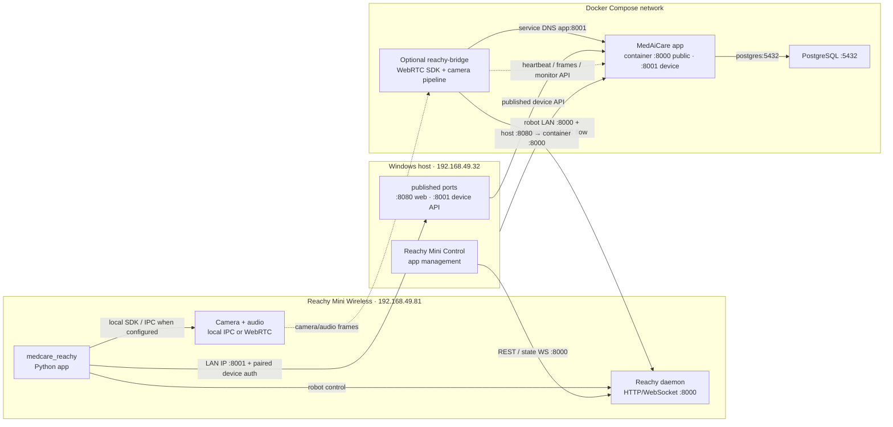

# Reachy Mini data transfer and deployment architecture

**Research date:** 2026-10-02 (Asia/Taipei)  
**Scope:** existing Reachy Mini Wireless, MedAiCarePlus, the installed `medcare_reachy` robot app, and the optional `reachy-bridge` runner. This is a documentation report; no services or device state were changed.

## Findings

There are three separate concerns in this setup: Reachy control and app lifecycle, camera/audio transport, and MedAiCare's private device API. A successful HTTP connection to the robot's daemon on port 8000 proves that the control API is reachable. It does not prove that WebRTC media transfer works, that the MedAiCare device API on port 8001 is reachable, or that the robot app has completed an authenticated request.

The observed robot is the Wireless model: its LAN address is `192.168.49.81`, and its daemon identified itself as `reachy_mini`. A read-only status check on 2026-10-02 reported daemon 1.11.0 running, backend ready, `error=null`, and zero control-loop errors. The Reachy Mini Control desktop app had previously reported `medcare_reachy` installed and running with `error=null`. These observations establish robot connectivity and app process state, but they do not establish that MedAiCare has received data.

In the MedAiCarePlus snapshot at 2026-10-02 00:09:19 Asia/Taipei, the database had a Reachy device record whose heartbeat was `NULL`. That means the server had no accepted heartbeat timestamp recorded for that device at that snapshot. It does not identify whether the robot app used the wrong address, lacked valid pairing credentials, failed before sending, or did not send heartbeats. A TCP test or GET to the robot's port 8000 cannot distinguish those cases.

There is also a separate server-side workflow blocker: `/models/emotion_seed43/model_fp32.onnx` was absent in the running app container. The app health snapshot reported emotion readiness false. The device heartbeat endpoint does not check model readiness, but `/api/device/monitor/start` returns HTTP 503 unless both identity and emotion models are ready. Fixing connectivity alone will not make that monitor-start operation succeed; restoring/configuring the model is a distinct task.

The installed robot app's implementation and configuration have not been inspected. The repository already treats the Docker bridge as optional and says to run only one runner for a Reachy device. Verify whether `medcare_reachy` is already configured to call MedAiCare and stream frames before starting another bridge. The old Reachy web dashboard is not a required step here; use Reachy Mini Control to inspect the installed app and its logs.

## Which service owns each address and port

| Address from the named machine | Service | Purpose |
|---|---|---|
| Robot `192.168.49.81:8000` | Reachy daemon | Reachy HTTP REST and state/move WebSockets: daemon status, control and telemetry. Wireless runs this daemon on the robot. |
| Robot `192.168.49.81:8443` | Reachy WebRTC signaling path in the desktop architecture | Separate from the REST API. WebRTC media is negotiated through signaling and then transferred as a peer connection; it is not an HTTP response from port 8000. Confirm the actual SDK negotiation and media flow from the selected runner. |
| Windows host `192.168.49.32:8080` | MedAiCare public web service | Current Compose mapping `${WEB_PORT:-8080}:8000`; intended for the browser-facing app. It is not the Reachy daemon. |
| Windows host `127.0.0.1:8001` by default | MedAiCare device API | Compose maps `${DEVICE_BIND:-127.0.0.1}:8001:8001`. It is private and intended for robot-device requests. A robot cannot use the laptop's loopback address; an on-robot client needs a deliberate bind to the laptop's trusted LAN address and must use that address. |
| Compose service `app:8001` | MedAiCare app container, on the Compose network | Correct device API destination for `reachy-bridge` when both services are in this Compose project. It uses the container port and Compose DNS, not the host port. |
| Compose service `postgres:5432` | PostgreSQL, on the Compose network | Database path for the MedAiCare app. It is not part of the robot's connection path. |

These values are in the current [Compose file](../../docker-compose.yml), [server listener setup](../../app/serve.py), and [device-port isolation middleware](../../app/main.py). In this repository, host port 8080 maps to container port 8000, while device port 8001 has a separate host binding. The app rejects `/api/device/*` on the public listener and rejects `rdv1.` device bearer tokens there. Keep device traffic on 8001; do not place that port behind a public tunnel.

`localhost` depends on where the caller runs:

- On Windows, `http://localhost:8001` reaches the Windows host's published device port when it is bound locally.
- Inside the `reachy-bridge` container, `localhost` means that bridge container. Use `http://app:8001` for the MedAiCare app service on the same Compose network.
- On Reachy, `localhost` means the robot itself. The on-robot app must address the Windows host's LAN IP for MedAiCare; it must not use `localhost:8001` or Compose-only DNS such as `app:8001`.
- In Docker Desktop, `host.docker.internal` resolves to the host from a container. It is useful only when a container must reach a service published on Windows. It does not mean “the robot,” and it is unnecessary for same-Compose service communication.

## Data paths

### Current robot-installed app path (verify before adding a bridge)

A Python Reachy Mini app is started and managed by the robot daemon. Official Reachy docs describe the daemon launching the app as a subprocess and passing it an already-connected `ReachyMini` instance; on Wireless the app runs on the robot. The daemon owns camera/audio hardware. A local client can use the robot's local media IPC; a remote client uses WebRTC. The installed `medcare_reachy` app may therefore have a simpler on-robot path to the robot's own camera than a remote container does, but that app's current code must be checked before assuming it does.

If `medcare_reachy` is the active runner, its MedAiCare requests need to reach the private device listener on the Windows host. The target would be `http://<Windows-Wi-Fi-IP>:8001/api/device/...`, with the host port deliberately bound to that Wi-Fi address and scoped to the trusted local network. `127.0.0.1` is insufficient from the robot. The app must also use its paired device credential. Do not copy that credential into a report, shell history, or a public route.

### Optional Docker bridge path

The repository's bridge is a second, independent runner. Its current configuration sets `APP_INTERNAL_URL=http://app:8001` and expects `REACHY_ROBOT_HOST` to be the robot's LAN address. `ReachyRobot` explicitly constructs `ReachyMini(host=..., media_backend="webrtc")`; it captures frames, sends landmarks/JPEGs and heartbeats to `/api/device/*`, and controls robot motion/audio. The bridge container has no published ports in Compose. See [bridge README](../../reachy_bridge/README.md), [bridge media adapter](../../reachy_bridge/media.py), and [bridge runner](../../reachy_bridge/runner.py).

That path has two independent network legs:

1. Bridge container to Reachy at the robot's LAN address for daemon control plus WebRTC signaling/media.
2. Bridge container to `app:8001` over the Compose network for authenticated MedAiCare device requests.

`host.docker.internal` is not needed for either leg in this same-Compose layout. Use it only if the runner is in a different network context and must reach a host-published service.

### Request and media plane split

Reachy's daemon REST API is documented on port 8000 for both Lite and Wireless. Wireless uses the robot address (`reachy-mini.local` or its IP); Lite uses `localhost` because its daemon runs on the developer's machine. The Python SDK's current source defaults to port 8000 and selects local media only when it can reach the daemon's local IPC endpoint; remote/network connections use WebRTC. The bridge explicitly requests the WebRTC backend.

The official media architecture separates signaling from media: the Reachy daemon owns the camera/audio devices, and a remote SDK client receives camera and audio via WebRTC. The desktop app architecture also draws WebRTC separately from REST/state WebSockets and lists a local proxy that forwards TCP/UDP. Consequently, a successful TCP connect or GET to `192.168.49.81:8000/api/daemon/status` is only a control-plane check. It does not prove that WebRTC signaling, ICE negotiation, UDP media, GStreamer decode, camera frames, audio, or JPEG upload to MedAiCare succeeds. No fixed set of opened ports should be inferred from the 8000 check alone; verify an actual frame received in the chosen runner and an accepted authenticated device request.

## Windows Docker Desktop implications

Docker Desktop Linux containers run in a managed Linux VM. Outbound container network traffic is NATed through Docker Desktop's Windows backend process; published inbound ports are forwarded through that backend. Docker's docs state that host firewall/VPN/endpoint rules can act on that backend process. That explains why a connection from a container may be evaluated differently from a PowerShell request from Windows. It does not establish that any particular antivirus or firewall caused the observed state, so no such cause is assigned here.

On a Compose default bridge network, services resolve each other by service name, and service-to-service calls use the container port. Thus `reachy-bridge -> app:8001` is the direct path. Host port 8001 is only for callers outside the Compose network, such as the robot or a Windows-native bridge. Docker Desktop documents `host.docker.internal` for container-to-host access and `-p`/Compose `ports` for publishing a container service to the host/LAN. These mechanisms are directional and distinct.

Do not switch the whole bridge to host networking as the first remedy. The default Compose network isolates the bridge and keeps the app and database service names available. Docker's host mode shares the host network namespace, removes normal port mapping, and disables Compose service-name DNS; Docker Desktop host networking is also a separately enabled feature. Consider it only after an in-container WebRTC probe proves a concrete network requirement and after its isolation tradeoff is accepted.

Likewise, do not open broad firewall rules, disable endpoint security, or expose port 8001 through a tunnel. If evidence later points to inbound LAN filtering, scope any change to the exact device/API port, the private Wi-Fi interface, and the Reachy source address. For container egress failures, test from the bridge container and identify the exact destination/protocol before proposing a targeted rule.

## Recommended investigation and deployment choice

1. **Inspect the existing robot app first in Reachy Mini Control.** Confirm its installed version, configured MedAiCare base URL, pairing state, active SDK/media backend, and recent app logs. Redact the device token. The app process being `running` does not prove successful API or media traffic.
2. **Confirm the private API address from the app's own execution location.** For the robot app, use the Windows Wi-Fi IP and port 8001, with `DEVICE_BIND` restricted to that trusted host interface. For a bridge in this Compose project, use `http://app:8001`. For a Windows-native bridge, use `http://localhost:8001` if the device listener is bound on loopback.
3. **Separate checks by layer:** daemon GET/status at robot `:8000`; an SDK media probe that receives a real camera frame from the selected app/container; authenticated heartbeat to MedAiCare `:8001`; then a monitor-start request. A 200 on one layer is not evidence that later layers work.
4. **Resolve the independent model condition.** The current health snapshot had emotion readiness false because `model_fp32.onnx` was absent in the running app container. `/api/device/heartbeat` records liveness without requiring that model; `/api/device/monitor/start` rejects with 503 while identity or emotion readiness is false. Restore/configure the intended emotion model before expecting monitoring sessions to start.
5. **Use one runner per robot.** If `medcare_reachy` is already the intended on-robot integration, keep `reachy-bridge` stopped and correct that app's connection/configuration. If it is only an unrelated app, or cannot implement the required data flow, compare a Windows-native runner (the repository documents it as a fallback) with the opt-in Docker bridge. Before using the Docker bridge, complete its documented M1 media probe from inside the container against the real robot; its Linux GStreamer/WebRTC path is explicitly marked unverified in this repository.
6. **Keep exposure narrow.** The browser-facing host port 8080 and device API host port 8001 serve different clients. Keep 8001 private, bind only to the trusted LAN interface when the robot must connect, and do not tunnel it or publish the bridge container. No public port, cloud relay, or blanket firewall change is necessary to begin the local-network diagnosis.

## Runtime and version limits

The observed robot daemon was version 1.11.0, and the installed desktop app was previously identified as Reachy Mini Control 0.9.32. The installed `medcare_reachy` app's own version and source were not available in this repository, so this report does not claim what its current code does. Official Reachy documentation and `main`-branch source are living references; they may differ from a robot app built against another SDK. The actual installed app logs and a media receive test remain the decisive evidence for its path.

## Sources (checked 2026-10-02)

Official Reachy sources:

- [Reachy Mini REST API](https://github.com/pollen-robotics/reachy_mini/blob/main/docs/source/API/rest-api.mdx) — Lite and Wireless daemon addresses and HTTP/WebSocket API base.
- [Reachy Mini media architecture](https://github.com/pollen-robotics/reachy_mini/blob/main/docs/source/SDK/media-architecture.md) — daemon-owned camera/audio, local IPC, remote WebRTC and signaling/media roles.
- [Reachy Mini apps guide](https://github.com/pollen-robotics/reachy_mini/blob/main/docs/source/SDK/apps.md) — app lifecycle, subprocess and Wireless placement.
- [Reachy Mini Python SDK source](https://github.com/pollen-robotics/reachy_mini/blob/main/src/reachy_mini/reachy_mini.py) — daemon port and auto-selection of local versus WebRTC media backend.
- [Reachy Mini Control desktop app architecture](https://github.com/pollen-robotics/reachy-mini-desktop-app#readme) — desktop lifecycle management, REST/state WebSocket, local TCP/UDP proxy and separate WebRTC path.

Official Docker sources:

- [Docker Desktop networking](https://docs.docker.com/desktop/features/networking/) — VM/backend routing, outbound traffic visibility and published port forwarding on Windows.
- [Docker Desktop networking how-tos](https://docs.docker.com/desktop/features/networking/networking-how-tos/) — `host.docker.internal`, published ports, VPNs and network/DNS modes.
- [Docker Compose networking](https://docs.docker.com/compose/how-tos/networking/) — service-name DNS, container-port routing, default bridge and host-network tradeoffs.

Repository evidence:

- [Compose service and port bindings](../../docker-compose.yml)
- [Two MedAiCare listeners](../../app/serve.py)
- [Public/device API separation](../../app/main.py)
- [Device heartbeat and monitor-start policy](../../app/routers/api_device.py)
- [Bridge configuration and runner guidance](../../reachy_bridge/README.md)
- [Bridge's explicit WebRTC client](../../reachy_bridge/media.py)
- [Bridge camera/heartbeat loop](../../reachy_bridge/runner.py)

